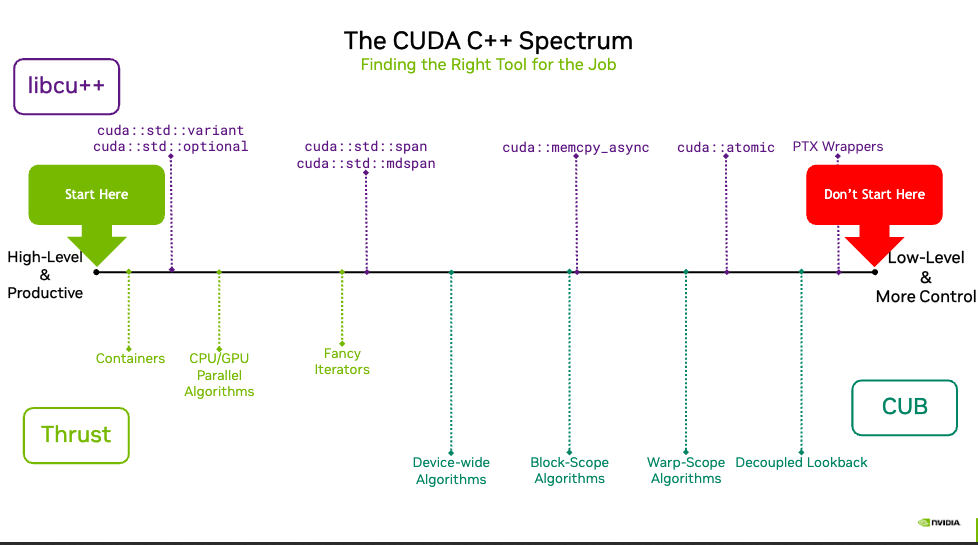

[TOC]


## CUDA C++核心库（CCCL）

**一、标准 C++ 组成**

1. C++ 语言核心
2. 标准库（Standard Library）
   - 核心功能：
     ▶ 通用抽象（General Purpose Abstractions）
     ▶ 数据结构（Data Structures）
     ▶ 算法库（Algorithms）
   - 价值：简化开发流程，提升代码健壮性，避免底层重复实现

**二、CUDA C++ 组成**
1. 基础组件：
   ▶ C++ 语言核心
   ▶ 主机标准库（Host Standard Library）
2. 扩展组件：
   ▶ CUDA 语言扩展（CUDA Language Extensions）
   ▶ CUDA C++ 核心库（CUDA C++ Core Libraries, CCCL）
3. CCCL 核心功能：
   - 异构 C++ 标准库（Heterogeneous C++ Standard Library）
     ✅ 支持 CPU/GPU 协同编程
     ✅ 提供统一内存模型抽象
   - CUDA 基础抽象（Fundamental CUDA Abstractions）
     ✅ 封装线程管理（Thread Hierarchy）
     ✅ 设备内存操作（Memory Management）
   - 高性能并行算法库（High-Performance Parallel Algorithms）
     ✅ 矩阵运算加速
     ✅ 数据并行处理原语

## 核心库介绍

### CUDA C++ 开发工具的层级范围

- 横轴意义：从左到右，工具呈现从 “高层且易用（High-Level & Productive）” 到 “底层且更具控制力（Low-Level & More Control）” 的变化。
- 左侧起点（绿色箭头 “Start Here”）：建议从高层工具开始，如Thrust，因其易用性高、能提升开发效率。
- 右侧终点（红色箭头 “Don’t Start Here”）：不建议直接从底层工具（如 PTX Wrappers）入手，这类工具复杂且维护难度大。



### 各层级工具的具体内容

1. **高层工具（High-Level & Productive）**
   - `libcu++`：提供 C++ 标准库扩展，例如`cuda::std::variant`和`cuda::std::optional`，方便使用容器及抽象化功能。
   - `Thrust`：提供 CPU/GPU 并行算法，适用于快速开发高层算法和数据处理。
2. **中间层工具（中等抽象层次）**
   - **迭代器（Fancy Iterators）**：如`cuda::std::span`和`cuda::std::mdspan`，用于处理复杂数据结构。
   - **设备范围算法（Device-wide Algorithms）**：用于对设备内数据进行全局操作。
   - **块范围算法（Block-Scope Algorithms）**：如`cuda::memcpy_async`，适合更精细的块级控制。
   - **Warp 范围算法（Warp-Scope Algorithms）**：通过`cuda::atomic`实现线程束间的同步与控制。
3. **底层工具（Low-Level & More Control）**
   - **PTX Wrappers**：对 PTX 汇编代码进行封装，适用于需要极端性能优化的场景。
   - **CUB**：提供低级 GPU 并行算法的实现，灵活性更高，但使用复杂度也随之增加。

## Thrust

### 自动内存管理
**解释**：Thrust容器使用RAII（资源获取即初始化）模式，在对象生命周期结束时自动释放内存，避免内存泄漏。传统CUDA编程需手动调用`cudaFree`，容易遗漏。

**传统方法**：

```cpp
int* d_data;
cudaMalloc(&d_data, N * sizeof(int));
// 使用d_data
cudaFree(d_data); // 必须手动释放，否则内存泄漏
```

**Thrust方法**：
```cpp
thrust::device_vector<int> d_data(N); // 自动分配内存
// 使用d_data
// 离开作用域时自动释放内存
```


### 类型安全
**解释**：Thrust容器在编译期进行类型检查，防止不匹配的数据操作。传统`cudaMemcpy`仅检查指针类型，不验证实际数据类型。

**不安全示例**（传统方法）：
```cpp
cuda::std::complex<float>* d_complex;
cudaMalloc(&d_complex, N * sizeof(cuda::std::complex<float>));
int* h_int = new int[N];
// 错误：类型不匹配，但cudaMemcpy不报错
cudaMemcpy(d_complex, h_int, N * sizeof(int), cudaMemcpyHostToDevice);
```

**安全示例**（Thrust方法）：

```cpp
thrust::device_vector<cuda::std::complex<float>> d_complex(N);
thrust::host_vector<int> h_int(N);
// 编译错误：无法将int赋值给complex<float>
// d_complex = h_int; // 此操作会触发编译错误
```


### 自定义分配器（页锁定内存）
**解释**：Thrust允许通过自定义分配器使用页锁定内存（pinned memory），提升主机与设备间的数据传输效率。

**传统方法**：
```cpp
float* h_data;
cudaHostAlloc(&h_data, N * sizeof(float), cudaHostAllocDefault); // 分配页锁定内存
// 使用h_data
cudaFreeHost(h_data); // 手动释放
```

**Thrust方法**：
```cpp
using pinned_allocator = thrust::cuda_cub::tagged_allocator<
    float, // 分配的元素类型
    thrust::cuda_cub::thread_safe_allocator_tag, // 线程安全标记
    thrust::cuda_cub::pinned_host_memory_resource_tag // 固定内存标记
>;

// 使用页锁定内存的host_vector
thrust::host_vector<float, pinned_allocator> h_data(N);
// 使用h_data
// 自动释放
```


### 高级API替代底层操作
**解释**：Thrust提供高层算法（如`fill_n`）替代底层函数（如`cudaMemset`），提升代码可读性和安全性。

**传统方法**：

```cpp
float* d_data;
cudaMalloc(&d_data, N * sizeof(float));
cudaMemset(d_data, 0, N * sizeof(float)); // 字节级操作，需手动计算字节数
// 使用d_data
cudaFree(d_data);
```

**Thrust方法**：

```cpp
thrust::device_vector<float> d_data(N);
thrust::fill(d_data.begin(), d_data.end(), 0.0f); // 类型安全，自动处理内存
```

### thrust::transform

#### 基本使用

**传统方法**：

```c++
__global__ void gelu_kernel(float* out, const float* inp, int N) {
    int i = blockIdx.x * blockDim.x + threadIdx.x;
    if (i < N) {
        float x = inp[i];
        float cube = x * x * x;
        float cdf = 0.5f * (1.0f + tanh(0.79788456f * (x + 0.044715f * cube)));
        out[i] = x * cdf;
    }
}

void gelu_forward(float* out, const float* inp, int N) {
    int block_size = 128;
    int grid_size = CEIL_DIV(N, block_size);
    gelu_kernel<<<grid_size, block_size>>>(out, inp, N);
}  
```

**thrust::transform方法**: 

- 使用thrust::transform方法，只需要关心每个元素的计算逻辑，不用手动管线程分工，代码更加简洁，突出”算法意图“。
- 可以直接使用多种多种执行策略，控制计算在设备上的执行，如thrust::device、thrust::cuda::par_nosync和thrust::cuda::par_on(stream)等。

```c++
struct gelu_functor {
    __host__ __device__
    float operator()(const float& x) const {  // 运算符重载operator()，将结构体转变为函数对象
        float cube = x * x * x;
        return x * 0.5f * (1.0f + tanh(0.79788456f * (x + 0.044715f * cube)));
    }
};

void gelu_forward(float* out, const float* inp, int N) {
    thrust::device_ptr<const float> d_inp(inp);
    thrust::device_ptr<float> d_out(out);
    // d_inp输入数据的起始位置；d_inp+N输入数据的结束位置；d_out输出数据的起始位置
    thrust::transform(thrust::device, d_inp, d_inp + N, d_out, gelu_functor());
} 
```

#### 几种执行策略

**thrust::device**

- 它指定 Thrust 算法应该在 GPU 设备上执行。它是一种相对通用的设备端执行策略，使用默认的 CUDA 流
- 在默认情况下，使用thrust::device执行完 Thrust 算法后，主机端代码如果继续访问与该操作相关的设备内存，会隐式地等待操作完成

**thrust::cuda::par_nosync**

- 指示 Thrust 算法在 GPU 设备上运行，但它强调不进行隐式同步。这意味着 Thrust 操作提交到 GPU 后，主机端代码会立即继续执行，而不会等待 GPU 操作完成。
- 利用这种策略可以实现主机端和设备端的重叠计算，提高整体的计算效率。例如，在一些复杂的计算流程中，主机端可能需要在设备端计算的同时进行一些其他的预处理或后处理操作，此时thrust::cuda::par_nosync就非常有用。
- 由于没有隐式同步，如果主机端后续需要访问设备端操作的结果，必须手动调用 CUDA 的同步函数（如cudaDeviceSynchronize() ）来确保 GPU 操作已经完成，否则会导致错误

**thrust::cuda::par_on(stream)**

- 通过使用特定的 CUDA 流，可以更好地管理 GPU 资源，实现更细粒度的并行。比如，在一个应用中有多个不同优先级或者不同类型的计算任务，可以分别放在不同的 CUDA 流中，利用thrust::cuda::par_on(stream)将相应的 Thrust 操作分配到合适的流上。
- 并发与同步管理：可以结合不同流之间的同步原语（如cudaStreamSynchronize() ）来控制不同流中操作的执行顺序和依赖关系。同时，不同流中的操作在硬件支持下能够并发执行，进一步提高 GPU 利用率。

### iterator

**传统方法：**

```c++
__global__ void unpermute_kernel(float* inp, float *out, int B, int N, int NH, int d) {
    int idx = blockIdx.x * blockDim.x + threadIdx.x;
    if (idx < B * NH * N * d) {
        int b = idx / (NH * N * d);
        int rest = idx % (NH * N * d);
        int nh_ = rest / (N * d);
        rest = rest % (N * d);
        int n = rest / d;
        int d_ = rest % d;
        int other_idx = (b * NH * N * d) + (n * NH * d) + (nh_ * d) + d_;
        out[other_idx] = __ldcs(&inp[idx]);
    }
}

// 核函数调用示例
num_blocks = CEIL_DIV(B * T * C, block_size);
unpermute_kernel<<<num_blocks, block_size>>>(vaccum, out, B, T, NH, HS);  
```

**优化方法：**

```c++
// Thrust库迭代器方式实现
auto map = thrust::make_transform_iterator(
    thrust::make_counting_iterator(0),  // 创建从 0 开始的计数迭代器，提供连续的索引值 idx
    [=] __host__ __device__ (int idx) {   // 通过 lambda 表达式作为变换操作，[=] 表示按值捕获外部变量
        auto [b, n, nh_, d_] = i2n(idx, NH, T, HS);
        return (b * NH * T * HS) + (n * NH * HS) + (nh_ * HS) + d_;
    }
);

cub::CacheModifiedInputIterator<cub::LOAD_CS, float> vaccumcs(vaccum);
// 该操作会根据 map 提供的索引，把 vaccumcs 指向的数据按序分散到 out 数组对应位置
thrust::scatter(thrust::device, vaccumcs, vaccumcs + B * T * C, map, out); 
```

### load_cs

thrust的高级抽象不会牺牲底层控制能力。可以通过`cub::CacheModifiedInputIterator<cub::LOAD_CS, float>`来等价cuda kernel中直接调用底层的`__ldcs`指令。

**传统方法**：

```c++
// CUDA 核函数，实现两个数组对应元素相加，结果存入输出数组
__global__ void residual_forward_kernel(float* out, float* inp1, float* inp2, int N) {
    int idx = blockIdx.x * blockDim.x + threadIdx.x;
    if (idx < N) {
        out[idx] = __ldcs(&inp1[idx]) + __ldcs(&inp2[idx]);
    }
}

// 主机端函数，用于调用上述 CUDA 核函数
void residual_forward(float* out, float* inp1, float* inp2, int N) {
    const int block_size = 256;
    const int grid_size = CEIL_DIV(N, block_size); 
    residual_forward_kernel<<<grid_size, block_size>>>(out, inp1, inp2, N);
    cudaCheck(cudaGetLastError()); 
}
```

**thrust**：

```c++
void residual_forward(float* out, float* inp1, float* inp2, int N) {
    cub::CacheModifiedInputIterator<cub::LOAD_CS, float> inp1cs(inp1);
    cub::CacheModifiedInputIterator<cub::LOAD_CS, float> inp2cs(inp2);
    thrust::transform(thrust::device,
                      inp1cs, inp1cs + N, inp2cs, out, thrust::plus<float>());
}
```

### 高效索引mdspan

使用`cuda::std::mdspan`管理多维数据，从而将传统的按照一维数组访问的方式，转变为以多维方式进行访问。

**传统方法**：

```c++
// permute_kernel函数实现矩阵重排列操作
__global__ void permute_kernel(float* q, float* k, float* v,
                             const float* inp, int B, int N, int NH, int d) {
    // 计算当前线程的全局索引
    int idx = blockIdx.x * blockDim.x + threadIdx.x;
    
    // 原始代码中的矩阵重排列计算
    // dlb[nh][n][d_] = inp[b][n][nh][d_]
    
    // 计算输入张量的各个维度索引
    int b = idx / (NH * N * d);      // batch维度
    int rest = idx % (NH * N * d);   // 剩余部分
    int nh = rest / (N * d);         // head维度
    rest = rest % (N * d);           // 继续分解剩余部分
    int n = rest / d;                // 序列长度维度
    int d_ = rest % d;               // 特征维度
    
    // 计算输入张量的线性索引
    int inp_idx = 
        (b * N * NH * d) +           // batch偏移
        (n * NH * d) +               // 序列长度偏移
        (nh * d) +                   // head偏移
        d_;                          // 特征维度偏移
    
    // 执行张量重排列操作
    q[idx] = __ldcs(&inp[inp_idx]); // 使用__ldcs进行缓存优化的内存读取
    k[idx] = __ldcs(&inp[inp_idx + NH * d]);
    v[idx] = __ldcs(&inp[inp_idx + 2 * NH * d]);
}

// attention_forward函数实现注意力前向传播
void attention_forward(float* out, float* veccum, float* qkv, float* presft, float* att,
                      int B, int T, int C, int NH) {
    const int block_size = 256;              // CUDA线程块大小
    const int softmax_block_size = 256;      // Softmax操作的线程块大小

    int HS = C / NH;                        // 每个head的维度大小
    
    // 计算每个head的维度大小
    float *q, *k, *v;
    q = qkv;                                 // 查询矩阵Q的起始位置
    k = qkv + B * T * C;                     // 键矩阵K的起始位置
    v = qkv + 2 * B * T * C;                 // 值矩阵V的起始位置
    
    // 计算需要的CUDA线程块数量
    int total_threads = B * NH * T * HS;
    int num_blocks = CEIL_DIV(total_threads, block_size);
    
    // 启动permute_kernel进行张量重排列
    permute_kernel<<<num_blocks, block_size>>>(q, k, v, qkv, B, T, NH, HS);
}
```

**优化方法：**

```c++
void attention_forward(float* out, float* vaccum, float* qkvr, float* prestt, float* att,
                      float* inp, int B, int T, int C, int NH) {
    // 设置CUDA块大小常量
    const int block_size = 256;
    const int softmax_block_size = 256;
    
    // 计算每个注意力头的维度大小
    int HS = C / NH;  // head size
    
    // 设置Q、K、V矩阵的指针，它们在内存中是连续存储的
    float *q, *k, *v;
    q = qkvr + 0 * B * T * C;      // Q矩阵起始位置
    k = qkvr + 1 * B * T * C;      // K矩阵起始位置
    v = qkvr + 2 * B * T * C;      // V矩阵起始位置
    
    // 使用CUDA动态内存分配
    constexpr auto dyn = cuda::std::dynamic_extent;  // 这是一个编译时常量，表示数组维度的大小在运行时确定
    using ext_t = cuda::std::extent<int, dyn, dyn, 3, dyn, dyn>;  // 定义了一个 5 维数组的维度结构
    using mds_t = cuda::std::mdspan<const float, ext_t>;  // 不拥有内存，只是提供多维索引到一维内存的映射；提高代码可读性和维护性，避免手动计算偏移量
    
    // 创建多维数组视图，用于更方便地访问数据
    ext_t extents(B, T, NH, HS);   // 只传入动态维度，extents仍然是5维的
    mds_t inp_md(inp, extents);  // 将一维内存指针 inp 映射为多维视图
    /**
    * 示例访问方式：
    * 访问批次b、时间步t、第0个矩阵(对应Q)、头nh_、维度hs的数据
    * float value = inp_md(b, t, 0, nh_, hs);
    */
    
    // 使用thrust库创建迭代器，用于并行处理
    auto begin = thrust::make_counting_iterator(0);
    auto end = begin + B * NH * T * T;
    
    // 原始重排列操作的注释：Q[b][nh][t][d_] = inp[b][t][nh][d_]
    
    // 使用thrust并行处理每个元素
    // [=]：捕获方式为值捕获（By Value），表示 Lambda 内部可以使用外部作用域的所有变量（如B, T, C, NH, q, k, v, inp_md等）
    thrust::for_each(thrust::cuda::par,
                    begin, end,
                    [=] __device__ (int idx) {
                        // 计算当前处理位置的各个维度索引
                        auto [b, t, nh_, hs] = idx2(idx, NH, T, HS);
                        
                        // 执行Q、K、V矩阵的数据重排列
                        q[idx] = inp_md(b, t, 0, nh_, hs);  // Q矩阵赋值
                        k[idx] = inp_md(b, t, 1, nh_, hs);  // K矩阵赋值
                        v[idx] = inp_md(b, t, 2, nh_, hs);  // V矩阵赋值
                    });
}
```


## Libcu++

### cuda::std::tuple 

**传统方法**：

```c++
__global__ void permute_kernel(float* q, float* k, float* v,
                               const float* inp, int B, int N, int NH, int d) {
    int idx = blockIdx.x * blockDim.x + threadIdx.x;
    if (idx < B * NH * N * d) {
        int b = idx / (NH * N * d);
        int rest = idx % (NH * N * d);
        int nh_ = rest / (N * d);
        rest = rest % (N * d);
        int n = rest / d;
        int d_ = rest % d;
        //...
    }
}

__global__ void unpermute_kernel(float* inp, float *out, int B,
                                 int N, int NH, int d) {
    int idx = blockIdx.x * blockDim.x + threadIdx.x;
    if (idx < B * NH * N * d) {
        int b = idx / (NH * N * d);
        int rest = idx % (NH * N * d);
        int nh_ = rest / (N * d);
        rest = rest % (N * d);
        int n = rest / d;
        int d_ = rest % d;
        //...
    }
}
```

**优化方法**：

- 使用cuda::std::tuple减少了代码冗余

```c++
__host__ __device__ 
cuda::std::tuple<int, int, int, int> 
idx2n(int idx, int E1, int E2, int E3) {
    int b = idx / (E1 * E2 * E3);
    int rest = idx % (E1 * E2 * E3);
    int nh_ = rest / (E2 * E3);
    rest = rest % (E2 * E3);
    int t = rest / E3;
    int hs = rest % E3;
    return {b, t, nh_, hs};
}

__global__ void permute_kernel(float* q, float* k, float* v,
                               const float* inp, int B, int N, int NH, int d) {
    int idx = blockIdx.x * blockDim.x + threadIdx.x;
    if (idx < B * NH * N * d) {
        auto [b, n, nh_, d_] = idx2n(idx, NH, N, d);
        //...
    }
}

__global__ void unpermute_kernel(float* inp, float *out, int B,
                                 int N, int NH, int d) {
    int idx = blockIdx.x * blockDim.x + threadIdx.x;
    if (idx < B * NH * N * d) {
        auto [b, n, nh_, d_] = idx2n(idx, NH, N, d);
        //...
    }
}
```

### cuda::std::variant

`cuda::std::variant` 是一种类型安全的联合（tagged union ）。它可以在同一时间存储一个值，这个值的类型可以是在声明 `variant` 时指定的几种类型中的任意一种。与传统的 `union` 不同，`variant` 知道当前存储的值具体是哪种类型，并且提供了安全的访问方式。

```c++
__global__ void variant_kernel() {
    // 声明一个可以存储 int 或 float 类型的 variant
    cuda::std::variant<int, float> var; 
    var = 42;  // 存储 int 类型的值
    if (auto *i = cuda::std::get_if<int>(&var)) {
        // 安全地获取 int 类型的值
        std::cout << "The value is an int: " << *i << std::endl; 
    }
    var = 3.14f;  // 存储 float 类型的值
    if (auto *f = cuda::std::get_if<float>(&var)) {
        std::cout << "The value is a float: " << *f << std::endl; 
    }
}
```

### cuda::std::pair

`cuda::std::pair` 是一个简单的模板类，用于将两个不同类型的对象组合成一个单一的对象。它有两个公共成员变量 `first` 和 `second`，可以方便地访问存储的两个值。

```c++
__global__ void pair_kernel() {
    // 创建一个 pair，存储 int 和 float 类型的值
    cuda::std::pair<int, float> my_pair(10, 2.5f); 
    std::cout << "First value: " << my_pair.first << std::endl;
    std::cout << "Second value: " << my_pair.second << std::endl;
}
```


**主要参考：**

- [how-to-optim-algorithm-in-cuda](https://github.com/BBuf/how-to-optim-algorithm-in-cuda/blob/master/cuda-mode/Lecture%2016%20%E9%80%9A%E8%BF%87CUDA%20C%2B%2B%E6%A0%B8%E5%BF%83%E5%BA%93%E6%8A%8Allm.c%E7%A7%BB%E6%A4%8D%E4%B8%BAllm.cpp.md)


[**点击查看我的更多AI学习笔记github**](https://github.com/xueyongfu11/awesome-deep-learning-resource)


