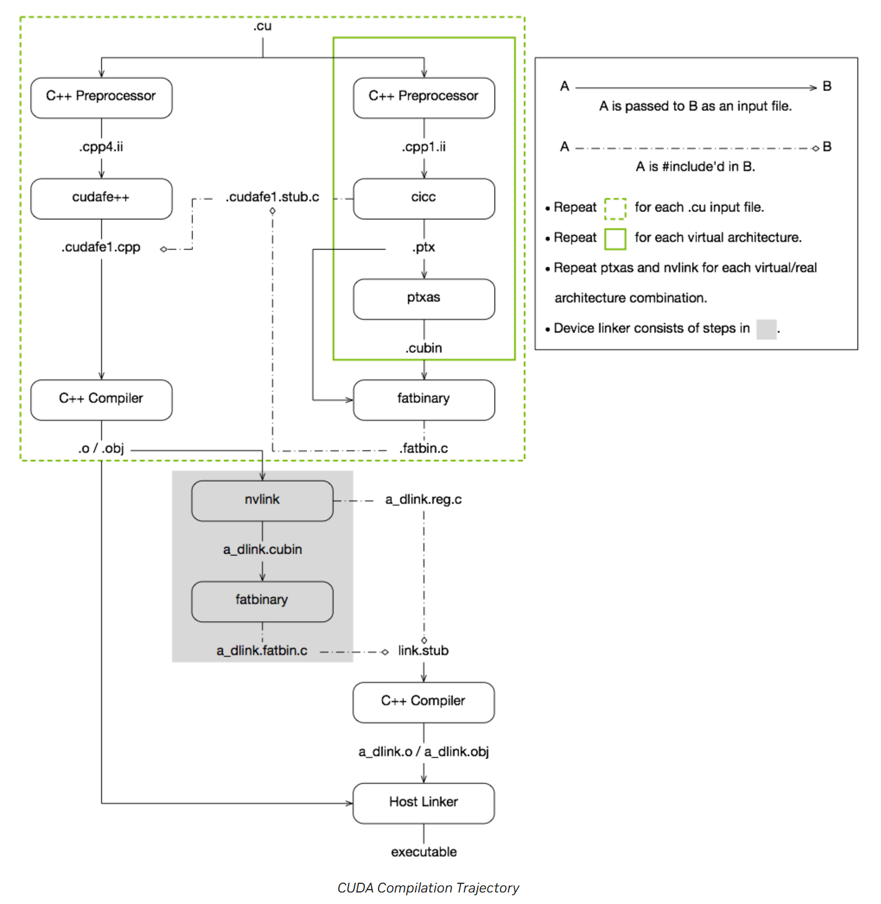

[TOC]


# NVCC编译

## NVCC总结

- NVIDIA CUDA编译器(NVCC)的完整工作流程。NVCC的主要作用是将CUDA代码分离成主机代码（C/C++）和设备代码（CUDA内核）。主机代码通过标准的C/C++编译器（如g++或clang）进行编译，而设备代码则被编译成PTX或cubin格式。

- 整个流程通过一系列的中间步骤，包括预处理、编译和链接，最终生成可执行文件。

## NVCC编译轨迹



### C++ Preprocessor（C++ 预处理器）

输入：.cu 文件

输出：.cpp4.ii（主机分支）、.cpp1.ii（设备分支）

作用：处理 .cu 中的预编译指令（#include、#define、条件编译 #if 等）；拆分代码：将混合的 主机代码（CPU 执行） 和 设备代码（GPU 执行） 初步分离，为后续工具分工做准备

### cicc（CUDA Intermediate Compiler）

输入：.cpp1.ii（设备分支预处理结果）

输出：.ptx（并行线程执行虚拟指令）

PTX：PTX是GPU架构无关的虚拟指令集，不绑定硬件

作用：

1. 专注处理 GPU 设备代码，将其转换为 PTX（虚拟指令集）
2. 基于 LLVM 框架做优化（循环展开、内存访问优化等），生成与 GPU 架构解耦的中间表示

### ptxas（PTX Assembler）

PTXAS：PTXAS针对具体GPU架构编译

输入：.ptx（虚拟指令）

输出：.cubin（GPU 二进制）

作用：将 PTX 转换为 特定 GPU 架构的机器码（如 SM80、SM90 对应指令）；执行寄存器分配、指令调度等硬件相关优化，生成 GPU 可直接执行的二进制文件

### fatbinary

输入：.cubin、.ptx

输出：.fatbin.c

作用：打包 多架构 GPU 二进制 到一个文件，实现「一次编译，多架构适配」；运行时由 CUDA 驱动自动选择当前 GPU 匹配的架构代码，提升兼容性

### cudafe++（CUDA Front End）

输入：.cpp4.ii（主机分支预处理结果）、.cudafe1.stub.c、.fatbin.c

输出：.cudafe1.cpp

### C++ Compiler（主机端编译器，如 GCC/Clang）

输入：.cudafe1.cpp（主机分支处理后代码）

输出：.o/.obj（CPU 目标文件）

作用：将主机端代码编译为 CPU 可执行的二进制（如 x86_64 指令）；处理常规 C++ 逻辑（控制流、串行代码等），与普通 C++ 编译流程对齐

### Host Linker

输入：主机端 .o/.obj、设备端链接后产物（a_dlink.o 等）、CUDA 运行时库（libcudart.so）

输出：最终可执行文件

# Triton编译

## Triton总结

Triton编译器会将DSL代码经过多个阶段的编译，最终生成CUBIN/fatbinary格式的可执行文件。

1. 前端：DSL 解析与语义分析
   - 解析用户编写的 Triton DSL 代码（如张量计算逻辑、内存访问模式），生成抽象语法树（AST）。
   - 验证语义合法性，例如检查张量形状匹配、内存访问越界等问题。
2. 中间表示（IR）生成与转换
   - 将 AST 转换为 Triton 自定义的中间表示（如静态单赋值形式，SSA），便于后续优化。
   - 支持多轮 IR 转换，例如将高层级的计算描述（如 “矩阵乘法”）分解为底层 GPU 指令原语。
3. 优化阶段
   - 并行化优化：自动识别可并行计算的部分，生成线程块（block）和线程（thread）分配策略。
   - 内存优化：
     - 自动生成共享内存（shared memory）调度逻辑，减少全局内存访问延迟；
     - 优化寄存器分配和内存合并（memory coalescing），提升带宽利用率。
   - 循环展开与向量化：根据硬件特性（如 SM 数量、寄存器文件大小）动态调整循环策略。
4. 代码生成与目标平台适配
   - 将优化后的 IR 转换为 NVIDIA GPU 的机器码，生成 CUBIN（CUDA Binary）或 fatbinary 格式文件：
     - CUBIN：针对特定 GPU 架构（如 Volta、Ampere）的二进制文件，执行效率高；
     - fatbinary：包含多架构 CUBIN 的打包格式，支持跨架构动态加载，提升兼容性。
   - 分为几个主要分支：
     - 通过SPIRV处理,最终编译到x86和Intel GPU后端
     - 经过LLVM和AMD GPU后端处理
     - 通过LLVM和PTX处理,最终到达SASS(NVIDIA GPU汇编)
     - 处理各类加速器(Accelerators)


一些blogs：

- [Triton编译器-PytorchConference2023](https://www.aispacewalk.cn/docs/ai/framework/pytorch/PytorchConference2023/torchcon_triton)
- [OpenAI Triton MLIR 第零章 源码编译-来自GiantPandaCV](http://giantpandacv.com/project/%E9%83%A8%E7%BD%B2%E4%BC%98%E5%8C%96/%E6%B7%B1%E5%BA%A6%E5%AD%A6%E4%B9%A0%E7%BC%96%E8%AF%91%E5%99%A8/OpenAI%20Triton%20MLIR%20%E7%AC%AC%E9%9B%B6%E7%AB%A0%20%E6%BA%90%E7%A0%81%E7%BC%96%E8%AF%91/)

## Triton编译器的优化Pass

Pass 本质上是一段程序，它接收一种形式的 IR 作为输入，经过处理后输出转换后的 IR（可能是同一种形式，也可能是不同形式）。例如，在 MLIR（多语言中间表示）中，Pass 可以对不同层次的 IR 进行优化、转换或验证。


一些重要的优化Pass：

- TritonCombineOps：用于合并基础运算操作，比如点乘和地址计算
- TritonReorderBroadcast：重排广播和分片操作的顺序，使其更高效
- TritonRewriteTensorPointer：移除tensor指针相关的操作
- TritonLoopUnroll：根据指定的因子展开循环结构
- 内存合并访问（Coalescing）
- F32 点积运算优化
- CTA（合作线程阵列）规划
- 线程局部性优化
- 矩阵乘法加速
- 点运算操作数优化
- 数据去重
- 指令重排序
- TMA（Tensor Memory Access）lowering等优化

## Triton编译中间产物

下面以一个基于triton编写的kernel为例进行详细说明

### 代码执行

```python
# vector_add.py中的kernel部分

@triton.jit
def add_kernel(x_ptr,
               y_ptr,
               output_ptr,
               n_elements,
               BLOCK_SIZE: tl.constexpr,
               ):
    pid = tl.program_id(axis=0)  # We use a 1D launch grid so axis is 0.
    block_start = pid * BLOCK_SIZE
    offsets = block_start + tl.arange(0, BLOCK_SIZE)
    mask = offsets < n_elements
    x = tl.load(x_ptr + offsets, mask=mask)
    y = tl.load(y_ptr + offsets, mask=mask)
    output = x + y
    tl.store(output_ptr + offsets, output, mask=mask)
```

```shell
# 命令行执行

python3 ../../triton/python/triton/tools/compile.py \
  --kernel-name add_kernel \
  --signature "*fp32,*fp32,*fp32,i32,64" \
  --grid=1024,1024,1024 \
  vector_add.py
 
# *fp32,*fp32,*fp32表示三个张量的输入是fp32类型，*表示内存地址
```

### 中间产物

```shell
$ ll | grep add_kernel
-rw-rw-r--  1 ksharma ksharma  36K Aug  1 22:55 add_kernel.9969bdda_0123.c
-rw-rw-r--  1 ksharma ksharma  501 Aug  1 22:55 add_kernel.9969bdda_0123.h

$ ll ~/.triton/cache/z8LaDnJEt9PBQ6kqB-fckHL71-x-aUysRw-hpmbeuJc
total 36K
-rw-rw-r-- 1 ksharma ksharma 5.5K Sep 11 07:27 add_kernel.cubin
-rw-rw-r-- 1 ksharma ksharma  686 Sep 11 07:27 add_kernel.json
-rw-rw-r-- 1 ksharma ksharma 4.1K Sep 11 07:27 add_kernel.llir
-rw-rw-r-- 1 ksharma ksharma 3.0K Sep 11 07:27 add_kernel.ptx
-rw-rw-r-- 1 ksharma ksharma 3.5K Sep 11 07:27 add_kernel.ttgir
-rw-rw-r-- 1 ksharma ksharma 3.1K Sep 11 07:27 add_kernel.ttir
-rw-rw-r-- 1 ksharma ksharma  679 Sep 11 07:27 __grp__add_kernel.json
```

也可以通过kernel直接检索获取：

```python

size = 1024
x = torch.rand(size, device='cuda')
y = torch.rand(size, device='cuda')
grid = lambda meta: (triton.cdiv(size, meta['BLOCK_SIZE']),)

output = torch.empty_like(x)
compiled_kernel = add_kernel[grid](x, y, output, size, BLOCK_SIZE=1024)

# to get all the codegen keys
print(compiled_kernel.asm.keys())
# dict_keys(['llir', 'ttgir', 'ttir', 'ptx', 'cubin'])
```

### add_kernel.9969bdda_0123.c

```c
#include <stdio.h>
#include <stdint.h>
#include <inttypes.h>
#include <string.h>
#include <cuda.h>

#define CUDA_CHECK(ans) {\
    gpuAssert((ans), __FILE__, __LINE__);\
  }\

// CUDA错误检查辅助函数
static inline void gpuAssert(CUresult code, const char *file, int line) {
  if (code != CUDA_SUCCESS) {
    const char *prefix = "Triton Error [CUDA]: ";
    const char *str;
    cuGetErrorString(code, &str);  
    char err[1024] = {0};
    strcat(err, prefix);  
    strcat(err, str);     
    printf("%s\\n", err); 
    exit(code);          
  }
}

// 全局变量定义
#define CUBIN_NAME add_kernel_9969bdda_0123_cubin
CUmodule add_kernel_9969bdda_0123_mod = NULL;    // CUDA模块句柄
CUfunction add_kernel_9969bdda_0123_func = NULL;  // CUDA函数句柄

// CUBIN二进制数据,包含编译后的CUDA内核代码
unsigned char CUBIN_NAME[10960] = { 0x7f, 0x45, 0x4c, 0x46, 0x02, 0x01, 0x01, 0x33, 0x07, 0x00, 0x00, 0x00, 0x00, 0x00, 0x00, 0x00, 0x02, 0x00, 0xbe, 0x00, 0x7c, 0x00, 0x00, 0x00, 0x00, 0x00, 0x00, 0x00, 0x00, 0x00, 0x00, 0x00, 0xc0, 0x14.... };


// 卸载CUDA内核模块
void unload_add_kernel_9969bdda_0123(void) {
    CUDA_CHECK(cuModuleUnload(add_kernel_9969bdda_0123_mod));
}

// 加载CUDA内核模块
void load_add_kernel_9969bdda_0123() {
    int dev = 0;
    void *bin = (void *)&CUBIN_NAME;
    int shared = 0;
    // 加载CUBIN数据到CUDA模块
    CUDA_CHECK(cuModuleLoadData(&add_kernel_9969bdda_0123_mod, bin));
    // 获取add_kernel函数句柄
    CUDA_CHECK(cuModuleGetFunction(&add_kernel_9969bdda_0123_func, add_kernel_9969bdda_0123_mod, "add_kernel"));
    
    // 配置共享内存
    int shared_optin;
    // 获取设备支持的最大共享内存大小
    CUDA_CHECK(cuDeviceGetAttribute(&shared_optin, CU_DEVICE_ATTRIBUTE_MAX_SHARED_MEMORY_PER_BLOCK_OPTIN, dev));
    // 如果需要的共享内存大于默认值且设备支持,则设置更大的共享内存
    if (shared > 49152 && shared_optin > 49152) {
      CUDA_CHECK(cuFuncSetCacheConfig(add_kernel_9969bdda_0123_func, CU_FUNC_CACHE_PREFER_SHARED));
      CUDA_CHECK(cuFuncSetAttribute(add_kernel_9969bdda_0123_func, CU_FUNC_ATTRIBUTE_MAX_DYNAMIC_SHARED_SIZE_BYTES, shared_optin))
    }
}

/*
内核配置参数:
['BLOCK_SIZE=64', 'num_warps=1', 'num_stages=3']
*/
// CUDA内核启动函数
CUresult add_kernel_9969bdda_0123(CUstream stream, CUdeviceptr x_ptr, CUdeviceptr y_ptr, CUdeviceptr output_ptr, int32_t n_elements) {
    // 如果函数未加载则先加载
    if (add_kernel_9969bdda_0123_func == NULL)
       load_add_kernel_9969bdda_0123();
    // 设置网格维度
    unsigned int gX = 1024;
    unsigned int gY = 1024;
    unsigned int gZ = 1024;
    // 准备内核参数
    void *args[4] = { &x_ptr, &y_ptr, &output_ptr, &n_elements };
    // 启动CUDA内核
    if(gX * gY * gZ > 0)
      return cuLaunchKernel(add_kernel_9969bdda_0123_func, gX, gY, gZ, 1 * 32, 1, 1, 0, stream, args, NULL);
}
```

### add_kernel.9969bdda_0123.h

```C
#ifndef TT_KERNEL_INCLUDES
#define TT_KERNEL_INCLUDES

#include <cuda.h>
#include <inttypes.h>
#include <stdint.h>
#include <stdio.h>

#endif

void unload_add_kernel_9969bdda_0123(void);
void load_add_kernel_9969bdda_0123(void);
// tt-linker: add_kernel_9969bdda_0123:CUdeviceptr x_ptr, CUdeviceptr y_ptr, CUdeviceptr output_ptr, int32_t n_elements:64_warps1xstages3
CUresult add_kernel_9969bdda_0123(CUstream stream, CUdeviceptr x_ptr, CUdeviceptr y_ptr, CUdeviceptr output_ptr, int32_t n_elements);
```


### TTIR (Triton IR)

```text
#loc = loc("/home/ksharma/dev/git/ml-projects/triton_internals/vector_add.py":9:0)
module {
  tt.func public @add_kernel_0d1d2d3de(%arg0: !tt.ptr<f32, 1> {tt.divisibility = 16 : i32} loc("/home/ksharma/dev/git/ml-projects/triton_internals/vector_add.py":9:0), %arg1: !tt.ptr<f32, 1> {tt.divisibility = 16 : i32} loc("/home/ksharma/dev/git/ml-projects/triton_internals/vector_add.py":9:0), %arg2: !tt.ptr<f32, 1> {tt.divisibility = 16 : i32} loc("/home/ksharma/dev/git/ml-projects/triton_internals/vector_add.py":9:0), %arg3: i32 {tt.divisibility = 16 : i32, tt.max_divisibility = 16 : i32} loc("/home/ksharma/dev/git/ml-projects/triton_internals/vector_add.py":9:0)) attributes {noinline = false} {
    %c1024_i32 = arith.constant 1024 : i32 loc(#loc1)
    %0 = tt.get_program_id x : i32 loc(#loc2)
    %1 = arith.muli %0, %c1024_i32 : i32 loc(#loc1)
    %2 = tt.make_range {end = 1024 : i32, start = 0 : i32} : tensor<1024xi32> loc(#loc3)
    %3 = tt.splat %1 : (i32) -> tensor<1024xi32> loc(#loc4)
    %4 = arith.addi %3, %2 : tensor<1024xi32> loc(#loc4)
    %5 = tt.splat %arg3 : (i32) -> tensor<1024xi32> loc(#loc5)
    %6 = arith.cmpi slt, %4, %5 : tensor<1024xi32> loc(#loc5)
    %7 = tt.splat %arg0 : (!tt.ptr<f32, 1>) -> tensor<1024x!tt.ptr<f32, 1>> loc(#loc6)
    %8 = tt.addptr %7, %4 : tensor<1024x!tt.ptr<f32, 1>>, tensor<1024xi32> loc(#loc6)
    %9 = tt.load %8, %6 {cache = 1 : i32, evict = 1 : i32, isVolatile = false} : tensor<1024xf32> loc(#loc7)
    %10 = tt.splat %arg1 : (!tt.ptr<f32, 1>) -> tensor<1024x!tt.ptr<f32, 1>> loc(#loc8)
    %11 = tt.addptr %10, %4 : tensor<1024x!tt.ptr<f32, 1>>, tensor<1024xi32> loc(#loc8)
    %12 = tt.load %11, %6 {cache = 1 : i32, evict = 1 : i32, isVolatile = false} : tensor<1024xf32> loc(#loc9)
    %13 = arith.addf %9, %12 : tensor<1024xf32> loc(#loc10)
    %14 = tt.splat %arg2 : (!tt.ptr<f32, 1>) -> tensor<1024x!tt.ptr<f32, 1>> loc(#loc11)
    %15 = tt.addptr %14, %4 : tensor<1024x!tt.ptr<f32, 1>>, tensor<1024xi32> loc(#loc11)
    tt.store %15, %13, %6 {cache = 1 : i32, evict = 1 : i32} : tensor<1024xf32> loc(#loc12)
    tt.return loc(#loc13)
  } loc(#loc)
} loc(#loc)
#loc1 = loc("/home/ksharma/dev/git/ml-projects/triton_internals/vector_add.py":23:24)
#loc2 = loc("/home/ksharma/dev/git/ml-projects/triton_internals/vector_add.py":18:24)
#loc3 = loc("/home/ksharma/dev/git/ml-projects/triton_internals/vector_add.py":24:41)
#loc4 = loc("/home/ksharma/dev/git/ml-projects/triton_internals/vector_add.py":24:28)
#loc5 = loc("/home/ksharma/dev/git/ml-projects/triton_internals/vector_add.py":26:21)
#loc6 = loc("/home/ksharma/dev/git/ml-projects/triton_internals/vector_add.py":29:24)
#loc7 = loc("/home/ksharma/dev/git/ml-projects/triton_internals/vector_add.py":29:16)
#loc8 = loc("/home/ksharma/dev/git/ml-projects/triton_internals/vector_add.py":30:24)
#loc9 = loc("/home/ksharma/dev/git/ml-projects/triton_internals/vector_add.py":30:16)
#loc10 = loc("/home/ksharma/dev/git/ml-projects/triton_internals/vector_add.py":31:17)
#loc11 = loc("/home/ksharma/dev/git/ml-projects/triton_internals/vector_add.py":33:26)
#loc12 = loc("/home/ksharma/dev/git/ml-projects/triton_internals/vector_add.py":33:35)
#loc13 = loc("/home/ksharma/dev/git/ml-projects/triton_internals/vector_add.py":33:4)
```

可以看到IR是非常通用的，没有任何硬件相关的信息

### Triton GPU IR (TTGIR)

```text
#blocked = #triton_gpu.blocked<{
  sizePerThread = [4], threadsPerWarp = [32], warpsPerCTA = [4], order = [0]
}>
#loc = loc("/home/ksharma/dev/git/triton/python/tutorials/01-vector-add.py":28:0)
module attributes {
  "triton_gpu.num-ctas" = 1 : i32, 
  "triton_gpu.num-warps" = 4 : i32, 
  triton_gpu.target = "cuda:89", 
  "triton_gpu.threads-per-warp" = 32 : i32} {
      tt.func public @add_kernel(
        %arg0: !tt.ptr<f32> {tt.divisibility = 16 : i32} ..., 
        %arg1: !tt.ptr<f32> {tt.divisibility = 16 : i32} ..., 
        %arg2: !tt.ptr<f32> {tt.divisibility = 16 : i32} ..., 
        %arg3: i32 {tt.divisibility = 16 : i32} ...) attributes {noinline = false} {
    %c1024_i32 = arith.constant 1024 : i32 loc(#loc1)
    %0 = tt.get_program_id x : i32 loc(#loc2)
    %1 = arith.muli %0, %c1024_i32 : i32 loc(#loc3)
    %2 = tt.make_range {end = 1024 : i32, start = 0 : i32} : tensor<1024xi32, #blocked> loc(#loc4)
    %3 = tt.splat %1 : i32 -> tensor<1024xi32, #blocked> loc(#loc5)
    %4 = arith.addi %3, %2 : tensor<1024xi32, #blocked> loc(#loc5)
    %5 = tt.splat %arg3 : i32 -> tensor<1024xi32, #blocked> loc(#loc6)
    %6 = arith.cmpi slt, %4, %5 : tensor<1024xi32, #blocked> loc(#loc6)
    %7 = tt.splat %arg0 : !tt.ptr<f32> -> tensor<1024x!tt.ptr<f32>, #blocked> loc(#loc7)
    %8 = tt.addptr %7, %4 : tensor<1024x!tt.ptr<f32>, #blocked>, tensor<1024xi32, #blocked> loc(#loc7)
    %9 = tt.load %8, %6 : tensor<1024x!tt.ptr<f32>, #blocked> loc(#loc8)
    %10 = tt.splat %arg1 : !tt.ptr<f32> -> tensor<1024x!tt.ptr<f32>, #blocked> loc(#loc9)
    %11 = tt.addptr %10, %4 : tensor<1024x!tt.ptr<f32>, #blocked>, tensor<1024xi32, #blocked> loc(#loc9)
    %12 = tt.load %11, %6 : tensor<1024x!tt.ptr<f32>, #blocked> loc(#loc10)
    %13 = arith.addf %9, %12 : tensor<1024xf32, #blocked> loc(#loc11)
    %14 = tt.splat %arg2 : !tt.ptr<f32> -> tensor<1024x!tt.ptr<f32>, #blocked> loc(#loc12)
    %15 = tt.addptr %14, %4 : tensor<1024x!tt.ptr<f32>, #blocked>, tensor<1024xi32, #blocked> loc(#loc12)
    tt.store %15, %13, %6 : tensor<1024x!tt.ptr<f32>, #blocked> loc(#loc13)
    tt.return loc(#loc14)
  } loc(#loc)
} loc(#loc)
...
```

相比TTIR，TTGIR添加了更多细节，如 compute capability, number of CTAs, warps, threads per warp等等


这段代码是Triton编译器生成的中间表示（IR），用于执行向量加法操作。下面是对其主要部分的分析：

#### 1. 内核配置参数
```
#blocked = #triton_gpu.blocked<{
  sizePerThread = [4], threadsPerWarp = [32], warpsPerCTA = [4], order = [0]
}>
```
- **sizePerThread = 4**：每个线程处理4个元素
- **threadsPerWarp = 32**：每个线程束(warp)包含32个线程
- **warpsPerCTA = 4**：每个CTA(Compute Thread Array，类似CUDA中的block)包含4个线程束
- **order = 0**：内存访问顺序为按维度0排序

#### 2. 模块属性
```
"triton_gpu.num-ctas" = 1 : i32, 
"triton_gpu.num-warps" = 4 : i32, 
triton_gpu.target = "cuda:89", 
"triton_gpu.threads-per-warp" = 32 : i32
```
- **num-ctas = 1**：使用1个CTA
- **num-warps = 4**：总共使用4个线程束
- **target = "cuda:89"**：目标GPU架构为CUDA 8.9
- **threads-per-warp = 32**：每个线程束32个线程

#### 3. 函数定义
```
tt.func public @add_kernel(
  %arg0: !tt.ptr<f32> ...,  // 输入向量A
  %arg1: !tt.ptr<f32> ...,  // 输入向量B
  %arg2: !tt.ptr<f32> ...,  // 输出向量C
  %arg3: i32 ...)           // 向量长度
```
这是向量加法的内核函数，接收两个输入向量和一个输出向量的指针，以及向量长度。

#### 4. 核心计算逻辑
(1) 计算起始索引

```
%c1024_i32 = arith.constant 1024 : i32
%0 = tt.get_program_id x : i32
%1 = arith.muli %0, %c1024_i32 : i32
```
- 获取当前CTA的ID (`get_program_id`)
- 计算当前CTA负责的起始索引：`CTA_ID * 1024`

(2) 创建索引范围

```
%2 = tt.make_range {end = 1024 : i32, start = 0 : i32} : tensor<1024xi32, #blocked>
%3 = tt.splat %1 : i32 -> tensor<1024xi32, #blocked>
%4 = arith.addi %3, %2 : tensor<1024xi32, #blocked>
```
- 创建一个从0到1023的索引张量 (`make_range`)
- 将起始索引广播到整个张量 (`splat`)
- 计算每个线程处理的全局索引：`起始索引 + 局部索引`

(3) 边界检查

```
%5 = tt.splat %arg3 : i32 -> tensor<1024xi32, #blocked>
%6 = arith.cmpi slt, %4, %5 : tensor<1024xi32, #blocked>
```
- 将向量长度广播到整个张量
- 检查索引是否越界 (`index < length`)，生成掩码张量

(4) 加载数据

```
%7 = tt.splat %arg0 : !tt.ptr<f32> -> tensor<1024x!tt.ptr<f32>, #blocked>
%8 = tt.addptr %7, %4 : tensor<1024x!tt.ptr<f32>, #blocked>, tensor<1024xi32, #blocked>
%9 = tt.load %8, %6 : tensor<1024x!tt.ptr<f32>, #blocked>
```
- 将输入向量A的指针广播到整个张量
- 计算每个元素的内存地址
- 加载数据，使用掩码避免越界访问

(5) 向量加法

```
%12 = tt.load %11, %6 : tensor<1024x!tt.ptr<f32>, #blocked>
%13 = arith.addf %9, %12 : tensor<1024xf32, #blocked>
```
- 同样方法加载向量B的数据
- 执行元素级加法：`C = A + B`

(6) 存储结果

```
%14 = tt.splat %arg2 : !tt.ptr<f32> -> tensor<1024x!tt.ptr<f32>, #blocked>
%15 = tt.addptr %14, %4 : tensor<1024x!tt.ptr<f32>, #blocked>, tensor<1024xi32, #blocked>
tt.store %15, %13, %6 : tensor<1024x!tt.ptr<f32>, #blocked>
```
- 将输出向量C的指针广播到整个张量
- 计算存储地址
- 存储结果，使用掩码避免越界写入

### LLVM IR

```text
; ModuleID = 'LLVMDialectModule'
source_filename = "LLVMDialectModule"

; 定义CUDA内核函数：add_kernel_0d1d2d3de
; 参数说明：
; %0: 第一个输入数组指针（addrspace(1)表示全局内存）
; %1: 第二个输入数组指针
; %2: 输出数组指针
; %3: 数组长度
define void @add_kernel_0d1d2d3de(ptr addrspace(1) %0, ptr addrspace(1) %1, ptr addrspace(1) %2, i32 %3) local_unnamed_addr !dbg !5 {
  ; 获取当前线程在x维度的索引（0~127）
  %5 = tail call i32 @llvm.nvvm.read.ptx.sreg.tid.x(), !dbg !8
  ; 线程索引左移2位（乘以4），计算float元素偏移量（每个float占4字节）
  %6 = shl i32 %5, 2, !dbg !8
  ; 与508（0x1FC）按位与，确保地址对齐到16字节边界
  %7 = and i32 %6, 508, !dbg !8
  ; 获取线程块在x维度的索引（ctaid.x）
  %8 = tail call i32 asm "mov.u32 $0, %ctaid.x;", "=r"() #1, !dbg !9
  ; 线程块索引左移10位（乘以1024），计算块内偏移量
  %9 = shl i32 %8, 10, !dbg !10
  ; 合并线程块偏移和线程偏移，形成基础索引
  %10 = or i32 %9, %7, !dbg !11
  ; 基础索引 + 512（128个线程×4个元素），形成第二个索引
  %11 = or i32 %10, 512, !dbg !11
  ; 边界检查：基础索引是否小于数组长度
  %12 = icmp slt i32 %10, %3, !dbg !12
  ; 边界检查：第二个索引是否小于数组长度
  %13 = icmp slt i32 %11, %3, !dbg !12
  
  ; 将32位索引扩展为64位，用于指针运算
  %14 = sext i32 %10 to i64, !dbg !13
  ; 计算第一个输入数组的访问地址：%0 + %14*4
  %15 = getelementptr float, ptr addrspace(1) %0, i64 %14, !dbg !13
  %16 = sext i32 %11 to i64, !dbg !13
  %17 = getelementptr float, ptr addrspace(1) %0, i64 %16, !dbg !13
  
  ; 内联汇编：从全局内存读取4个float值（v4.b32向量）
  ; 条件执行：仅当%12为真时执行
  %18 = tail call { i32, i32, i32, i32 } asm sideeffect "mov.u32 $0, 0x0;\0A\09mov.u32 $1, 0x0;\0A\09mov.u32 $2, 0x0;\0A\09mov.u32 $3, 0x0;\0A\09@$5 ld.global.v4.b32 { $0, $1, $2, $3 }, [ $4 + 0 ];", "=r,=r,=r,=r,l,b"(ptr addrspace(1) %15, i1 %12) #1, !dbg !14
  ; 提取向量中的4个32位整数值
  %19 = extractvalue { i32, i32, i32, i32 } %18, 0, !dbg !14
  %20 = extractvalue { i32, i32, i32, i32 } %18, 1, !dbg !14
  %21 = extractvalue { i32, i32, i32, i32 } %18, 2, !dbg !14
  %22 = extractvalue { i32, i32, i32, i32 } %18, 3, !dbg !14
  ; 将32位整数转换为float
  %23 = bitcast i32 %19 to float, !dbg !14
  %24 = bitcast i32 %20 to float, !dbg !14
  %25 = bitcast i32 %21 to float, !dbg !14
  %26 = bitcast i32 %22 to float, !dbg !14
  
  ; 读取第二个输入数组的第二组4个值
  %27 = tail call { i32, i32, i32, i32 } asm sideeffect "mov.u32 $0, 0x0;\0A\09mov.u32 $1, 0x0;\0A\09mov.u32 $2, 0x0;\0A\09mov.u32 $3, 0x0;\0A\09@$5 ld.global.v4.b32 { $0, $1, $2, $3 }, [ $4 + 0 ];", "=r,=r,=r,=r,l,b"(ptr addrspace(1) %17, i1 %13) #1, !dbg !14
  %28 = extractvalue { i32, i32, i32, i32 } %27, 0, !dbg !14
  %29 = extractvalue { i32, i32, i32, i32 } %27, 1, !dbg !14
  %30 = extractvalue { i32, i32, i32, i32 } %27, 2, !dbg !14
  %31 = extractvalue { i32, i32, i32, i32 } %27, 3, !dbg !14
  %32 = bitcast i32 %28 to float, !dbg !14
  %33 = bitcast i32 %29 to float, !dbg !14
  %34 = bitcast i32 %30 to float, !dbg !14
  %35 = bitcast i32 %31 to float, !dbg !14
  
  ; 计算第二个输入数组的地址（%1为第二个输入数组指针）
  %36 = getelementptr float, ptr addrspace(1) %1, i64 %14, !dbg !15
  %37 = getelementptr float, ptr addrspace(1) %1, i64 %16, !dbg !15
  
  ; 读取第一个输入数组的另外4个值（可能是重复读取，实际应为读取第二个数组）
  %38 = tail call { i32, i32, i32, i32 } asm sideeffect "mov.u32 $0, 0x0;\0A\09mov.u32 $1, 0x0;\0A\09mov.u32 $2, 0x0;\0A\09mov.u32 $3, 0x0;\0A\09@$5 ld.global.v4.b32 { $0, $1, $2, $3 }, [ $4 + 0 ];", "=r,=r,=r,=r,l,b"(ptr addrspace(1) %36, i1 %12) #1, !dbg !16
  %39 = extractvalue { i32, i32, i32, i32 } %38, 0, !dbg !16
  %40 = extractvalue { i32, i32, i32, i32 } %38, 1, !dbg !16
  %41 = extractvalue { i32, i32, i32, i32 } %38, 2, !dbg !16
  %42 = extractvalue { i32, i32, i32, i32 } %38, 3, !dbg !16
  %43 = bitcast i32 %39 to float, !dbg !16
  %44 = bitcast i32 %40 to float, !dbg !16
  %45 = bitcast i32 %41 to float, !dbg !16
  %46 = bitcast i32 %42 to float, !dbg !16
  
  ; 读取第二个输入数组的另外4个值
  %47 = tail call { i32, i32, i32, i32 } asm sideeffect "mov.u32 $0, 0x0;\0A\09mov.u32 $1, 0x0;\0A\09mov.u32 $2, 0x0;\0A\09mov.u32 $3, 0x0;\0A\09@$5 ld.global.v4.b32 { $0, $1, $2, $3 }, [ $4 + 0 ];", "=r,=r,=r,=r,l,b"(ptr addrspace(1) %37, i1 %13) #1, !dbg !16
  %48 = extractvalue { i32, i32, i32, i32 } %47, 0, !dbg !16
  %49 = extractvalue { i32, i32, i32, i32 } %47, 1, !dbg !16
  %50 = extractvalue { i32, i32, i32, i32 } %47, 2, !dbg !16
  %51 = extractvalue { i32, i32, i32, i32 } %47, 3, !dbg !16
  %52 = bitcast i32 %48 to float, !dbg !16
  %53 = bitcast i32 %49 to float, !dbg !16
  %54 = bitcast i32 %50 to float, !dbg !16
  %55 = bitcast i32 %51 to float, !dbg !16
  
  ; 执行向量加法运算：a[i] + b[i] = c[i]
  %56 = fadd float %23, %43, !dbg !17  ; 第一组第一个元素相加
  %57 = fadd float %24, %44, !dbg !17  ; 第一组第二个元素相加
  %58 = fadd float %25, %45, !dbg !17  ; 第一组第三个元素相加
  %59 = fadd float %26, %46, !dbg !17  ; 第一组第四个元素相加
  %60 = fadd float %32, %52, !dbg !17  ; 第二组第一个元素相加
  %61 = fadd float %33, %53, !dbg !17  ; 第二组第二个元素相加
  %62 = fadd float %34, %54, !dbg !17  ; 第二组第三个元素相加
  %63 = fadd float %35, %55, !dbg !17  ; 第二组第四个元素相加
  
  ; 计算输出数组的存储地址
  %64 = getelementptr float, ptr addrspace(1) %2, i64 %14, !dbg !18
  %65 = getelementptr float, ptr addrspace(1) %2, i64 %16, !dbg !18
  
  ; 将浮点数结果转换为32位整数，准备存储
  %66 = bitcast float %56 to i32, !dbg !19
  %67 = bitcast float %57 to i32, !dbg !19
  %68 = bitcast float %58 to i32, !dbg !19
  %69 = bitcast float %59 to i32, !dbg !19
  ; 内联汇编：将4个结果值作为向量写入全局内存
  tail call void asm sideeffect "@$5 st.global.v4.b32 [ $4 + 0 ], { $0, $1, $2, $3 };", "r,r,r,r,l,b"(i32 %66, i32 %67, i32 %68, i32 %69, ptr addrspace(1) %64, i1 %12) #1, !dbg !19
  
  %70 = bitcast float %60 to i32, !dbg !19
  %71 = bitcast float %61 to i32, !dbg !19
  %72 = bitcast float %62 to i32, !dbg !19
  %73 = bitcast float %63 to i32, !dbg !19
  tail call void asm sideeffect "@$5 st.global.v4.b32 [ $4 + 0 ], { $0, $1, $2, $3 };", "r,r,r,r,l,b"(i32 %70, i32 %71, i32 %72, i32 %73, ptr addrspace(1) %65, i1 %13) #1, !dbg !19
  
  ret void, !dbg !20  ; 内核函数返回
}

; 声明NVVM内建函数：读取线程索引tid.x
declare noundef i32 @llvm.nvvm.read.ptx.sreg.tid.x() #0

; 函数属性定义
attributes #0 = { mustprogress nocallback nofree nosync nounwind speculatable willreturn memory(none) }
attributes #1 = { nounwind }

; 调试信息和元数据
!llvm.module.flags = !{!0}
!llvm.dbg.cu = !{!1}
!nvvm.annotations = !{!3, !4, !4, !3}

!0 = !{i32 2, !"Debug Info Version", i32 3}
!1 = distinct !DICompileUnit(language: DW_LANG_C, file: !2, producer: "triton", isOptimized: true, runtimeVersion: 0, emissionKind: FullDebug)
!2 = !DIFile(filename: "vector_add.py", directory: "/home/ksharma/dev/git/ml-projects/triton_internals")
!3 = !{ptr @add_kernel_0d1d2d3de, !"kernel", i32 1}  ; 标记为CUDA内核
!4 = !{ptr @add_kernel_0d1d2d3de, !"maxntidx", i32 128}  ; 最大线程数128
!5 = distinct !DISubprogram(name: "add_kernel_0d1d2d3de", linkageName: "add_kernel_0d1d2d3de", scope: !2, file: !2, line: 9, type: !6, scopeLine: 9, spFlags: DISPFlagDefinition | DISPFlagOptimized, unit: !1)
!6 = !DISubroutineType(cc: DW_CC_normal, types: !7)
!7 = !{}
!8 = !DILocation(line: 24, column: 41, scope: !5)
!9 = !DILocation(line: 18, column: 24, scope: !5)
!10 = !DILocation(line: 23, column: 24, scope: !5)
!11 = !DILocation(line: 24, column: 28, scope: !5)
!12 = !DILocation(line: 26, column: 21, scope: !5)
!13 = !DILocation(line: 29, column: 24, scope: !5)
!14 = !DILocation(line: 29, column: 16, scope: !5)
!15 = !DILocation(line: 30, column: 24, scope: !5)
!16 = !DILocation(line: 30, column: 16, scope: !5)
!17 = !DILocation(line: 31, column: 17, scope: !5)
!18 = !DILocation(line: 33, column: 26, scope: !5)
!19 = !DILocation(line: 33, column: 35, scope: !5)
!20 = !DILocation(line: 33, column: 4, scope: !5)
```

LLVM IR有了nvvm.annotations、llvm.nvvm.read.ptx.sreg.tid.x()等属性，这些属性是NVIDIA所特有的

### PTX

```text
//
// Generated by LLVM NVPTX Back-End
//

.version 8.2              // PTX ISA版本号，对应CUDA 11.x
.target sm_89             // 目标GPU架构为Ampere SM 8.9
.address_size 64          // 使用64位地址空间

    // .globl	add_kernel_0d1d2d3de

.visible .entry add_kernel_0d1d2d3de(                 # 可见的CUDA内核函数入口
    .param .u64 add_kernel_0d1d2d3de_param_0,        # 参数0：第一个输入数组的基地址（float* a）
    .param .u64 add_kernel_0d1d2d3de_param_1,        # 参数1：第二个输入数组的基地址（float* b）
    .param .u64 add_kernel_0d1d2d3de_param_2,        # 参数2：输出数组的基地址（float* c）
    .param .u32 add_kernel_0d1d2d3de_param_3         # 参数3：数组长度（uint32_t n）
)
.maxntid 128, 1, 1         # 每个线程块最多128个线程，仅在x维度上（一维线程块）
{
    .reg .pred    %p<7>;       # 分配7个谓词寄存器（用于条件执行）
    .reg .b32     %r<33>;      # 分配33个32位通用寄存器
    .reg .f32     %f<25>;      # 分配25个32位浮点寄存器
    .reg .b64     %rd<11>;     # 分配11个64位寄存器
    .loc    1 9 0              # 调试信息：对应源文件第1行第9列
$L__func_begin0:
    .loc    1 9 0

    ld.param.u64    %rd7, [add_kernel_0d1d2d3de_param_0];     # 从参数加载第一个输入数组基地址到%rd7
    ld.param.u64    %rd8, [add_kernel_0d1d2d3de_param_1];     # 从参数加载第二个输入数组基地址到%rd8
$L__tmp0:
    .loc    1 24 41
    mov.u32     %r26, %tid.x;           # 获取当前线程在x维度的索引（0~127）
    shl.b32     %r27, %r26, 2;           # 将线程索引左移2位（乘以4），计算字节偏移量（float占4字节）
    ld.param.u64    %rd9, [add_kernel_0d1d2d3de_param_2];       # 从参数加载输出数组基地址到%rd9
    and.b32     %r28, %r27, 508;                # 计算与508的按位与，用于地址对齐（508 = 0x1FC）
    // ... 中间代码被截断 ...

    .loc    1 33 26
    add.s64     %rd5, %rd9, %rd10;        # 计算输出数组的第一个写入地址：基址 + 偏移量
    add.s64     %rd6, %rd5, 2048;         # 计算输出数组的第二个写入地址：第一个地址 + 2048字节
    .loc    1 33 35
    mov.b32     %r18, %f17;               # 将浮点数结果%f17转换为32位整数存入%r18
    mov.b32     %r19, %f18;               # 同上，处理第二个结果值
    mov.b32     %r20, %f19;               # 同上，处理第三个结果值
    mov.b32     %r21, %f20;               # 同上，处理第四个结果值
    @%p1 st.global.v4.b32 [ %rd5 + 0 ], { %r18, %r19, %r20, %r21 };  # 条件存储：将4个32位值作为向量写入全局内存
    mov.b32     %r22, %f21;               # 准备下一组结果值
    mov.b32     %r23, %f22;               # 同上
    mov.b32     %r24, %f23;               # 同上
    mov.b32     %r25, %f24;               # 同上
    @%p2 st.global.v4.b32 [ %rd6 + 0 ], { %r22, %r23, %r24, %r25 };  # 条件存储：写入第二组4个值
    .loc    1 33 4
    ret;                                # 内核函数返回
$L__tmp1:
$L__func_end0:

}
    .file    1 "/home/ksharma/dev/git/ml-projects/triton_internals/vector_add.py"  # 源文件路径
    .section    .debug_abbrev                      # 调试信息：缩写表部分
    {
.b8 1
.b8 17
.b8 1
.b8 37
.b8 8
    // ... 调试信息被截断 ...
$L__pubTypes_end0:
    }
    .section    .debug_loc    {    }               # 调试信息：行号表部分
```

### CUBIN

运行在GPU上的二进制码

### CUBIN-ELF

```shell
$ readelf -a /tmp/cubin_data.o
ELF Header:
  Magic:   7f 45 4c 46 02 01 01 33 07 00 00 00 00 00 00 00 
  # ELF魔数：7f 45 4c 46标识ELF文件，02表示64位，01表示小端序，33为NVIDIA CUDA特定ABI
  Class:                             ELF64                  # 64位ELF格式
  Data:                              2's complement, little endian  # 小端字节序
  Version:                           1 (current)              # ELF版本
  OS/ABI:                            <unknown: 33>            # NVIDIA CUDA专用ABI（33对应NVPTX）
  ABI Version:                       7                        # ABI子版本号
  Type:                              EXEC (Executable file)   # 可执行文件类型
  Machine:                           NVIDIA CUDA architecture # 目标架构为NVIDIA CUDA
  Version:                           0x7b                   # 内部版本号
  Entry point address:               0x0                    # 入口地址（CUDA模块无传统入口）
  Start of program headers:          6784 (bytes into file)   # 程序头表起始偏移
  Start of section headers:          5760 (bytes into file)   # 段头表起始偏移
  Flags:                             0x590559                # 特殊标志位（与CUDA执行模型相关）
  Size of this header:               64 (bytes)              # ELF头大小
  Size of program headers:           56 (bytes)              # 单个程序头大小
  Number of program headers:         3                       # 程序头数量
  Size of section headers:           64 (bytes)              # 单个段头大小
  Number of section headers:         16                      # 段头数量
  Section header string table index: 1                       # 段名表索引

Section Headers:
  [Nr] Name              Type             Address           Offset
       Size              EntSize          Flags  Link  Info  Align
  [ 0]                   NULL             0000000000000000  00000000
       0000000000000000  0000000000000000           0     0     0
  [ 1] .shstrtab         STRTAB           0000000000000000  00000040
       0000000000000155  0000000000000000           0     0     1
  # 段名表（.shstrtab）：存储段名称字符串，偏移40字节，大小0x155字节
...
...（中间段被截断）...
  [15] .note.gnu.build-id NOTE             0000000000000000  000016e0
       0000000000000024  0000000000000000   A       0     0     4
  # GNU构建标识段，存储编译信息，偏移0x16e0，大小0x24字节
```

### SASS

```
Function:add_kernel_0d1d2d3de
--:-:-:Y:2	MOV R1, c[0x0][0x28];          # 从常量内存加载线程块大小到R1
--:-:0:-:1	S2R R0, SR_TID.X;              # 将线程索引(TID.X)存入R0
--:-:-:-:1	MOV R15, 0x4;                  # 设置常量4(用于计算字节偏移)
--:-:-:-:1	CS2R R16, SRZ;                # 初始化寄存器(可能为0)
--:-:-:-:1	CS2R R18, SRZ;                # 同上
--:-:1:-:1	S2R R3, SR_CTAID.X;            # 将线程块索引(CTAID.X)存入R3
--:-:-:-:1	CS2R R20, SRZ;                # 初始化寄存器
--:-:-:-:1	CS2R R22, SRZ;                # 初始化寄存器
--:-:-:-:1	ULDC.64 UR4, c[0x0][0x118];   # 从常量内存加载输出数组指针
--:-:-:-:1	CS2R R4, SRZ;                 # 初始化寄存器
--:-:-:-:1	CS2R R6, SRZ;                 # 初始化寄存器

01:-:-:Y:4	SHF.L.U32 R0, R0, 0x2, RZ;    # R0 = R0 << 2 (乘以4，计算字节偏移)
--:-:-:Y:4	LOP3.LUT R0, R0, 0x1fc, RZ, 0xc0, !PT;  # 地址对齐到16字节边界(0x1fc=508)
02:-:-:Y:4	LEA R0, R3, R0, 0xa;          # 计算全局索引: R0 = R3 * 1024 + R0
--:-:-:-:1	ISETP.GE.AND P0, PT, R0.reuse, c[0x0][0x178], PT;  # 边界检查: idx >= N ?
--:-:-:-:1	IMAD.WIDE R12, R0.reuse, R15, c[0x0][0x168];  # 计算第一个输入数组地址
--:-:-:Y:4	IADD3 R2, R0, 0x200, RZ;      # 计算第二个索引: idx + 512
--:-:-:-:1	ISETP.GE.AND P1, PT, R2, c[0x0][0x178], PT;  # 边界检查: idx+512 >= N ?
--:-:-:-:1	IMAD.WIDE R2, R0, R15, c[0x0][0x160];  # 计算第二个输入数组地址
--:-:-:-:1	CS2R R8, SRZ;                 # 初始化寄存器
--:-:-:Y:4	CS2R R10, SRZ;                # 初始化寄存器
--:-:2:-:4	@!P0 LDG.E.128 R16, [R2.64];  # 如果P0=0(未越界)，从全局内存加载128位数据到R16-R19
--:-:2:-:4	@!P0 LDG.E.128 R20, [R12.64]; # 加载第二个输入数组数据
--:-:3:-:4	@!P1 LDG.E.128 R4, [R2.64+0x800];  # 加载第二组数据(偏移0x800=2048字节)
--:-:3:-:1	@!P1 LDG.E.128 R8, [R12.64+0x800]; # 同上

--:-:-:-:1	IMAD.WIDE R14, R0, R15, c[0x0][0x170];  # 计算输出数组地址

04:-:-:-:1	FADD R16, R20, R16;           # 执行浮点数加法: R16 = R20 + R16
--:-:-:-:1	FADD R17, R21, R17;           # 同上，处理第二个元素
--:-:-:-:1	FADD R18, R22, R18;           # 处理第三个元素
--:-:-:Y:5	FADD R19, R23, R19;           # 处理第四个元素
--:0:-:-:1	@!P0 STG.E.128 [R14.64], R16;  # 如果未越界，将结果写回全局内存

08:-:-:-:1	FADD R4, R8, R4;             # 处理第二组数据的加法
--:-:-:-:1	FADD R5, R9, R5;             # 同上
--:-:-:-:1	FADD R6, R10, R6;            # 同上
--:-:-:-:1	FADD R7, R11, R7;            # 同上
--:-:-:-:6	@P1 EXIT;                    # 如果P1=1(越界)，提前退出
--:-:-:-:1	STG.E.128 [R14.64+0x800], R4;  # 将第二组结果写回内存
--:-:-:-:5	EXIT;                        # 退出内核

LBB0:
--:-:-:Y:0	BRA LBB0;                    # 无限循环(未使用的代码路径)
--:-:-:Y:0	NOP;                         # 空操作
--:-:-:Y:0	NOP;                         # 空操作
--:-:-:Y:0	NOP;                         # 空操作
--:-:-:Y:0	NOP;                         # 空操作
--:-:-:Y:0	NOP;                         # 空操作
--:-:-:Y:0	NOP;                         # 空操作
--:-:-:Y:0	NOP;                         # 空操作
--:-:-:Y:0	NOP;                         # 空操作
--:-:-:Y:0	NOP;                         # 空操作
```


