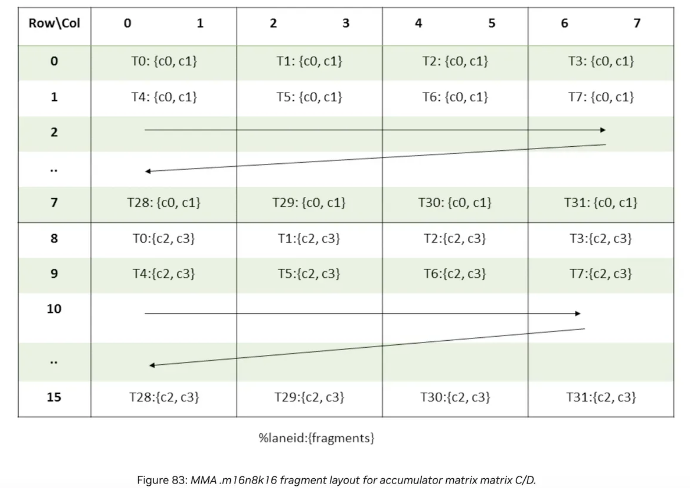

[TOC]

> 本文主要基于cuda官方文档：[URL](https://docs.nvidia.com/cuda/parallel-thread-execution/#instruction-set)

# 指令集基础

### 基本指令格式

PTX 指令：opcode是具体操作指令， 以及后面跟随0 到 4 个操作数，此外，在操作指令左侧可通过 `@` 符号添加一个可选谓词，具体形式如下：
- `@p   opcode;`
- `@p   opcode a;`
- `@p   opcode d, a;`
- `@p   opcode d, a, b;`
- `@p   opcode d, a, b, c;`

说明：

- `@p`用来控制指令的指定条件，`@!p`表示取反。

- `d` 表示目标操作数
- `a`、`b`、`c` 表示源操作数

**特殊情况：**

1. 下面指令会写入两个目标寄存器，用 `|` 符号分隔多个目标寄存器。  
   示例：`setp.lt.s32  p|q, a, b;  // p = (a < b); q = !(a < b);`

### 寄存器

**谓词寄存器**：

谓词寄存器专门用于存储布尔值（真 / 假），常用于条件执行。谓词寄存器的声明格式如下：

`.reg .pred p, q, r;`

- `.pred`是关键字，表示寄存器类型是谓词寄存器


**通用寄存器**：

用于存储多种类型的数据（如整数、浮点数地址等），支持各种算术和逻辑运算。声明格式如下：

`.reg .s32 a, b;`

其声明了两个 32 位整数寄存器`a`和`b`。

### 举例

对于高级代码：

```
if (i < n)
    j = j + 1;
```

其相应的PTX代码如下：

```
      setp.lt.s32  p, i, n;    // p = (i < n)，执行有符号 32 位整数的小于比较（Less Than）并设置相应的谓词寄存器
@p    add.s32      j, j, 1;    // if i < n, add 1 to j
```

条件分支PTX代码：

```
      setp.lt.s32  p, i, n;    // p = (i < n),
@!p   bra  L1;                 // if p 为 False, 跳转(bra)到标签L1对应的指令
      add.s32      j, j, 1;    // if p 为 True，执行该条指令
L1:     ...
```

### 指令和操作数的类型

指令必须包含数据类型修饰符。示例：

```
.reg .u16 d, a, b;   // 寄存器声明

add.u16 d, a, b;    // 执行16位无符号加法
```

有些指令需要多个数据类型修饰符，最典型的是数据转换指令`cvt`。它需要为结果和源分别指定数据类型修饰符，且修饰符的顺序与操作数的顺序一致。例如：

```
.reg .u16 a;
.reg .f32 d;

cvt.f32.u16 d, a;   // 将16位无符号整数a转换为32位浮点数d
```

通常情况下，操作数的数据类型必须与对应的指令类型修饰符一致。操作数与指令类型的一致性规则如下：
- 位大小类型与相同大小的任何类型一致。
- 有符号和无符号整数类型在大小相同时一致，且必要时整数操作数会被隐式转换为指令类型。例如，在有符号整数指令中使用无符号整数操作数时，该操作数会被指令当作有符号整数处理。
- 浮点类型仅在大小相同时才一致，即它们必须完全匹配。

当指令类型和操作数类型不匹配时：

- ld、st 和 cvt 指令允许源操作数和目的操作数的数据宽度大于指令类型的大小
- 位大小和整数（有符号与无符号）指令类型的操作数类型检查规则有所放宽；浮点指令类型仍要求操作数类型大小完全匹配，除非操作数是位大小类型
- 当源操作数大小超过指令类型大小时，源数据会被截断至指令类型大小所指定的相应位数

## 16bit的机器特定语义

PTX程序在支持不同数据类型的GPU上的执行情况：

- PTX程序可在16位或32位数据类型的GPU上运行。在32位数据类型上，PTX的16位寄存器会映射到32位物理寄存器，16位计算也会提升为32位计算，这可能导致同一代码在16位和32位机器上的计算结果出现差异，额外的精度位可能在应用层面显现（如右移指令）。

- 从PTX语言层面，一种解决方案是为16位代码定义与16位数据类型执行一致的语义，但这会使16位代码在32位数据类型上执行时产生性能损失（需额外屏蔽指令处理高位多余精度位）。

- 因此，PTX中16位指令的语义是机器特定的，以避免32位GPU上16位代码的性能损失。编译器或程序员可通过在程序适当位置添加显式16位转换来保证代码可移植性，但这对许多性能关键型应用并不理想，且很多应用更能接受执行差异而非限制性能。

# warp级矩阵乘累计指令

## WMMA

- 每个线程持有一个片段：Warp 中的 32 个线程，每个线程都会 “拿” 到矩阵的一小部分（即 “片段”），32 个线程的片段合起来才能构成完整的矩阵（或矩阵的一个分块）。
- 片段分布 “不透明”：片段在矩阵中的具体位置（比如哪个线程拿了矩阵的哪几行哪几列）是由 GPU 硬件架构（如 SM 7.0、8.0 等）决定的，用户不需要关心具体分布，只需按规则使用即可（这也是 “分布未指定” 的含义）。
- 片段可以在多个 wmma 操作中传递使用，但有严格的 “兼容性要求”：
  - 必须匹配的条件：如果一个片段要作为另一个 wmma 操作的输入，两个操作涉及的矩阵必须满足：形状、布局、元素类型
  - 如果两个函数编译时针对的 GPU 架构（SM 版本）不同，即使链接在一起，它们的片段也可能不兼容（因为不同架构对片段的内部布局设计可能不同）。
  - 不要把片段传给带有.weak链接属性的函数：这种函数在链接时可能被替换成其他模块的版本，而不同模块的片段布局可能不匹配，导致错误。

### Integer Fragment

#### 乘法矩阵

| 形状（m x n x k） | 矩阵A的片段构成                | 矩阵B的片段构成                | 背后逻辑                                                     |
| ----------------- | ------------------------------ | ------------------------------ | ------------------------------------------------------------ |
| `.m16n16k16`      | 2个`.b32`寄存器，每个存4个元素 | 2个`.b32`寄存器，每个存4个元素 | -  `.b32`是32位寄存器，每个能存4个8位元素（4×8=32）；<br>-  A和B的每个线程各拿2×4=8个元素，32个线程共拿32×8=256个元素，正好匹配16×16矩阵的大小（16×16=256）。 |
| `.m8n32k16`       | 1个`.b32`寄存器，存4个元素     | 4个`.b32`寄存器，每个存4个元素 | - A是8×16矩阵，每个线程拿4个元素，32线程共拿32×4=128个元素（8×16=128）；<br>- B是16×32矩阵，每个线程拿4×4=16个元素，32线程共拿32×16=512个元素（16×32=512）。 |

#### 累加器矩阵

矩阵乘法的结果（或中间累加结果）存在累加器中，元素类型是`.s32`（32位有符号整数，位数更高是为了避免计算时溢出）。

| 数据类型 | 形状（m x n x k） | 片段构成        | 解读                                                         |
| -------- | ----------------- | --------------- | ------------------------------------------------------------ |
| `.s32`   | `.m16n16k16`      | 8个`.s32`寄存器 | 16x16的结果矩阵，每个线程负责的片段需要用8个32位寄存器存储（32位寄存器直接存32位整数，无需像8位那样“打包”）。 |
| `.s32`   | `.m8n32k16`       | 8个`.s32`寄存器 | 每个线程负责的片段需要用8个32位寄存器存储                    |

### 低秩对齐

考虑下面的指令：

```shell
wmma.load.a.sync.aligned.row.m16n16k16.f16 {x0,...,x7}, [p], s;
```

- 段大小是32字节，每段可以存储8个.fp16×2数据（两个.fp16的向量）
- 指令中的`s`是 “步长”，但它的单位是`.f16`元素（不是字节）。因为 1 个`.f16`是 2 字节，所以将步长`s`转换为字节就是`2×s`。
- 因为片段大小是 32 字节，所以每一行的起始地址必须是 32 的倍数。
  - 基指针`p`是第一行的其实地址，p必须是32的倍数。
  - 第二行的其实地址是p+2×s，因此s也必须是32的倍数。
- 为什么要进行地址对齐？
  - 若地址对齐，硬件可以一次读取完整的段，效率极高。
  - 若地址不对齐，硬件可能需要分两次读取，然后裁剪，再拼接数据，会降低性能，甚至部分硬件不支持非对齐访问，直接导致程序出错。

### wmma.load

.f16浮点类型数据load指令：

```shell
wmma.load.a.sync.aligned.layout.shape{.ss}.atype r, [p] {, stride};
wmma.load.b.sync.aligned.layout.shape{.ss}.btype r, [p] {, stride};
wmma.load.c.sync.aligned.layout.shape{.ss}.ctype r, [p] {, stride};

.layout = {.row, .col};
.shape  = {.m16n16k16, .m8n32k16, .m32n8k16};
.ss     = {.global, .shared{::cta}};
.atype  = {.f16, .s8, .u8};
.btype  = {.f16, .s8, .u8};
.ctype  = {.f16, .f32, .s32};
```

- p是起始地址
- r是加载到的目标寄存器
- .ss表示支持从global memory或者share memory加载数据
- {, stride} 表示可选参数

**举例：**

```c
// 为当前线程分配 8 个 32 位的寄存器
// x<8>：声明一组寄存器变量，变量名前缀为x，数字范围从 0 到 7（即 x0, x1, x2, ..., x7），总共 8 个寄存器
.reg .b32 x<8>;
// 从行主序的f16矩阵B加载元素到寄存器
wmma.load.b.sync.aligned.m16n16k16.row.f16 {x0,x1,x2,x3,x4,x5,x,x7}, [ptr];

.reg .b32 x<8>;
// 从f32列主序矩阵C加载元素并缩放这些值
wmma.load.c.sync.aligned.m16n16k16.col.f32 {x0,x1,x2,x3,x4,x5,x6,x7}, [ptr];

// 对于C，现在使用{x0, ..., x7}进行实际的wmma.mma运算
mul.f32 x0, x0, 0.1;
// 对所有寄存器x<8>重复此操作；
...
mul.f32 x7, x7, 0.1;
// 现在使用{x0, ..., x7}进行实际的wmma.mma运算

.reg .b32 x<4>  // 寄存器x<4>各自包含四个打包的.u8值
// 从整型矩阵A加载元素
wmma.load.a.sync.aligned.m32n8k16.row.u8 {x0,x1,x2,x3}, [ptr];

.reg .b32 x<4>;
// 从.bf16矩阵A加载元素：
wmma.load.a.sync.aligned.m16n16k16.row.bf16 {x0,x1,x2,x3}, [ptr];
```

### wmma.store

**指令语法：**

```shell
wmma.store.d.sync.aligned.layout.shape{.ss}.type [p], r {, stride};

.layout = {.row, .col};
.shape  = {.m16n16k16, .m8n32k16, .m32n8k16};
.ss     = {.global, .shared{::cta}};
.type   = {.f16, .f32, .s32};
```

**举例：**

```c

.reg .b32 x<8>;
// 执行矩阵乘法累加操作 D += A×B。
wmma.mma.sync.m16n16k16.row.col.f32.f32 {d0, d1, d2, d3, d4, d5, d6, d7}, ...;
wmma.store.d.sync.m16n16k16.row.f32 [ptr], {d0, d1, d2, d3, d4, d5, d6, d7};

// Store s32 accumulator for m16n16k16 shape:
.reg .b32 d<8>;
wmma.store.d.sync.aligned.m16n16k16.row.s32 [ptr], {d0, d1, d2, d3, d4, d5, d6, d7};
```

### wmma.mma

**指令语法：**

```c
// Floating point (.f16 multiplicands) wmma.mma
wmma.mma.sync.aligned.alayout.blayout.shape.dtype.ctype d, a, b, c;

// Integer (.u8/.s8 multiplicands) wmma.mma
wmma.mma.sync.aligned.alayout.blayout.shape.s32.atype.btype.s32{.satfinite} d, a, b, c;

.alayout = {.row, .col};
.blayout = {.row, .col};
.shape  =  {.m16n16k16, .m8n32k16, .m32n8k16};
.dtype   = {.f16, .f32};
.atype   = {.s8, .u8};
.btype   = {.s8, .u8};
.ctype   = {.f16, .f32};
```

**举例：**

```c
.global .align 32 .f16 A[256], B[256];  // 32表示按照32位对齐
.global .align 32 .f32 C[256], D[256];
.reg .b32 a<8> b<8> c<8> d<8>;

wmma.load.a.sync.aligned.m16n16k16.global.row.f16
        {a0, a1, a2, a3, a4, a5, a6, a7}, [A];
wmma.load.b.sync.aligned.m16n16k16.global.col.f16
        {b0, b1, b2, b3, b4, b5, b6, b7}, [B];

wmma.load.c.sync.aligned.m16n16k16.global.row.f32
        {c0, c1, c2, c3, c4, c5, c6, c7}, [C];

wmma.mma.sync.aligned.m16n16k16.row.col.f32.f32
        {d0, d1, d2, d3, d4, d5, d6, d7},
        {a0, a1, a2, a3, a4, a5, a6, a7},
        {b0, b1, b2, b3, b4, b5, b6, b7},
        {c0, c1, c2, c3, c4, c5, c6, c7};

wmma.store.d.sync.aligned.m16n16k16.global.col.f32
        [D], {d0, d1, d2, d3, d4, d5, d6, d7};
```

## MMA

- MMA（Matrix Multiply Accumulate）是 NVIDIA GPU 中用于高效矩阵乘法的指令集，在 Ampere 架构及后续版本中得到广泛应用。

- 矩阵乘法和累加操作的形式为`D = A * B + C`，其中`D`和`C`被称为累加器，可能引用相同的矩阵。

- MMA描述每个线程束执行矩阵乘法时处理的子矩阵尺寸。有两种操作可以执行warp级别的MMA操作：`wmma`和`mma`。在Hopper上，为了获得最高的性能，应该使用`wgmma`指令。

### 相关PTX代码

#### 半精度MMA指令

```shell
# 指令格式：mma.sync.aligned.<m>x<n>x<k>.<a布局>.<b布局>.<d数据类型>.<a数据类型>.<b数据类型>.<c数据类型> d, a, b, c;

# m8n8k4定义矩阵乘法的基础计算单元大小（与输出矩阵相关）
# m=8：输出矩阵 D 的行维度大小为 8
# n=8：输出矩阵 D 的列维度大小为 8
# k=4：收缩维度大小为 4，即 A 的列数和 B 的行数
# alayout 和 blayout 是占位符
mma.sync.aligned.m8n8k4.alayout.blayout.dtype.f16.f16.ctype  d, a, b, c;

# 计算 16×8 的输出矩阵
# 明确指定A为行优先，B为列优先
mma.sync.aligned.m16n8k8.row.col.dtype.f16.f16.ctype  d, a, b, c;

# 计算 16×8 的输出矩阵，K 维度进一步扩展到 16
mma.sync.aligned.m16n8k16.row.col.dtype.f16.f16.ctype d, a, b, c;

.alayout = {.row, .col};  # 指定矩阵 A 的存储布局：行优先
.blayout = {.row, .col};  # 指定矩阵 B 的存储布局：行优先
.ctype   = {.f16, .f32};  # 指定操作数C的数据类型，包含两种
.dtype   = {.f16, .f32};  # 指定操作数D数据类型，包含两种
```

#### 指令骨架

```shell
mma.sync.aligned.m16n8k16.row.col.f32.f16.f16.f32
  {%Rd0, %Rd1, %Rd2, %Rd3},  # 输出矩阵D (4个FP32寄存器)
  {%Ra0, %Ra1, %Ra2, %Ra3},  # 输入矩阵A (4个FP16寄存器)
  {%Rb0, %Rb1},              # 输入矩阵B (2个FP16寄存器)
  {%Rc0, %Rc1, %Rc2, %Rc3};  # 累加矩阵C (4个FP32寄存器)
```

#### 该指令累加器矩阵的布局



这张图展示了 **MMA（矩阵乘法累加）指令中累加器矩阵 C/D 的分片布局**，对应 `mma.m16n8k16` 这类指令的硬件实现细节。核心是解释 **线程束（warp）内的线程如何协作处理 16×8 尺寸的累加器矩阵**，以下分层次拆解：

##### 基础概念

| 符号/维度  | 含义                             | 硬件关联                     |
| ---------- | -------------------------------- | ---------------------------- |
| `m16n8k16` | 输出矩阵尺寸：16行（M）×8列（N） | 每个线程束处理 16×8 的子矩阵 |
| `Row\Col`  | 矩阵的行（Row）和列（Col）索引   | 对应计算结果的二维位置       |
| `T0-T31`   | 线程束内的线程 ID（0-31）        | 32线程协作完成矩阵计算       |
| `{c0,c1}`  | 寄存器分片（Fragment）           | 线程存储的部分计算结果       |


##### 矩阵分片的「行-列-线程」映射
**1. 矩阵尺寸与线程分工**

- **目标矩阵**：16行（Row 0-15）×8列（Col 0-7），共 16×8=128 个元素。
- **线程束**：32个线程（T0-T31）协作，每个线程需处理 **128/32=4 个元素**（通过寄存器分片实现）。

**2. 行分组：2组×8行**

- 矩阵被分为 **2个行块**：
  - 第1块：Row 0-7（8行）
  - 第2块：Row 8-15（8行）

**3. 列分组：4列×2元素**

- 每列（Col 0-7）被拆分为 **2个元素的分片**（如 `{c0,c1}`、`{c2,c3}`）：
- 每个线程处理 **2个列元素**（通过寄存器存2个值），配合行处理实现 **4个元素/线程**（8行分组 × 2列分片 → 4元素/线程）。

**4\. 线程处理**

每个线程处理4个元素`c0`, `c1`, `c2`, `c3`。`c1`和`c2`之间的距离是8 * 8个元素。`c0`和`c1`一起是`8 bytes = 2 * sizeof(float)`


##### 硬件执行流程
1. **数据读取**：  
   线程束从全局内存/共享内存读取矩阵 A（16×16）、矩阵 B（16×8）的分片。  
   - A 矩阵：行优先存储，每个线程读取 2 个 FP16 元素（对应 `{a0,a1}` 分片）。  
   - B 矩阵：列优先存储，每个线程读取 2 个 FP16 元素（对应 `{b0,b1}` 分片）。  

2. **矩阵乘法**：  
   每个线程执行 **小矩阵乘法**（如 2×2×2），结果暂存到寄存器分片（如 `{c0,c1}`）。  

3. **累加同步**：  
   线程束内通过 `mma.sync` 指令同步，将 32 个线程的寄存器分片 **拼接成完整的 16×8 累加矩阵**，完成 `D += A×B + C` 的计算。    


##### 与 PTX 指令的映射
结合你之前的指令 `mma.sync.aligned.m16n8k16.row.col.f32.f16.f16.f32` 看：
- `.row.col`：A 行优先、B 列优先，对应图中矩阵 A/B 的存储方式。  
- `.f32.f16.f16.f32`：累加器 C/D 用 FP32（分片 `{c0,c1}` 实际是 FP32 存储），A/B 用 FP16（线程读取的分片是 FP16）。  


