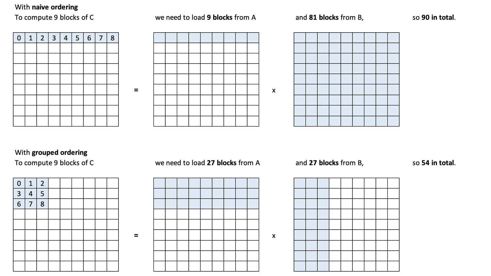

[TOC]


## Triton 操作的是physical view Contiguous()

1. CUDA编程中"连续性(Contiguity)"这个容易被忽视但非常重要的问题。它指出连续性问题可能会导致难以调试的静默bug，需要花费大量时间来解决。
2. 因此，完成一个triton kernel之后，只进行单元正确性和性能测试对于生产环境是不够的，因为生产环境会遇到张量连续性、张量形状和数据类型的差异。

2. 因此建议通过模拟真实的生产训练环境来验证模型输出(logits)、权重(weights)和损失值(loss)
3. 下面提供一个google colab脚本，用来进行Triton内核补丁版本与原始模型的逐层对比：[脚本](https://colab.research.google.com/drive/1e52FH0BcE739GZaVp-3_Dv7mc4jF1aif?usp=sharing)

## Triton 中的index越界bug

1. Triton的program_id是int32来表示的，然后在开发Cross Entropy时没有考虑到这一点，导致在较大的Vocab Size时index会越界。
2. 修复的方案是把program_id转换为int64
3. 不过，因为32位寻址可能会导致性能很慢，所以需要非常谨慎的处理这个问题。例如在PyTorch中，针对这两种不同的数据类型会通过C++模板来处理，它们的实现会共享一个kernel，但是可以避免这个index溢出的问题。
4. 这个脚本模拟了index越界的bug问题：[脚本](https://colab.research.google.com/drive/1WgaU_cmaxVzx8PcdKB5P9yHB6_WyGd4T?usp=sharing#scrollTo=X_Dn9wzVNpMC)

## Triton的矩阵乘法

### 重要函数

```python
@triton.jit
def get_1d_offset(size, n_prev_chunks):
    return n_prev_chunks * size + tl.arange(0, size)

@triton.jit
def get_2d_offset(offs_0, offs_1, stride_0, stride_1=1): 
    # offs_0, offs_1均是一维张量
    # 使用 tl.expand_dims 将 offs_0 和 offs_1 转换为二维张量
    # tl.expand_dims(offs_0, 1) 将 offs_0 转换为 (offs_0, 1) 形状的张量
    # tl.expand_dims(offs_1, 0) 将 offs_1 转换为 (1, offs_1) 形状的张量
    return tl.expand_dims(offs_0, 1)*stride_0 + tl.expand_dims(offs_1, 0)*stride_1

@triton.jit
def get_1d_mask(offs, max):
    return offs < max

@triton.jit
def get_2d_mask(offs_0, offs_1, max_0, max_1):
    # 使用 tl.expand_dims 将 offs_0 和 offs_1 转换为二维张量
    # tl.expand_dims(offs_0, 1) 将 offs_0 转换为 (offs_0, 1) 形状的张量
    # tl.expand_dims(offs_1, 0) 将 offs_1 转换为 (1, offs_1) 形状的张量
    return (tl.expand_dims(offs_0, 1) < max_0) & (tl.expand_dims(offs_1, 0) < max_1)
```

### 矩阵乘法kernel

```python
@triton.jit
def naive_matmul_k(
    a_ptr, b_ptr, c_ptr,
    m, n, k,
    stride_am, stride_ak, 
    stride_bk, stride_bn,
    stride_cm, stride_cn,
    bm: tl.constexpr, bn: tl.constexpr, bk: tl.constexpr
):
    # 获取当前线程块的二维 ID
    pid_m, pid_n = tl.program_id(0), tl.program_id(1)
    # 沿 m/n/k 维度分割计算
    rm = get_1d_offset(size=bm, n_prev_chunks=pid_m)  # 计算 m 维度的偏移量
    rn = get_1d_offset(size=bn, n_prev_chunks=pid_n)  # 计算 n 维度的偏移量
    rk = get_1d_offset(size=bk, n_prev_chunks=0)  # 计算 k 维度的偏移量
    # 计算 a 和 b 的相关偏移量
    # offs_a/offs_b均是二维的张量，每个值表示对应元素的偏移量
    offs_a = a_ptr + get_2d_offset(rm, rk, stride_am, stride_ak)  # 计算 a 的偏移量
    offs_b = b_ptr + get_2d_offset(rk, rn, stride_bk, stride_bn)  # 计算 b 的偏移量
    # 初始化并迭代更新累加器
    acc = tl.zeros((bm, bn), dtype=tl.float32)  # 初始化累加器
    # 每个block处理输出矩阵的（bk, bk）大小的元素
    for _ in range(0, k, bk):
        # todo umer: 加载 a 和 b 时是否需要掩码？
        a = tl.load(offs_a)  # 加载 a 的数据
        b = tl.load(offs_b)  # 加载 b 的数据
        acc += tl.dot(a, b, allow_tf32=False)  # 在块内进行矩阵乘法；注意：对于较旧的 GPU，allow_tf32 必须设置为 False，否则无法编译
        # 增加偏移量，以便下一次迭代加载下一个块
        offs_a += bk * stride_ak
        offs_b += bk * stride_bk
    c = c_ptr + get_2d_offset(rm, rn, stride_cm, stride_cn)  # 计算 c 的偏移量
    mask = get_2d_mask(rm, rn, m, n)  # 计算掩码
    tl.store(c, acc, mask=mask)  # 将结果存储到 c 中
```

### kernel调用

```python
from functools import partial

def matmul(a, b, matmul_k_fn, bs=16, group_sz=None):
    # 检查矩阵维度是否兼容
    assert a.shape[1] == b.shape[0], "矩阵维度不兼容，无法进行矩阵乘法"
    # 检查张量是否准备好在 GPU 上运行
    check_tensors_gpu_ready(a, b)
    # 获取矩阵 a 和 b 的形状
    (m, k), (_, n) = a.shape, b.shape
    # 创建一个空的输出张量 c
    c = torch.empty((m, n), device=a.device, dtype=torch.float16)
    
    # meta中数据的来源：显式传递的constexpr参数（如bm, bn, bk）；Triton 自动注入的硬件相关参数。
    # 定义网格函数，用于计算线程块的数量
    grid = lambda meta: (triton.cdiv(m, meta['bm']),  triton.cdiv(n, meta['bn']))
    # 处理 group_sz 参数，如果为 None，则使用空字典
    group_sz = {} if group_sz is None else {"group_sz":group_sz} # 在 naive_matmul 中未使用，但在后续的 grouped_matmul 中会用到
    # 调用 matmul_k_fn 函数，传入必要的参数
    matmul_k_fn[grid](
        a, b, c,
        m, n, k,
        a.stride(0), a.stride(1),  # k, 0
        b.stride(0), b.stride(1),  # n, 0
        c.stride(0), c.stride(1),  # n, 0
        bm=bs, bn=bs, bk=bs, # 注意：对于较旧的 GPU，allow_tf32 必须设置为 False，否则无法编译
        **group_sz
    )
    # 返回计算结果
    return c

# 使用 partial 创建一个部分应用的函数 naive_matmul
naive_matmul = partial(matmul, matmul_k_fn=naive_matmul_k)
```

### 重新排序块，提高L2缓存命中率

为了更好地利用 L2 缓存，我们希望重用最近加载的数据，这些数据很可能仍然在 L2 缓存中。

通过重新分配块的不同处理顺序，当块在加载数据时，可以更好的提高L2缓存命中率。

图中所示，每个蓝色块是一个block处理的数据块，第一种方式是传统的处理方式，第二种方式是重新分配块的处理顺序，使得加载数据时，L2缓存命中率更高



代码如下：

```python
@triton.jit
def grouped_matmul_k(
    a_ptr, b_ptr, c_ptr,  # 指向矩阵 A, B, C 的指针
    m, n, k,  # 矩阵的维度
    stride_am, stride_ak,  # 矩阵 A 的步长
    stride_bk, stride_bn,  # 矩阵 B 的步长
    stride_cm, stride_cn,  # 矩阵 C 的步长
    bm: tl.constexpr, bn: tl.constexpr, bk: tl.constexpr, group_sz: tl.constexpr  # 块大小和分组大小
):
    pid_m, pid_n = tl.program_id(0), tl.program_id(1)  # 获取当前线程块的 ID
    num_pid_m, num_pid_n = tl.num_programs(0), tl.num_programs(1)  # 获取线程块的总数
    # 确定块在分组排序中的位置 - 重新排列！
    pid_m, pid_n = tl.swizzle2d(pid_m, pid_n, num_pid_m, num_pid_n, group_sz)  # 奇怪的地方：tl.swizzle2d 在 CPU 模拟时不起作用
    # 沿 m/n/k 维度的块
    rm = get_1d_offset(size=bm, n_prev_chunks=pid_m)  # 计算 m 维度的偏移
    rn = get_1d_offset(size=bn, n_prev_chunks=pid_n)  # 计算 n 维度的偏移
    rk = get_1d_offset(size=bk, n_prev_chunks=0)  # 计算 k 维度的偏移
    # 矩阵 A 和 B 的相关偏移
    offs_a = a_ptr + get_2d_offset(rm, rk, stride_am, stride_ak)  # 计算矩阵 A 的偏移
    offs_b = b_ptr + get_2d_offset(rk, rn, stride_bk, stride_bn)  # 计算矩阵 B 的偏移
    # 初始化并迭代更新累加器
    acc = tl.zeros((bm, bn), dtype=tl.float32)  # 初始化累加器
    for _ in range(0, k, bk):
        # todo umer: 加载 a & b 时是否需要掩码？
        a = tl.load(offs_a)  # 加载矩阵 A 的块
        b = tl.load(offs_b)  # 加载矩阵 B 的块
        acc += tl.dot(a, b, allow_tf32=False)  # 块级别的矩阵乘法；奇怪的地方：对于较旧的 GPU，allow_tf32 必须设置为 False，否则无法编译
        # 增加偏移，以便下一次迭代加载下一个块
        offs_a += bk * stride_ak
        offs_b += bk * stride_bk
    c = c_ptr + get_2d_offset(rm, rn, stride_cm, stride_cn)  # 计算矩阵 C 的偏移
    mask = get_2d_mask(rm, rn, m, n)  # 计算掩码
    tl.store(c, acc, mask=mask)  # 将累加器的结果存储到矩阵 C 中
```

