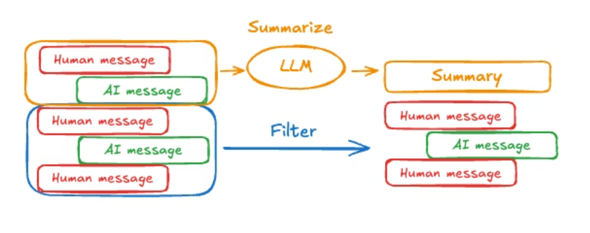

[TOC]

# Agent记忆管理的常见方法

在 Agent 系统中，往往存在多源输入（文档、检索结果、工具调用返回、对话历史等），其总长度经常超出模型的最大上下文窗口。因此，在受限的上下文 token 预算内，**为不同数据源分配合理的 token 配额**非常关键。常见做法是引入 **重排序（rerank）模型**，对候选内容进行打分筛选，只保留最相关、最有信息密度的上下文输入。

**1) 工具结果卸载到本地：用文件引用按需读取**

将工具调用的详细结果（例如调研材料、长表格、长文本）**卸载到本地存储**，并用 `file_id` 标识。上下文中只保留必要的摘要或索引信息，让模型自行判断是否需要进一步读取对应 `file_id` 的完整内容，从而显著降低上下文占用。

**2) 对话历史超长：摘要 + 原文落盘，避免“有损遗忘”**

当对话历史超过最大上下文时，常见方案是对历史进行摘要，但摘要属于**有损压缩**，容易丢失关键约束与细节，导致 agent “忘记任务要点”并出现效果退化。

改进方案是：**在生成摘要的同时，将原始对话历史卸载到本地**，并在上下文中提供指向该原文文件的引用（如 `history_file_id`）。当 agent 发现缺少关键细节时，可按需从本地文件回读，兼顾上下文可控与信息完整性。

**3) Skills 只放“索引”，细节放本地 skill.md**

对于 agent skills，上下文中仅保留 **skill 名称 + 简要描述 + 触发条件（可选）**。而 skill 的执行规范、步骤、边界条件、示例等详细内容统一存放在本地 `skill.md` 中；当模型决定使用某个 skill 时，再通过文件读取获取完整用法。

具体 skill 编写方式可参考 Anthropic 的文章：[URL](https://websearchapi.ai/blog/how-to-create-claude-code-skills)

**4) MCP 服务信息分层：静态清单 + 本地参数说明**

Agent 系统通常依赖多个 MCP 服务，而服务名称、能力描述、参数定义会显著占用上下文。可采用分层策略：

- **静态上下文**：仅保留 MCP 服务清单（名称、简要用途、选择建议）。
- **本地文件**：存放与服务相关的详细说明（输入/输出参数、示例调用、错误码、限流策略等）。

当 agent 需要调用某个 MCP 服务时，再读取本地文件获取细节，避免把“参数手册”常驻在上下文里。

**5) 上下文编辑：移除低价值内容以稳定长期运行**

在长时间运行的 agent 中，可能累计读取上百篇文档、产生大量工具调用。为了控制 workflow 并防止上下文膨胀，可以进行**上下文编辑（context editing）**：

- 移除或替换**已确认无用**的文档片段；
- 将工具调用的冗长结果移出上下文，仅保留结论、关键证据索引与 `file_id`；
- 对阶段性完成的信息做结构化沉淀（结论、决策、约束、待办）。

**6) 子 Agent：用上下文隔离实现解耦**

子 agent 使用**独立上下文**执行子任务，默认不与主 agent 共享全部过程，只向主 agent 返回结构化结果，从而实现上下文解耦、降低主上下文负担。

对于高度复杂或强依赖推理链条的任务，也可以选择性共享主/子上下文（例如共享关键约束与中间结论），在可控成本下提升一致性。

**7) 持续学习：把可复用知识固化到本地**

将可复用的信息沉淀到本地存储，减少重复输入与反复试错，例如：

- 执行任务所需的基础信息与固定约束；
- 成功执行的标准流程（playbook）；
- 失败案例与避坑清单（错误路径、常见误用、回滚策略）。

**8) 目标稀释问题：用 Todo 文件对抗“任务遗忘”**

在长上下文场景中，任务目标容易被逐步稀释。可创建 `todo.md` 或任务清单文件，将目标拆解为可勾选条目；每完成一项就打钩，并在每轮规划时对齐 todo 状态，显著降低遗漏风险。

# Langchain记忆管理

## short memory

对话历史裁剪：对于超过最大长度的对话内容进行裁剪。按 token 计数策略保留最近一段对话历史。

对话历史删除：可以对话历史中删除指定的对话。删除指定消息，甚至可以清空全部消息。

对话历史摘要：保留最近的N轮对话，对更早的对话进行摘要

## Long memory

longchain把长记忆分成了三种类型：

Semantic memory：事实类型记忆，比如Profile，事实性记忆片段，这些基于通常需要用新对话进行更新

Episodic memory：记过去的经历或具体事件。比如代理上次是怎么成功完成某个任务的，可以作为例子参考。

Procedural memory：记做事的规则和流程。这决定了代理“怎么”做事，比如它的核心逻辑和提示。

# Anthropic prompt engineering

基础技巧：

这是提升AI响应质量的基础，坚持使用能快速看到效果。

- 指令要明确清晰：用直接的动作动词开头，跳过无关铺垫，明确说明输出需包含的内容、质量要求和深度预期，不假设AI能推断你的需求。
- 提供背景与动机：解释需求的目的、受众、使用场景或约束原因，帮助AI理解核心目标，做出更贴合的回应。
- 内容要具体详实：明确约束条件（如字数、格式）、相关背景（受众、目标）、输出结构（表格、段落等）以及特殊要求（如饮食限制、技术规范），越具体越易获得理想结果。
- 合理使用示例：当输出格式、语气难以用文字描述，或简单指令效果不佳时，可提供1-2个示例（即少样本提示），但需确保示例符合期望行为。
- 允许表达不确定性：明确告知AI若信息不足可直接说明，无需猜测，以此减少幻觉，提升响应的可信度。

进阶技巧（应对复杂场景）

面对复杂任务、结构化输出或多阶段需求时，可采用以下进阶方法：

- 预填充响应：提前给出响应的开头或框架（如JSON的左括号），引导AI遵循特定格式、语气或结构，尤其适合结构化数据输出场景。
- 思维链提示：要求AI分步推理后再给出答案，适用于复杂分析类任务。现代模型的“扩展思考”功能可自动实现结构化推理，手动使用时可通过明确推理步骤或标签分隔推理过程与最终答案。
- 控制输出格式：避免否定式表述，改用正向引导；让提示格式与期望输出保持一致；详细说明格式偏好，明确可使用的标记类型及适用场景。
- 提示链：将复杂任务拆解为多个连续的简单步骤，每个步骤用单独提示处理，前一步输出作为后一步输入，通过迭代优化提升准确性，虽增加一定延迟，但能显著改善复杂任务的可靠性。

问题排查与避坑指南

问题排查：

- 响应太笼统：增加特异性要求，明确需“超越基础内容”，或补充示例。
- 偏离主题：重新明确核心目标，补充需求背景和使用场景。
- 格式不一致：添加示例或使用预填充功能。
- 复杂任务结果不可靠：拆分任务为提示链，每个步骤聚焦单一目标。
- 存在不必要铺垫：明确要求“跳过铺垫，直接给出答案”或使用预填充。
- 出现虚构信息：重申允许AI表达不确定性的规则。

错误避免：

- 不盲目追求长提示，避免过度工程化，简洁有效即可；
- 不忽视基础技巧，若核心指令模糊，进阶方法也无法弥补；
- 不假设AI能“读懂想法”，所有需求都需明确表述；
- 不堆砌技巧，根据具体问题选择适配的方法；
- 不放弃迭代，首次提示未必完美，需测试优化；
- 不依赖过时技巧，优先使用明确指令而非复杂标签或角色设定。

