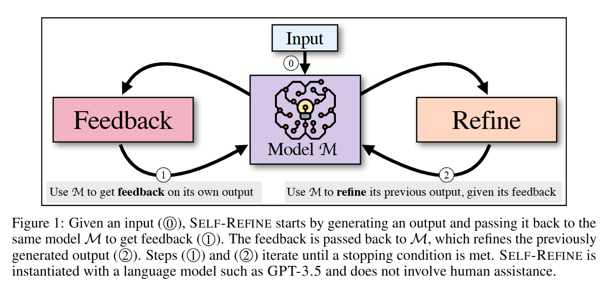

[TOC]

# Agent 

- LLMRefine: Pinpointing and Refining Large Language Models via Fine-Grained Actionable Feedback

  - 2024, NAACL

  - 不同于self-refine，Refine核心思想是利用一个经过训练的细粒度反馈模型来精准定位缺陷，并指导大语言模型（LLM）对其进行迭代优化。

- Self-Refine: Iterative Refinement with Self-Feedback

  - 2023.03

  - 大模型生成内容之后，然后用同一个大模型扮演批判者，对生成内容进行批判，反馈结果再给到大模型对生成内容进行优化，该过程重复多次

  - 

- Measuring and Narrowing the Compositionality Gap in Language Models

  - 2022.10, self-ask, 

  - 直接看图：

    

- [ReAct (Reason+Act) prompting in LLMs](https://tsmatz.wordpress.com/2023/03/07/react-with-openai-gpt-and-langchain/)

  - 2022.10, ReAct

  - 详细说明了ReAct原理，即“reasoning -> action -> observation”的不断迭代并得出最终结果的过程。以action为web search为例，搜索的结果需要填充在observation位置，然后接着输入大模型生成reasoning、action，继续把搜索结果填充在observation位置，再次输出大模型生成reasoning、action，该过程持续多次并得到最终结果。

  - 提供了few-shot和zero-shot的prompt构建方式

  - ReAct方法消耗大量的tokens，Blog也提及了一种改进算法ReWOO，一次性生成完整的reasonings、actions，然后顺序执行所有的actions并汇总结果。缺点是不能动态纠正。

- Survey

  - A Survey on Large Language Model based Autonomous Agents
    - https://github.com/Paitesanshi/LLM-Agent-Survey

  - The Rise and Potential of Large Language Model Based Agents: A Survey

# agent框架

- langchain
  - https://github.com/langchain-ai/langchain
  - 支持各种prompt提示方案
  - 支持多种任务链组成方案来处理复杂任务
  - 支持检索增强生成（include文本索引）
  - 支持基于摘要和检索的memory
  - 支持agent
- AutoGPT
  - https://github.com/Significant-Gravitas/AutoGPT
  - 仅支持单agent
- MetaGPT
  - https://github.com/geekan/MetaGPT
  - 支持单agent和多agent
- https://github.com/OpenBMB/ChatDev
- https://github.com/OpenBMB/AgentVerse

- AutoGen
  - https://github.com/microsoft/autogen
  - 支持单agent和多agent
  - 支持真人介入
- XAgent
  - https://github.com/OpenBMB/XAgent

# 基础内容

## 工具数量爆炸导致模型动作选择混乱？

在工具增强的大模型或 Agent 系统中，随着可用工具数量和类型的不断扩展，模型在每一步推理中面临的动作空间急剧膨胀，导致动作选择不稳定、误用或滥用工具等问题

### 方案一：基于 Logits 掩码的动态动作约束

**方案**：在解码阶段引入状态依赖的 logits 掩码机制，根据当前上下文动态屏蔽不合法或不相关的动作 token（如特定工具前缀对应的 token 集合），从而在不移除工具定义的前提下，显式约束模型的可选动作空间。该方法通过在概率层面将非法动作的生成概率置零，使模型只能在当前状态允许的工具子集中进行选择，有效降低动作空间复杂度并提升行为稳定性。

### 方案二：基于状态机的响应模式管理

**方案**：通过构建显式的状态机，对模型在不同推理阶段的响应模式进行管理，预先限定其输出类型（如自由选择、必须调用工具或指定调用某一工具），而非由模型隐式推断。状态机根据上下文切换响应模式，并与工具调用流程解耦，在不修改工具定义的情况下约束模型的高层行为路径，从而确保推理流程的结构一致性并减少工具调用混乱。

# Blog

- [一文搞懂Agent开发核心链路](https://mp.weixin.qq.com/s/gSDpv742AcDg7Jn4Ayppyg)
  - 提出多个agent开发中的问题及其解决方案
  - agent benchmark等

- [Agent及其主流框架介绍](https://mp.weixin.qq.com/s/qyCLff0WG15bEQvjodF-GQ)

- [Anthropic使用代码来调用工具](https://mp.weixin.qq.com/s/XHuQghz8bHXqxes_0dS3FQ)
  - 适用在工具链执行，但不依赖工具执行结果的系统中，如：读取数据->存储数据
  - 让Token消耗暴降98.7%

- [Lumine：在3D开放世界中打造通用智能体](https://www.lumine-ai.org/)

- [Ahthropic 如何构建多agent系统](https://www.anthropic.com/engineering/multi-agent-research-system)

- [大模型agent](https://zhuanlan.zhihu.com/p/662239288)

- Agentic Context Engineering（ACE）
  - [无需微调，让智能体自我学习与进化（上）](https://mp.weixin.qq.com/s/CIzchmwwHhNu7xo4KR9D3w)
  - [实现一个可自我学习与进化的智能体原型（下）](https://mp.weixin.qq.com/s/2ra6JQlUJQM0SLTi44ef8A)

- [大模型的外部工具调用能力](https://mp.weixin.qq.com/s/1v4Oc0XHROlUEqxi2p4xbg)

- [从第一性原理看大模型Agent技术](https://mp.weixin.qq.com/s/PL-QjlvVugUfmRD4g0P-qQ)