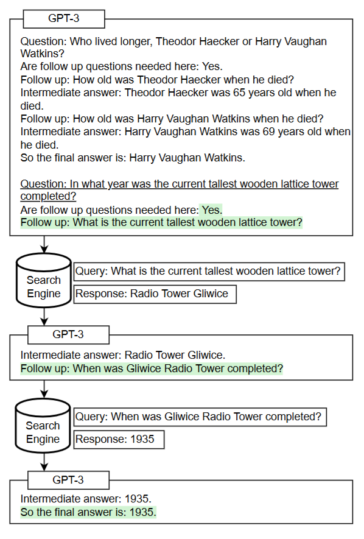

[TOC]

# Agent 

- Measuring and Narrowing the Compositionality Gap in Language Models

  - 2022.10, self-ask, 

  - 直接看图：

    

- [ReAct (Reason+Act) prompting in LLMs](https://tsmatz.wordpress.com/2023/03/07/react-with-openai-gpt-and-langchain/)

  - 2022.10, ReAct

  - 详细说明了ReAct原理，即“reasoning -> action -> observation”的不断迭代并得出最终结果的过程。以action为web search为例，搜索的结果需要填充在observation位置，然后接着输入大模型生成reasoning、action，继续把搜索结果填充在observation位置，再次输出大模型生成reasoning、action，该过程持续多次并得到最终结果。

  - 提供了few-shot和zero-shot的prompt构建方式

  - ReAct方法消耗大量的tokens，Blog也提及了一种改进算法ReWOO，一次性生成完整的reasonings、actions，然后顺序执行所有的actions并汇总结果。缺点是不能动态纠正。

- Survey

  - A Survey on Large Language Model based Autonomous Agents
    - https://github.com/Paitesanshi/LLM-Agent-Survey

  - The Rise and Potential of Large Language Model Based Agents: A Survey

# agent框架

- langchain
  - https://github.com/langchain-ai/langchain
  - 支持各种prompt提示方案
  - 支持多种任务链组成方案来处理复杂任务
  - 支持检索增强生成（include文本索引）
  - 支持基于摘要和检索的memory
  - 支持agent
- AutoGPT
  - https://github.com/Significant-Gravitas/AutoGPT
  - 仅支持单agent
- MetaGPT
  - https://github.com/geekan/MetaGPT
  - 支持单agent和多agent
- https://github.com/OpenBMB/ChatDev
- https://github.com/OpenBMB/AgentVerse

- AutoGen
  - https://github.com/microsoft/autogen
  - 支持单agent和多agent
  - 支持真人介入
- XAgent
  - https://github.com/OpenBMB/XAgent

# Blog

- [Agent全面爆发！一文搞懂Agent开发核心链路](https://mp.weixin.qq.com/s/gSDpv742AcDg7Jn4Ayppyg)
  
- [大模型agent](https://zhuanlan.zhihu.com/p/662239288)
  
- Agentic 上下文工程：无需微调，让智能体自我学习与进化
  - [实战·Agentic 上下文工程（上）：无需微调，让智能体自我学习与进化](https://mp.weixin.qq.com/s/CIzchmwwHhNu7xo4KR9D3w)

  - [实战·Agentic 上下文工程（下）：实现一个可自我学习与进化的智能体原型](https://mp.weixin.qq.com/s/2ra6JQlUJQM0SLTi44ef8A)

- [论文导读 | 大模型的工具学习](https://mp.weixin.qq.com/s/G2thTH204ufM71qzovSNsQ)

- [大模型的外部工具调用能力](https://mp.weixin.qq.com/s/1v4Oc0XHROlUEqxi2p4xbg)

- [Paper: ToolLLM：开源大模型工具使用能力的新高峰](https://mp.weixin.qq.com/s/nNueOgD-6TPfG_wMm3USFw)

- [Paper: HuggingGPT： 用ChatGPT和它的朋友在HuggingFace中解决AI任务](https://zhuanlan.zhihu.com/p/619763221)

- [OpenBMB的BMTools笔记](https://zhuanlan.zhihu.com/p/639581784)

- [从第一性原理看大模型Agent技术](https://mp.weixin.qq.com/s/PL-QjlvVugUfmRD4g0P-qQ)