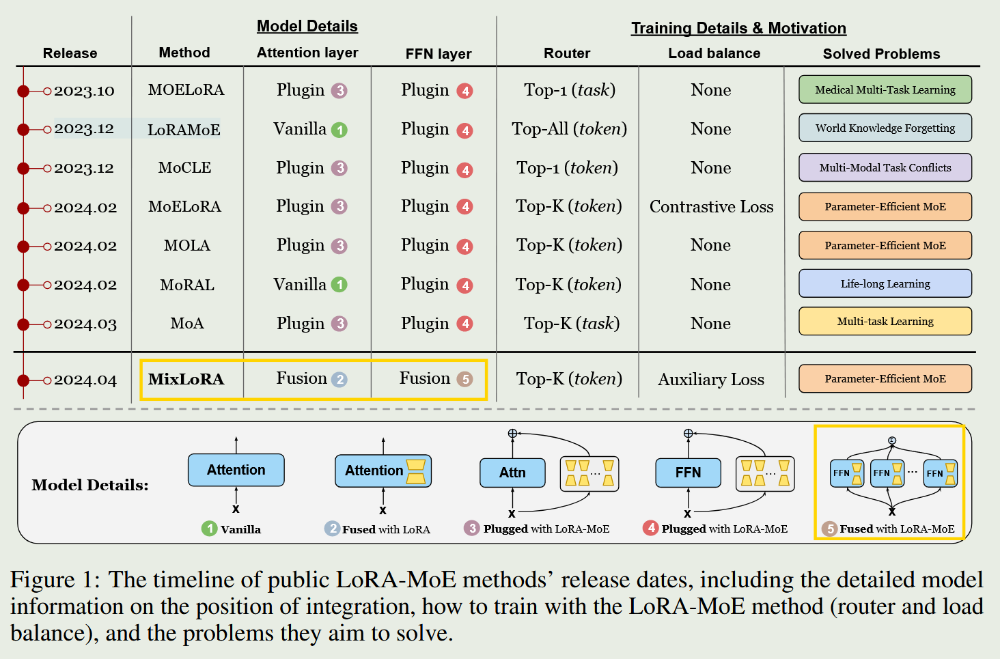

[TOC]

## llm

- https://github.com/OpenBMB/BMPrinciples
  - A collection of phenomenons observed during the scaling of big foundation models, which may be developed into consensus, principles, or laws in the future

- https://github.com/modelscope/data-juicer
  - A one-stop data processing system to make data higher-quality, juicier, and more digestible for (multimodal) LLMs

  - 为大模型提供更高质量、更丰富、更易”消化“的数据

- https://github.com/wdndev/llm_interview_note
  - 主要记录大语言大模型（LLMs） 算法（应用）工程师相关的知识及面试题

- https://github.com/open-compass/opencompass
  - OpenCompass is an LLM evaluation platform, supporting a wide range of models

- https://github.com/modelscope/evalscope
  - A streamlined and customizable framework for efficient large model evaluation and performance benchmarking

- [从头预训练大模型实践经验](https://mp.weixin.qq.com/s/LvOsS25mSRFWAHYv9IqTyQ)

- https://github.com/yanqiangmiffy/how-to-train-tokenizer

- [大模型的涌现能力介绍](https://mp.weixin.qq.com/s/Jymq2ho3VQx7-o6y-JHxeg)

- https://github.com/huggingface/datatrove
  - 大规模处理、过滤和删除重复文本
- An Empirical Study of Catastrophic Forgetting in Large Language Models During Continual Fine-tuning

## leaderboard

- https://flageval.baai.ac.cn/#/trending
- https://opencompass.org.cn/leaderboard-llm
- https://huggingface.co/spaces/HuggingFaceH4/open_llm_leaderboard
- https://cluebenchmarks.com/superclue.html
- https://github.com/google/BIG-bench
- https://github.com/suzgunmirac/BIG-Bench-Hard
- LongBench
  - eval datasets: https://kaiokendev.github.io/context
  - https://github.com/THUDM/LongBench#leaderboard
  - 清华 中英文大模型评估
- 偏好数据标注工具
  - https://github.com/SupritYoung/RLHF-Label-Tool

- 大模型评测中文benckmark
  - C-Eval：https://cevalbenchmark.com/index.html

## MoE

- https://github.com/TUDB-Labs/MoE-PEFT
- MIXLORA: Enhancing Large Language Models Fine-Tuning with LoRA-based Mixture of Experts
  - 2024.04
  - 提出了MixLoRA，不同于其它方法，MixLoRA的每个专家都由原始模型层结构和LoRA组成，与传统的MoE模型更加相似。
  - MixLoRA使用top-k router策略，训练时加入了expert balance loss，MixLoRA也探索了对self-attention使用MoE-LoRA，结果是进一步提升了整体效果。整体结构与PESC非常相似。
  - 

- Higher Layers Need More LoRA Experts
  - 2024.02
  - 论文验证了模型的较低层的expert之间相似性更大，存在参数冗余
  - 论文提出了MoLA，从对比实验中可以得出，固定expert的总数，模型较高层相比较低层设置更多的expert，效果表现最好
  
- Parameter-Efficient Sparsity Crafting from Dense to Mixture-of-Experts for  Instruction Tuning on General Tasks
  - 2024.01，PESC
  
  - 提出了一种MoE-LoRA架构模型PESC，该方法使用了串行结构的adapter-MoE，并在损失中添加了expert balance loss
  
- LoRAMoE: Alleviate World Knowledge Forgetting in Large Language Models via MoE-Style Plugin
  - 2023.12
  - 实验发现在SFT阶段显著增加指令数据量会损害LLMs中的世界知识
  - 引入了LoRAMoE框架，通过集成LoRAs和路由器来增强模型处理下游任务的能力，同时减轻世界知识遗忘。具体是提出局部平衡约束，以鼓励专家之间的合作，并在不同类型的任务上实现专家的专业化。
- When MOE Meets LLMs: Parameter Efficient Fine-tuning for Multi-task Medical Applications
  - 2023.10
  - 主要为了解决任务多样性问题和高昂的调优成本，提出的方法主要应用的医疗领域
  - MOELoRA：结合了MoE和LoRA，核心是门控的设计，具体是不同层共享门控，构建任务类型的embedding，通过一个线性层输出专家权重，这里可以使用稀疏和非稀疏的加权方式。
  - 推理时，可以恢复出每个任务类型的微调权重，并将微调权重与原始模型合并，避免的MoE带来的额外推理成本
- Pushing Mixture of Experts to the Limit:  Extremely Parameter Efficient MoE for  Instruction Tuning
  - 2023.09
  - 提出了结合peft和MoE的两种方法MoV和MoLoRA
  - 结论1：上一层网络输出x作为门控网络的输入相比sentence embedding效果更好
  - 结论2：专家数量达到10时，效果开始区域稳定
  - 结论3：soft merging策略相比离散路由策略效果更好

### Blog

- [Mixture-of-Experts (MoE) 经典论文一览](https://zhuanlan.zhihu.com/p/542465517)
- [对MoE大模型的训练和推理做分布式加速——DeepSpeed-MoE论文速读](https://zhuanlan.zhihu.com/p/466363675)

## LLM和知识图谱

- [万字长文讲述大模型与知识图谱的关系](https://zhuanlan.zhihu.com/p/626433991)
- [LLM 时代的金融知识图谱实践](https://zhuanlan.zhihu.com/p/623104680)
  - 比较基础

## 大模型幻觉

- Semantic uncertainty: Linguistic invariances for uncertainty estimation in natural language generation
  - 2023, ICLR

  - 背景：传统不确定性方法（预测熵、词汇相似度）存在核心挑战：语义等价（不同句子但是表达相同，可能被认为意义不确定）、语言空间的高纬性（语言的输出概率只能通过蒙特卡洛采样，低概率序列影响熵的估计）、生成长度（意义相同的句子概率差异大）
  
  - 论文提出语义熵，一种基于意义分布而非序列分布的不确定性度量，核心是将模型输出从 “token 序列空间” 映射到语义等价类空间。
  
  - 从 LLM 的预测分布中采样M个输出序列（如M=10），无需修改模型，仅用单模型采样
  
  - 通过双向蕴含算法，将 “表达相同意义” 的序列聚类为 “语义等价类，使用微调过 MNLI 数据集的 DeBERTa-large 模型，判断 “上下文 + s” 与 “上下文 + s'” 是否双向蕴含。
  
  - 先计算每个语义类的概率，即将类内所有序列的概率求和，再计算语义类分布的熵。
  
- R-Tuning: Instructing Large Language Models to Say ‘I Don’t Know’
  - 2023.11，NAACL 2024
  - 提出了一种解决大模型幻觉现象的方法，即通过训练的方式让大模型拒答或者表示不确定性
  - 拒答数据生成：首先用native模型生成指令集的预测结果，与ground truth对比，确定哪些指令集是native模型可回答的，哪些是不能回答的。使用一个prompt将指令集组合起来，并根据指令集的分类结果，以“I am sure” or “I am not sure”作为回复
  - 使用拒答数据来微调模型，注意，只计算answer和“I am sure” or “I am not sure”的loss
  - 推理时，先用native模型生成answer，然后用prompt组合起来，送入微调好的模型，得到模型的置信输出
  - 不太适合用在在线对话模型上

- Fine-grained Hallucination Detection and Editing for Language Models
  - 2024， COLM
  - 构建细粒度幻觉分类体系，将 LM 幻觉划分为实体 / 关系 / 句子级矛盾、虚构、主观、不可验证 6 类，明确各类型特征与验证需求
  - 打造 FAVABENCH 基准数据集，通过人工标注 3 个主流 LM 对 200 条信息查询指令的输出，形成约 1000 条含错误片段、类型及修正建议的细粒度标注数据；
  - 开发检索增强型模型 FAVA，基于 35k 条合成训练数据（按分类体系插入错误生成）训练，先检索 Top5 相关 Wikipedia 文档获取事实支撑，再精准检测细粒度幻觉并输出修正后的文本。
- Language Models (Mostly) Know What They Know
  - 2022
  - 该研究了语言模型对自身知识和输出的评估能力，发现大模型在合适格式（如带字母标记选项的选择题）下，在多类选择题和判断题任务中具有良好的校准性，即概率预测与实际正确率匹配
  - 通过让模型先生成答案再评估答案正确的概率，实现对开放式任务的自我评估，且提供多个自身样本辅助评估可提升性能
  - 训练模型预测自身能正确回答问题的概率，模型在该任务上表现良好且能部分跨任务泛化（如从 trivia 到数学、代码）

**Blog:**

- [大模型幻觉缓解方案](https://mp.weixin.qq.com/s/qa5SjDDUMwRBacoNBxbpPQ)
- [OpenAI 《Why Language Models Hallucinate》论文解读](https://zhuanlan.zhihu.com/p/1949144852601237594)
  - 探讨了大型语言模型产生幻觉的原因、表现及解决思路。
  - 幻觉表现为模型在不确定时生成看似合理却错误的内容，源于训练与评估流程更倾向于奖励猜测行为。预训练阶段，生成任务的复杂性及统计因素导致幻觉；后训练阶段，评估体系的二进制评分方式使幻觉持续存在。
  - 解决方法是修改评分规则，加入置信度目标，而非新增幻觉评估项目，以此引导模型诚实表达不确定性，提升可信度。
- [大模型：降低幻觉的六种方法](https://mp.weixin.qq.com/s/LNcRJ6OEiBNeGCtTysUewA)
- [大模型中的幻觉本质原因是什么？如何通过训练或推理手段抑制？](https://mp.weixin.qq.com/s/HWYdAZraztAnzw2b-TGe-g)
- [怎么阻止大模型说瞎话？](https://zhuanlan.zhihu.com/p/676530275)
  - 列举了缓解大模型幻觉的几个方法
- [John Schulman：强化学习与真实性，通往TruthGPT之路](https://juejin.cn/post/7229891752647950394)
  - 理论性和启发性很强

- [大模型「幻觉」，看这一篇就够了 | 哈工大华为出品](https://zhuanlan.zhihu.com/p/667478955)
  - 一篇综述性质的文章

## RolePlay

- RoleLLM: Benchmarking, Eliciting, and Enhancing Role-Playing Abilities of Large Language Models

  - https://github.com/InteractiveNLP-Team/RoleLLM-public
- https://github.com/LC1332/Chat-Haruhi-Suzumiya

  - trick: 动作、表情、心理以及对应的场景描写，通常中文放在（）里
- [角色扮演大模型技术分享](https://zhuanlan.zhihu.com/p/685823865)
- [论文阅读_训练大模型用于角色扮演](https://zhuanlan.zhihu.com/p/678889518)

- leaderboard
  - https://github.com/boson-ai/RPBench-Auto
  - https://github.com/morecry/CharacterEval
  - https://github.com/InteractiveNLP-Team/RoleLLM-public
  - https://github.com/CLUEbenchmark/SuperCLUE-Role
- Open-source LLM
  - https://huggingface.co/bosonai/Higgs-Llama-3-70B
  - https://github.com/thu-coai/CharacterGLM-6B

## 大模型遗忘

### 主流方法

- EWC（Elastic Weight Consolidation），基于正则化的方法
  - 损失函数： $ \mathcal{L} = \mathcal{L}_{B} + \sum_i \frac{\lambda}{2} F_i (\theta_i - \theta^{*}_{A,i})^2 $
  - A 表示旧任务，B 表示新任务，$ F $ 是 Fisher 矩阵，用来衡量每个参数对旧任务损失的敏感度。如果某个参数对旧任务重要，新任务训练更不允许改变它，如果对旧任务不重要，则更可以改变。

- 经验回放
  - LAMOL，生成式回放，让模型生成虚拟的旧任务数据
    - 经验回放可以防止大模型遗忘，但是很多时候无法获取旧数据，LAMOL方法是用大模型本身来生成数据，作为“旧数据”，然后再把“旧数据”和新任务数据混合训练。
  - Self-Synthesize Rehearsal (Magpie)：让基础模型自问自答，生成数据，然后将这些“自己合成”的数据用于后续训练。
  - 改写 (Paraphrase)：不用人工标注的答案，而是让基础模型将标准答案“换句话说”，再用改写后的答案去训练。因为改写后的句子更符合模型自身的语言风格，学习起来更不容易引起冲突。
  - 自输出 (Self-Output)：将新任务的问题输入基础模型，让它直接生成答案，通过某种机制验证答案是否正确，如果答案正确，就用模型自己的输出作为标准答案来训练它自己，它本质上是在强化模型已有的、正确的知识路径。
  - 过滤困难样本：一篇研究发现，人工标注的答案中，有些词元（token）对于基础模型来说是极难生成的（即低机率）。如果在训练时，直接忽略掉这些对模型来说过于困难的学习目标（不计算这些 token 的损失），反而能让模型学得更好，同时更好地保留原有能力。
- Task Vector，模型合并，通过向量叠加或抵消来合并新旧任务参数
- Gradient Projection，梯度投影，将新任务梯度投影到与旧任务冲突最小的方向上

### Paper

- Retaining By Doing: The Role of On-policy Data in Mitigating Forgetting
  - 2025.10
  - 论文证明了 RL 相比 SFT 训练之后的灾难性遗忘更低，RL 训练时能够更好的保持先前的任务知识。
- A Comprehensive Survey of Continual Learning:  Theory, Method and Application
  - 2024.08, survey

### Blog

- [每天一道大模型面试题 | 如何解决大模型训练中的灾难性遗忘问题？](https://mp.weixin.qq.com/s/UYIw5ceZgWD7XXEOkaIklA)
- [缓解LLM fine-tune模型遗忘](https://zhuanlan.zhihu.com/p/700156271)
- [ICLR 2025 | 大模型“遗忘”竟是错觉？首次揭示 LLM 训练中的“虚假遗忘”](https://zhuanlan.zhihu.com/p/23021161842)
  - 通过冻结模型底层若干层（如6层或者10层，以及输入嵌入层），可以显著防止对旧任务对齐的过度破坏
  - 但是冻结层数过多，会降低对新任务的适应能力，因此需要进行权衡。
- [UIUC、Amazon团队最新研究指出SFT灾难性遗忘问题或被误解](https://mp.weixin.qq.com/s/29pDMmX821Z10yFPFZ-5Ng)
  - 只需是要较小的学习率，即可缓解SFT的灾难性遗忘问题
  - 发现造成灾难性遗忘的问题主要是训练数据中的难token，提出了TALR方法，即token预测概率低自适应的分配更小的loss权重。
