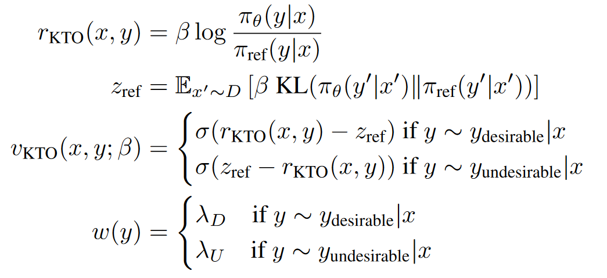

[TOC]

## resource

- [The N Implementation Details of RLHF with PPO](https://huggingface.co/blog/the_n_implementation_details_of_rlhf_with_ppo)
- https://github.com/huggingface/trl
- https://github.com/huggingface/alignment-handbook
  - DPO，IPO，KTO，excluding PPO and reward model
- https://github.com/microsoft/DeepSpeedExamples/tree/master/applications/DeepSpeed-Chat
  - reward model realted codes from trlx
- https://github.com/hpcaitech/ColossalAI/tree/main/applications/ColossalChat
  - 提及两种reward loss计算方法
- https://github.com/OpenLMLab/MOSS-RLHF
- https://github.com/SupritYoung/Zhongjing
  - 医疗领域，使用了rlhf
- https://huggingface.co/blog/trl-peft
- finetune Mistral-7b with DPO 
  - [Fine-tune a Mistral-7b model with Direct Preference Optimization](https://towardsdatascience.com/fine-tune-a-mistral-7b-model-with-direct-preference-optimization-708042745aac)
- https://github.com/CarperAI/trlx
- https://huggingface.co/blog/pref-tuning
  - DPO/IPO/KTO等模型的对比实验
  - 经过bug修复的IPO实现的最好的效果。其次是KTO相比DPO/IPO-src相关更好，当时在一定的超参设置下，DPO/IPO也能取得相比KTO更好的效果
  - 经过实验验证，DPO仍然是鲁棒性比较强的模型，KTO不需要成对的偏好数据，因此也具有一定的竞争优势
  

## rlhf-related-algorithm

- ORPO: Monolithic Preference Optimization without Reference Model
  - 2024.03, ORPO, 无需参考模型
  - ORPO的核心方法在于它不需要参考模型，并且可以在单一步骤中通过赋予不希望生成的风格一个小的惩罚，来高效地进行偏好对齐的监督式微调
  - ORPO通过在传统的负对数似然损失函数中加入一个基于赔率比（Odds Ratio）的惩罚项来区分优选和非优选的生成风格
- Direct Preference Optimization with an Offset
  - 2024.02，DPO改进

  - 将accept和reject的reward差值考虑了进去，相当于在DPO损失公式中添加一个margin

  - code：https://github.com/rycolab/odpo
- KTO: Model Alignment as Prospect Theoretic Optimization
  - 2024.02, 无需偏好数据

  - 相比DPO，KTO不需要成对的偏好数据，而是直接使用point wise的数据微调

  - 在一个batch中需要同时包含accept样本和reject样本

  - KTO之所以有效，是因为如果模型提高了accept样本奖励，那么KL惩罚也会上升，而在损失上就不会取得进展。这迫使模型学习究竟是什么使得输出变得理想，以便在保持KL项不变（甚至减少它）的同时增加奖励

  - 
- Aligning Large Language Models with Human Preferences through Representation Engineering
  - 2023.12，RAFT
  - RAHF通过识别和操作LLMs内部与高级人类偏好相关的表示和活动模式，来实现对模型行为的精确控制
  - 与RLHF相比，RAHF方法计算成本更低，因为它不需要额外训练奖励模型和价值网络
  - RAHF包含两种方法来控制表示和提取活动模式：单一LLM方法和双LLM方法。单一LLM方法通过对比指令来微调单一模型，而双LLM方法则分别对偏好和不偏好的响应进行监督训练
- Some things are more CRINGE than others:  Iterative Preference Optimization with the Pairwise Cringe Loss
  - 2023.12
  - 基于Cringe Loss改进对偏好数据进行训练，是一种DPO方法平替
  - Binary Cringe Loss：对chosen样本计算似然损失，对与rejected样本计算token-wise的对比loss，具体是基于LLM的top-k token与rejected样本的token计算对比损失
  - Pair Cringe Loss：是对2的改进，增加了一项基于门控的margin loss
  
- Unveiling the Implicit Toxicity in Large Language Models
  - 2023.11, EMNLP2024
  - 研究者们提出了一种基于强化学习的攻击方法，旨在进一步诱导LLMs生成隐性有毒的文本
- Black-Box Prompt Optimization: Aligning Large Language Models without Model Training
  - 2023.11, BPO, ACL2024，免微调对齐
  - BPO 的关键思想是通过优化用户输入的提示，使其更适合 LLMs 的输入理解，从而在不更新 LLMs 参数的情况下实现用户意图的最佳表达
  - 与使用人类反馈进行强化学习的方法相比，BPO 提供了更好的可解释性，因为它通过优化提示来改善模型的响应，而不是直接修改模型参数
  - BPO 使用一个自动的提示优化器，通过比较人类偏好的响应对来学习，并指导 LLMs 重写输入提示，使其更加明确地包含将响应从不受欢迎转变为受欢迎的特征
- Statistical Rejection Sampling Improves Preference Optimization
  - 2023.09，ICML2024
  - DPO算法所使用的数据是SFT或者其他算法采样出来的，而不是最优策略采样出来的
  - 想要估计某一个分布，需要用这个分布下采样出来的数据才能很好地对分布进行估计
  - DPO使用其他策略采样出的数据计算MLE去估计最优策略，会导致数据和最优策略之间的不匹配
  - [LLM RLHF 2024论文（三）RSO](https://zhuanlan.zhihu.com/p/690198669)
- LARGE LANGUAGE MODELS AS OPTIMIZERS
  - 2023.09, ICML2024, OPRO, 免微调对齐
  - 本文提出了一种名为OPRO的方法，它利用大型语言模型作为优化器来解决各种优化问题，特别是那些缺乏梯度信息的优化问题
  - 在OPRO框架中，优化任务通过自然语言描述，LLM基于此描述和先前生成的解决方案来迭代生成新的解决方案，并通过评估和反馈进行优化
  - 论文在线性回归、旅行商问题和提示优化等案例研究中展示了OPRO的有效性，证明了LLMs能够通过自然语言提示有效优化解决方案，甚至在某些情况下超过了手工设计的启发式算法
- Preference Ranking Optimization for Human Alignment
  - 2023.06，AAAI 2024，基于排序的方法
  - 出了一种偏好排序方法，即采样不同源的回复并使用reward打分，并基于打分结果排序，然后计算首个最佳回复与其余回复的InfoNEC loss，然后drop掉最佳回复，然后使用第二位最佳回复与其余回复的InfoNCE loss，然后drop第二位最佳回复，重复过程，知道drop掉所有回复。将所有的infoNCE loss相加，作为loss1。
  - 选择首个最佳回复计算SFT loss，作为loss2。总loss未loss1和loss2的和。
- Direct Preference Optimization: Your Language Model is Secretly a Reward Model
  - 2023.05, DPO
  - DPO通过一个简单的分类损失函数直接优化策略，而不是先拟合一个奖励模型，然后使用强化学习来最大化这个奖励
  - 与RLHF相比，DPO算法更稳定、性能更好，且计算成本更低。它不需要在微调期间从LM中采样，也不需要进行大量的超参数调整
  - DPO方法背后的理论基础是，存在一个从奖励函数到最优策略的解析映射，这使得研究者能够将基于奖励的损失函数转换为直接针对策略的损失函数
- RRHF: Rank Responses to Align Language Models with Human Feedback without tears
  - 2023.04， NeurIPS 2023，基于排序的方法
  - 采样不同源的回复，并用reward打分。使用ranking loss + best response sft loss最为total loss
- RAFT: Reward rAnked FineTuning for Generative Foundation Model Alignment
  - 2023.04，TMLT
  - 使用reward模型过滤出高质量样本，然后使用高质量的样本微调模型
- A General Language Assistant as a Laboratory for Alignment
  - 2021.12,  from Anthropic
  - 偏好模型是在序列的最后一个token上加value head，value head负责预测一个标量值来表示得分；模仿学习是只用good example来微调模型
  - 排序偏好模型相比二进制偏好模型有更好的效果
  - context distillation: prompt会减少输入的长度等缺点，使用了一种基于KL的loss来对prompt微调
  - 偏好模型预训练的第二个阶段，使用二进制判别的预训练方法相比排序偏好方法有更好的收益

## reward model

### resource

- https://rlhflow.github.io/posts/2024-05-29-multi-objective-reward-modeling/
  - reward model的训练是通过构建多个aspect的回归loss
- reward model benchmark
  - https://huggingface.co/spaces/allenai/reward-bench
- [Reward Modeling for RLHF](https://efficient-unicorn-451.notion.site/Reward-Modeling-for-RLHF-abe03f9afdac42b9a5bee746844518d0)
  - 收集了几乎所有的开源偏好数据进行reward model的训练
  - 模型在 AlpacaEval 榜单上排名第二
- [Llama2的reward model](https://zhuanlan.zhihu.com/p/679012951)
  - reward model的损失函数中加入了margin
  - reward model的推理结果进行了WHITEN，即归一化操作，减去均值，除标准差
- https://github.com/OpenLMLab/MOSS-RLHF

### paper-reward model

- Critique-out-Loud Reward Models
  - 2024.08
  - 提出了CLoud，首先训练模型生成回复的评论信息，然后将prompt，response，回复的评论信息作为输入，输出reward value
  
- HAF-RM: A Hybrid Alignment Framework for Reward Model Training
  - 2024.07

  - 提出了一种reward model的混合对齐框架，通过共享backbone，header由value header（奖励模型的header）和prob header组成（生成的header）

  - 具体实现是由DPO的loss和奖励模型的loss组成
- Boosting Reward Model with Preference-Conditional Multi-Aspect Synthetic Data Generation
  - 2024.07，
  - 方法基于RLCD的改进，探索了基于条件生成偏好数据的方法
  - 具体是模型先生成回复，然后基于该回复生成另外一条回复
- Exploring Domain Robust Lightweight Reward Models based on Router Mechanism
  - 2024.07
  - 核心方法是探索基于路由器机制的领域鲁棒轻量级奖励模型
- Learning Goal-Conditioned Representations for Language Reward Models
  - 2024.07

  - 对比学习目标条件化：通过增加未来状态沿着采样的偏好轨迹的表示相似度，并减少沿着随机采样的不受欢迎轨迹的相似度，来训练奖励模型
- Interpretable Preferences via Multi-Objective Reward Modeling  and Mixture-of-Experts
  - 2024.06
  - 为了解决reward model不可解释性的问题，提出了ArmoRM模型，具体是在last token接一个多目标回归的header层，多目标对应偏好判断的不同方面
  - 为了将多方面的偏好值加权，提出了一种门控网络，该门控网络的输入是prompt的last token的hidden  state，输出是经过softmax的加和为1的权重值，与多方面的偏好值相乘之后得到总奖励值。门控网络的训练是冻结除了门控网络的其他所有权重，使用bradley-terry目标函数进行简介训练
- Preference Learning Algorithms Do Not Learn Preference Rankings
  - 2024.05，google，
  - 现有的模型很难实现高的ranking accuracy，一般低于60%
  - 现有的模型的ranking accuracy低于理想的ranking accuracy，19%-51%的gap
  - DPO这种偏好学习方法很少会纠正数据中的标签，更多是增大偏好回复与非偏好回复的log-prob
  - 在policy model和reference model未偏离太多的条件下，ranking accuracy和win rate两种评价指标是接近的
- Secrets of RLHF in Large Language Models Part II: Reward Modeling
  - 2024.01, 复旦大学
  - 提出了一种基于多个奖励模型投票机制的方法来衡量数据中偏好的强度。这有助于区分数据集中的错误、模糊和正常偏好，并据此对错误的偏好标签进行纠正以及label smoothing
  - 引入了对比学习来增强奖励模型区分被选择和被拒绝响应的能力，从而提高模型的泛化能力
  - 采用元学习来使奖励模型保持对分布外样本的微妙差异的区分能力，这可以用于迭代的RLHF优化
  - [深挖RLHF潜力，复旦语言和视觉团队创新奖励模型优化，让大模型更对齐](https://mp.weixin.qq.com/s/BSaGLikARlvM8yitYtlA3w)
- SALMON: Self-Alignment with Instructable Reward Models
  - 2023.10, ICLR2024
  - 提出了指令性reward model，可以基于任意的人类准则来生成相应的奖励得分
- RLAIF: Scaling Reinforcement Learning from Human Feedback with AI Feedback
  - 2023.09
  - 方法旨在解决传统通过人类反馈进行强化学习中的一个关键瓶颈问题：获取高质量的人类偏好标签
  - 偏好标记：使用现成的LLM为一对候选摘要打上偏好标签。然后，使用对比损失训练一个奖励模型，最后使用RM提供的奖励进行策略模型的强化学习微调
- RLCD: Reinforcement Learning from Contrastive Distillation for Language Model Alignment
  - 2023.07，ICML2024，RLCD
  - 论文提出基于positive prompt和negative prompt来生成对比性强、质量好的偏好对，然后训练reward模型，接下来的PPO训练部分与常见方案相同
  - 不同于RLAIF，仅使用同一个prompt生成两个回复并打分，RLCD是使用两个对比prompt生成回复。

### paper-reward hacking

- Spontaneous Reward Hacking in Iterative Self-Refinement
  - 2024.07

  - 本文主要研究了基于大模型的生成器和评估器的自我迭代的框架中，由于基于大模型的评估器并不能代表人类真实的判断意图，造成存在一定的reward hacking问题

  - 当生成器和评估器共享同一个大模型时，这种reward hacking问题会变得更加严重
  - 通过一篇论文编辑任务，展示了迭代自我完善如何导致评估者和人类判断之间出现自发的偏差。研究了奖励黑客攻击发生的条件，并观察了影响其严重性的两个因素：模型大小和生成器与评估者之间的上下文共享

- SCALABLE ENSEMBLING FOR MITIGATING REWARD  OVEROPTIMISATION
  - 2024.06, ICLR2024

  - 提出了一种高效的reward model ensemble方法，即使用共享的encoder，组合中的每个reward model拥有自己的linear head来计算reward value

- Scaling Laws for Reward Model Overoptimization in Direct Alignment Algorithms
  - 2024.06

  - 该论文主要研究了直接偏好算法如DPO、IPO的reward model overoptimization问题，不同于PPO中的reward model overoptimization问题

  - 实验发现，直接偏好算法同传统的RLHF，也存在reward model overoptimization问题
  - 实验发现直接对齐算法不仅在正常的KL范围内性能会恶化，而且往往在完成数据集的哪怕一个训练周期之前就已经出现性能下降。
  - 论文展示了直接偏好算法中的奖励建模目标是严重欠约束，在训练过程中可能会对训练数据中未出现过的、分布外的样本给予过高的概率估计
  - 论文研究了不同模型如DPO、IPO、SLiC的WinRate、KL、eval acc、loss等之间的关系

- Regularizing Hidden States Enables Learning Generalizable Reward Model for LLMs
  - 2024.06
  - 提出了通过正则化hidden state的方法来提高reward model的泛化能力
  - 该正则化的提出背景：传统的reward model的训练通常随机初始化分类header，这种方式会扭曲预训练权重特征
  - 该正则化的具体实现：计算reward model loss的同时，添加sft的loss同时训练，训练时对sft的header进行freeze，对backbone以及reward model header进行训练
- Regularized Best-of-N Sampling to Mitigate Reward Hacking for  Language Model Alignment
  - 2024.04
  - 通过正则化最佳N采样（Regularized Best-of-N，简称RBoN）来减轻大型语言模型在解码时对奖励模型的过度优化问题，即奖励黑客攻击问题

- Fine-Tuning Language Models with Reward Learning on Policy
  - 2024.03, NAACL2024, RLP, 解决reward model hacking问题
  - reward model的效果随着policy model的优化出现不准确的分布偏移，常用的方法是从policy model中重新采样、标注，训练新的reward model
  - RLP方法不需要重新采样数据训来练新reward model，提出了一种无监督的reward model微调方法，从而避免的分布偏移
  - 具体是使用了无监督的multi-view表示学习方法，来学习policy model的采样样本。二是提出了合成偏好数据的生成方法，进一步微调reward model。然后基于这两种方法微调reward model
- InfoRM: Mitigating Reward Hacking in RLHF via Information-Theoretic Reward Modeling
  - 2024.02

  - 信息瓶颈（Information Bottleneck, IB）目标：通过引入变分信息瓶颈目标，InfoRM能够在保留与人类偏好相关的信息的同时，过滤掉与偏好无关的冗余信息

  - 奖励过度优化检测：论文发现奖励过度优化与IB潜在空间中的异常值之间存在相关性，并基于此提出了簇分离指数，用于量化IB潜在空间中的偏差，作为奖励过度优化的指标。
- ODIN: Disentangled Reward Mitigates Hacking in RLHF
  - 2024.02

  - 本文主要研究reward hacking中最常见的回复长度问题，提出了一种公平的权衡score和response length的评估方法，本质是基于改进prompt的模型评估方法

  - 通过大量的实验，验证了几个超参设置对长度偏置的影响，比如KL loss系数、长度惩罚项、RM clip、PPO clip、从old policy采样数据等
  - 提出了一种改进的RM算法，ODIN，即使用length header和content header，推理时，只使用content header的奖励值
  - ODIN如何训练：首先可以容易构建Length Loss和Rank Loss，为了解耦出content  Loss，构建了一个正交Loss，即length header和content header权重的乘积，来间接的训练content  header。为了防止header权重为0，使用了weight norm。
- Improving Reinforcement Learning from Human Feedback with Efficient Reward Model Ensemble
  - 2024.01

  - 现有reward ensemble方法计算成本和资源消耗成本较高，因此提出了两个方法linear-layer ensemble和lora-based ensemble

  - linear-layer ensemble是使用共享的backbone，组合中的每个模型使用自己的reward header；
  - lora-based ensemble是组合中的每个模型使用自己的lora层，训练时先用部分数据基于linear-layer ensemble方法训练，然后再使用剩下的数据基于lora-based ensemble方法训练
  - 使用时提出了两种方法，一种是对奖励值取平均，第二种是计算lower confidence bound (LCB)
- Iterative Data Smoothing: Mitigating Reward Overfitting and  Overoptimization in RLHF
  - 2024.01

  - 为了缓解reward overoptimization，从理论视角设计了改进版的RM算法，即IDS

  - IDS的核心思想是，在每一个epoch训练期间，不仅用数据更新模型，还要用模型来更新数据，即使用soft labels来替代hard labels
  - 悲观最大似然估计（pessimistic MLE）通过降低对较少被选择的数据的估计奖励，有助于缓解奖励过度优化的问题。而IDS通过更新我们所训练数据的标签来实现这一点
- WARM: On the Benefits of Weight Averaged Reward Models
  - 2024.01
  - 引入了权重平均奖励建模的首个实例 WARM，可缓解奖励破解、提高分布变化下的可靠性和对标签损坏的鲁棒性。
  - 发现权重平均和预测平均的关键差异，权重平均能保持不变的预测机制，减少记忆（比如标签错误的训练样本），更关注可泛化特征
- Helping or Herding?  Reward Model Ensembles Mitigate but do not Eliminate Reward Hacking
  - 2023.12, COLM
  - reward model overoptimization可以使用reward model组合的方式进行缓解
  - 使用不同预训练seed的ensemble方法相比使用不同微调seed的ensemble方法的效果更好，但是仍然不能消除reward model  hacking问题，经过实验探究，ensemble的reward model展示除了一些相似的错误pattern
- REWARD MODEL ENSEMBLES HELP MITIGATE  OVEROPTIMIZATION
  - 2023.10，ICML2024
  - 提出使用多个模型组合的方式来缓解reward model的过优化问题
  - 多个reward model的组合，使用WCO和UWO，相比计算均值的方式效果更好
  - 论文也研究了RM的size、数据size、组合模型的数据等对效果的影响
- Confronting Reward Model Overoptimization with Constrained RLHF
  - 2023.10

  - 论文通过实验确定了复合奖励模型的过度优化问题，这些组成部分之间的相关性对优化点的位置有显著影响。优化点是超过了该位置之后，proxy reward上升，ground truth reward下降。

  - 为了解决过度优化问题，论文提出了一种使用约束强化学习的方法。这种方法通过防止代理超过每个奖励模型的有用性阈值，来防止过度优化。论文提出的方法通过学习动态权重来解决组成部分奖励模型的权重问题，这些权重自然由拉格朗日乘数表示。
  - 为了在单次运行中识别和优化这些点，论文引入了一种使用无梯度优化的方法。这种方法可以在训练过程中动态地找到这些代理点，显著节省计算资源
- Scaling Laws for Reward Model Overoptimization
  - 2022.10
  - 主要研究了RM model的size，Policy model 的size，RM的训练集size等对reward model overoptimization的影响
  - 评估方法是随着KL的增加，计算RM model的score与Gold RM model的score的差异。KL增加，表明policy model与initial model差异更大，采样到的数据标注时，越容易hacking RM model

## self-improving

- Bootstrapping Language Models with DPO Implicit Rewards
  - 2024.06
  - 方法与我的想法不谋而合，是对iterative DPO的改进，reward信号使用DPO的隐式奖励来对采样的数据进行标注
  - 为了减少响应的长度，添加了长度的正则loss
- self-Play Fine-Tuning Converts Weak Language Models  to Strong Language Models
  - 2024.01
  - 提出了一种自我博弈的方法提升弱模型到强模型，具体思路是main player的目标是最大化human  response与生成response的差值，而opponent player的目标是减小生成回复和human  response的差值，然后以一种对抗的方式进行提升，注意main player想比opponent player多一个iteration
  - 这种方法可以形式化为类DPO的公式描述，policy model相比reference model多一个iteration
  - 实验证明，SPIN相比DPO，不需要偏好数据，仅需要SFT数据，并且效果更好
- Self-Rewarding Language Models
  - 2024.01
  - 通过大模型生成回复，并用大模型自身对生成的回复进行打分
  - 基于打分结果筛选得分最高和最低的回复作为偏好数据对，然后使用DPO进行训练，相比直接用最高分数据微调的模型效果要好
  - 以上训练过程会经过多次迭代，每次迭代会用到之前创建的数据
  - [Meta发布自我奖励机制，Llama在3轮训练后超越GPT-4](https://zhuanlan.zhihu.com/p/680274984)
  - code: https://github.com/lucidrains/self-rewarding-lm-pytorch
- Adversarial Preference Optimization: Enhancing Your Alignment via RM-LLM Game
  - 2023.11, ACL findings2024
  - LLM模型需要不断提高回复质量，使得自己的回复和金标数据之间的得分差距减小，而RM模型需要不断将LLM回复和金标回复的得分差距拉大
  - 同时两个KL正则项会约束RM和LLM不要对抗得过于离谱。通过这种博弈，RM可以跟随LLM的变化而迭代，模型分布偏移的问题也就得到缓解了
  - [APO｜利用GAN的思想训练RLHF中的RM](https://zhuanlan.zhihu.com/p/674776494)
  - 想法：当前的很多模型的表现与gpt-4不相上下，当把gpt-4作为gold label时，可能会影响模型的效果？

