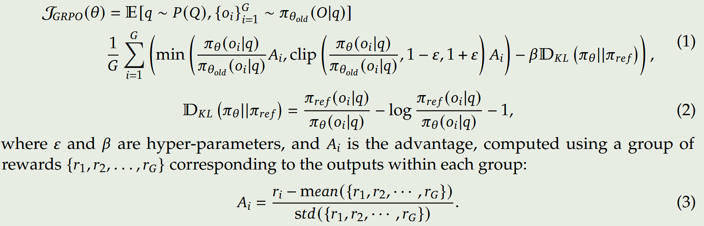
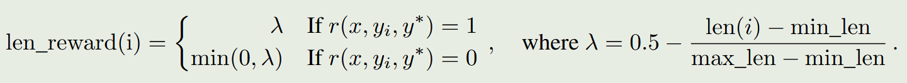

[TOC]

## Resource

- https://github.com/OpenManus/OpenManus-RL
  - 基于强化学习优化大模型智能体（类似R1算法）

- [复现和改进 DeepSeek-R1 的一些 tips](https://mp.weixin.qq.com/s/xqWYdf2c9frWbznKNGiagA)
  - 2025.03
- [浅谈 DeepSeek-R1 和 Kimi k1.5 论文中的思维链 + 强化学习](https://weaxsey.org/articels/2025-02-01/)
  - 2025.02
- GRPO复现代码
  - https://github.com/huggingface/open-r1
  - https://github.com/aburkov/theLMbook/blob/main/GRPO_From_Scratch_Multi_GPU_DataParallel_Qwen_2_5_1_5B_Instruct.ipynb

## Paper

- QwQ-32B-Preview

  - [Blog](https://qwenlm.github.io/zh/blog/qwq-32b/)

  - 训练的方法与Deepseek-R1相同

- DeepSeek-R1: Incentivizing Reasoning Capability in LLMs via Reinforcement Learning

  - 2025.01

  - Deepseek-R1-Zero

    - 直接对Base模型应用RL算法训练，没有使用任何有监督数据

    - 使用GRPO RL算法：摒弃了critic model，估计baseline使用了group scores（对于一个输出x，采样多个输出并计算rewards）

      

    - 奖励模型：未使用神经网络的奖励模型，具体使用两个rule-based的奖励方法：准确性方法（答案是否准确，code是否执行通过）；格式遵循方法（生成内容是否遵循要求的格式）

    - 效果：Deepseek-R1-Zero取得了媲美o1的效果，当然也存在一定问题：可读性和生成内容多语言混合

  - Deepseek-R1

    - 不同Deepseek-R1-Zero，Deepseek-R1使用了几千个long CoT数据对base模型微调，作为一个冷启动。该方法主要是为了生成更具可读性的内容。
    - 生成内容语言混合问题使用了语言一致性奖励模型
    - 第二阶段RL训练：主要是为了提高模型的helpfulness和harmlessness，同时保持模型的推理能力

  - 模型蒸馏

    - 使用Deepseek-R1（经过第1阶段RL的模型）生成推理数据和非推理数据，共800k
    - 使用上述数据直接微调qwen和llama模型

  - 蒸馏和RL

    - 使用Deepseek-R1蒸馏的Qwen-32B模型甚至超过了使用和Deepseek-R1一样训练方式的Qwen-32B

  - 失败尝试

    - 过程奖励模型PRM
    - MCTS

- KIMI K1.5:  SCALING REINFORCEMENT LEARNING WITH LLMS

  - 2025.01

  - 概述

    - long context scaling：将RL的上下文窗口scale到了128K，并且观察到不断增长的上下文长度，导致了不断的性能提升
    - 简化的框架：在没有使用复杂技术如Monte Carlo tree search的情况下，学习到的CoT具有规划、反思和纠错的能力
    - 支持多模态

  - Reinforcement Learning

    - 策略优化使用了一种更加鲁棒的在线镜像下降算法

    - 相比传统的RL算法，去掉了value network：value function可能会阻碍模型自我探索、恢复以及纠偏的能力

    - 使用了长度惩罚，对于problem x，采样k个responses，计算min_length和max_length

      

    - RL算法本身具有相对好的采样属性，也就是困难样本提供更大的梯度，论文引入了课程采样和优先采样算法，目的是为了获取更加高效的训练样本

    - reward model for math：使用了传统的RM和Chain-of-Thought RM，传统RM准确率84.4，Chain-of-Thought RM准确率98.5

  - Long2shot

    - 使用了model merging技术；最短CoT的拒绝采样；使用DPO训练，正确并较短的样本为正样本，正确并长的样本为负样本
    - 最后使用RL进行训练，单独执行了long2short RL训练阶段

  - 预训练

    - 多模态预训练；有监督微调，长上下文微调