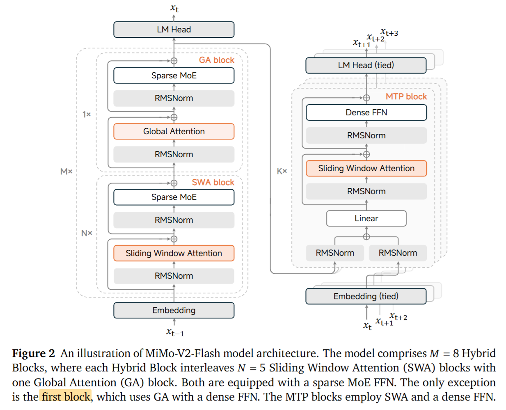
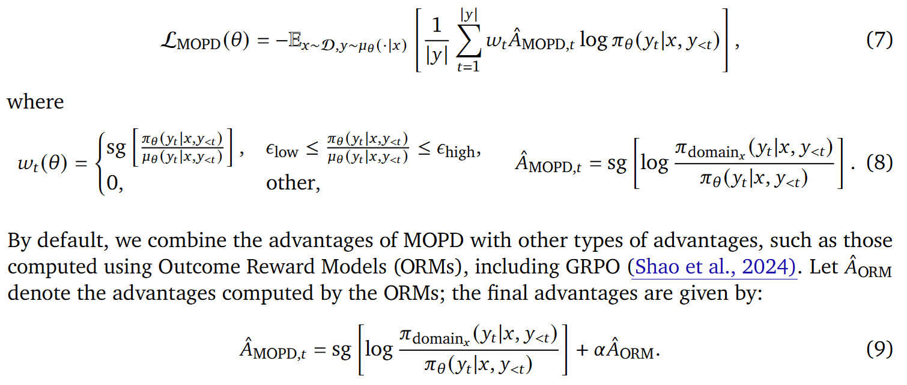
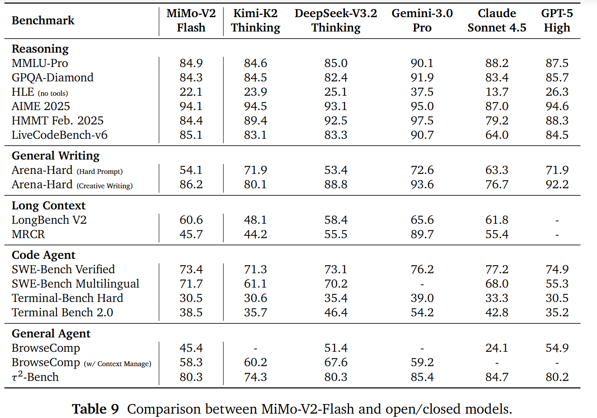
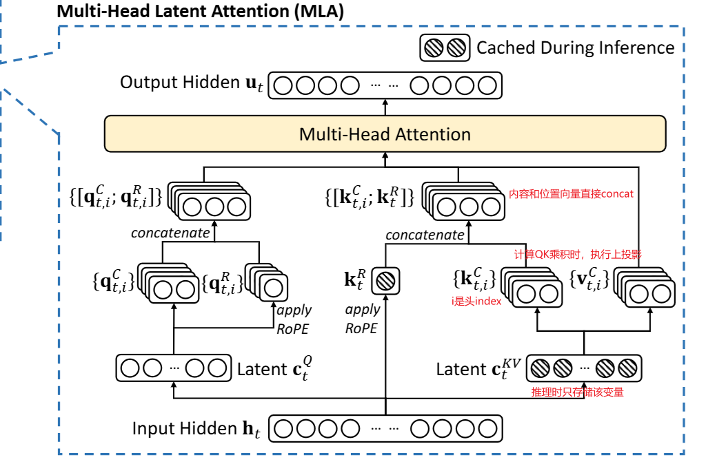
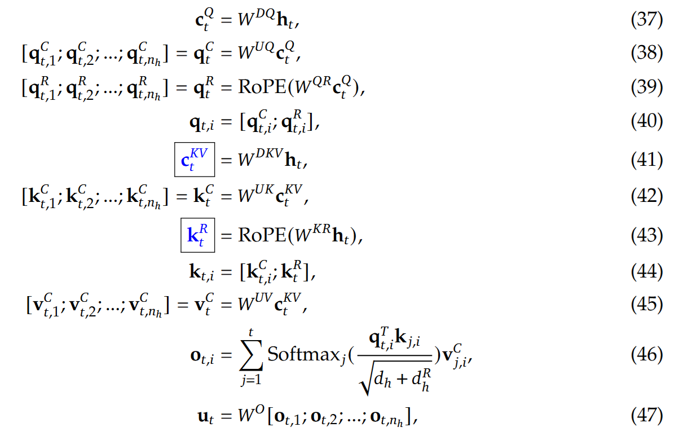
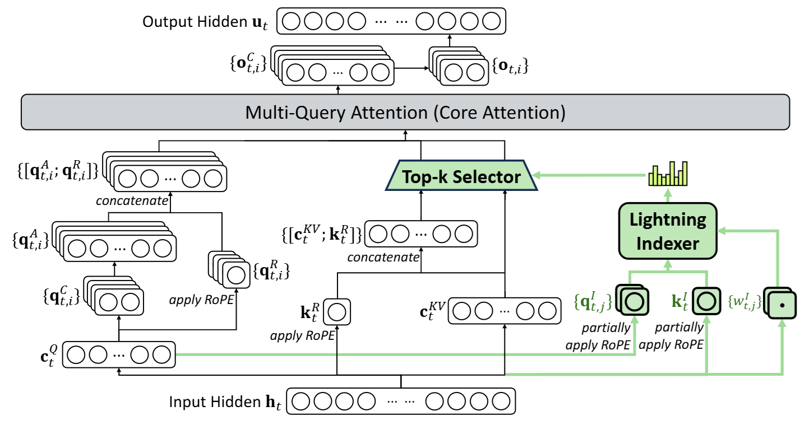

[TOC]

# MiMo-V2-Flash

- 2026.01
- 小米开源

## 研究背景

这篇技术报告的动机非常工程化：当推理链和自主智能体越来越依赖大规模 RL 时，系统会遇到一个共同瓶颈——长上下文建模既要足够强，还要足够快（否则训练/推理成本会爆炸）。论文因此提出 MiMo-V2-Flash：用更省 KV-cache 与更快解码的设计，在长上下文与智能体任务上尽量逼近顶尖模型表现。

## 核心方法

### 第一步：模型架构——混合注意力 + MoE，用更小计算换长上下文能力

MiMo-V2-Flash 是一个 309B 参数的 MoE，但每 token 只激活 15B，用稀疏激活控制成本。

为了解决全局注意力的二次复杂度，模型采用 Hybrid Attention：

- Sliding Window Attention（SWA）：局部滑窗注意力，窗口 128 tokens
- Global Attention（GA）：间隔插入全局注意力
- SWA:GA 约 5:1，论文宣称这带来 接近 6× 的 KV-cache 存储与注意力计算削减
- 并使用gpt-oss论文中 learnable attention sink bias 来缓解激进滑窗/高比例 SWA 可能带来的性能下降（作者强调其对长上下文能力的维持很关键）。learnable attention sink bias 是在attention的softmax分母上直接加上了可学习的 sink 偏执项

具体结构上，报告给出配置：总层数 48（SWA 39 / GA 9），MoE 256 experts、每 token 选 8 个 experts 等。

### 第二步：预训练——27T tokens + 32K→256K 上下文扩展

预训练规模为 27 trillion tokens，先以 原生 32K 预训练，再扩展到 256K 上下文长度。
（这也是它后续在 32K–256K 长上下文检索上接近 100% 成功率的基础。）

### 第三步：后训练范式——MOPD（Multi-Teacher On-Policy Distillation）

论文认为仅靠单一 RL 或简单合并/串行训练容易造成学习效率低与能力不均衡，于是提出 MOPD 三阶段：

1. 通用 SFT：先把 base 模型对齐成能用的助手（覆盖思考/非思考模式、对话、推理、代码、智能体等多域数据）。
2. 领域专精 teacher 训练（RL/SFT）：分别把 Search agent、Code agent、Math、Safety、Reasoning 等老师模型训练到各自峰值。
3. MOPD 蒸馏到 student：student 从两种信号学：
   - 来自多位老师的 token-level 稠密奖励（让 student 吃到老师的细粒度偏好/策略）
   - 可验证的 outcome-based reward（序列级奖励），用于稳定与对齐最终结果
   - 

你可以把它理解成：用多领域专家老师补齐能力上限 + 用可验证结果奖励兜住训练稳定性。

### 第四步：推理加速——把 MTP 当作 speculative decoding 的 draft model

MiMo-V2-Flash 训练时就引入 Multi-Token Prediction (MTP)；推理时把 MTP 复用为 speculative decoding 的draft模型：

- 报告给出的峰值是 acceptance length 最高 3.6，以及 最高 2.6× 解码加速（3 层 MTP）。
  并且作者在不同 batch size / accept length 下展示了系统性 speedup（Table 10）。

## 实验结果

# DeepSeek-V3.2

- time: 2025.12

## 研究背景：为什么要做 DeepSeek-V3.2

作者认为当前前沿模型的一大矛盾是：长上下文推理与 agent 任务会让注意力计算和推理轨迹变得非常昂贵；而如果为了省成本强行限制计算，又会伤性能。因此 DeepSeek-V3.2 的路线是：

1. 用一种新的稀疏注意力机制把长上下文的计算复杂度压下去；
2. 用可扩展的强化学习把推理与 agent 能力再拉上去，甚至做出一个高算力推理版Speciale。

## 核心方法

### 用 **DeepSeek Sparse Attention (DSA)** 把长上下文算得起

论文里说，V3.2 相比 V3.1-Terminus 唯一的架构改动就是引入 DSA（通过 continued training）。

DSA 的关键是两段式：

- Lightning indexer：先为当前 query token vs 之前每个 token计算一个轻量的相关性分数，用它决定哪些历史 token 值得看（实现上强调可以用更高效的计算方式）。
- Top-k 细粒度 token 选择：只取分数最高的 top-k key/value，再在这个稀疏集合上做注意力。

效果上，论文直接给出复杂度对比：核心 attention 从 O(L²) 降到 O(L·k)（k ≪ L）。

另外一个工程取舍是：为了能从旧版本继续训练，作者把 DSA 落在 MLA 框架下，并采用 MQA 模式来满足 kernel 层效率需求。

### DSA

介绍DSA之前首先介绍MLA，其架构图如下：

具体计算公式如下：

接下来介绍DSA，论文中并未提及Indexer的三个输入变量如何得来的，参考开源代码，总结了DSA的具体计算过程如下：

**输入变量解释**

A) $k_s^I$：来自 历史preceding token 的 hidden $h_s$
在开源实现的 `Indexer` 里，对应就是用 `wk` 把输入 `x`（即该层 token hidden，等价于 $h$）投影成 key，再做归一化与位置编码等变换：

* `k = self.wk(x)`（线性投影：$h_s \mapsto \tilde{k}_s$）
* `k = self.k_norm(k)`（LayerNorm）
* 对 key 的 RoPE 段做 `apply_rotary_emb(...)`（部分维度 RoPE）
* `k = rotate_activation(k)`（Hadamard/rotate 激活，带 $1/\sqrt{d^I}$ 缩放）

所以可以概括成：

$$
k_s^I
= \mathrm{Rotate}\Big([\mathrm{RoPE}(\mathrm{LN}(W_k h_s))_{\text{rope}};\ \mathrm{LN}(W_k h_s)_{\text{norope}}]\Big)
$$

（RoPE 只作用在 `rope` 子维度上；Rotate 对全维度做 Hadamard 变换并缩放。）

B) $q_{t,j}^I$：来自 query token 的一个中间表示 $qr_t$（再分 head）
实现里 indexer 的 q 不是直接从 `x` 投影，而是从传入的 `qr` 得到，即图中的$c_t^Q$：

* `q = self.wq_b(qr)` 得到 $(B,S,H^I\cdot d^I)$
* `q = q.view(bsz, seqlen, self.n_heads, self.head_dim)` 得到每个 head 的向量
* 对 q 的 RoPE 段做 `apply_rotary_emb(...)`
* `q = rotate_activation(q)`

对应到论文符号，就是对第 $t$ 个 token 的第 $j$ 个 indexer head：

$$
q_{t,j}^I
= \mathrm{Rotate}\Big(\mathrm{RoPE}\big((W_q, qr_t)_{j}\big)\Big)
$$

其中 $qr_t$ 是实现里提供给 indexer 的 query-side 表示（论文把它抽象成 derived from $h_t$）。

C) $w_{t,j}^I$：来自 *query token* $h_t$ 的 head 权重（门控/加权系数）

论文说：$w_{t,j}^I \in \mathbb{R}$ 由 query token $h_t$ 导出。
实现里对应就是：

* `weights = self.weights_proj(x.float()) * self.n_heads ** -0.5`

其中 `weights_proj: Linear(dim, n_heads)`，所以每个 token 会得到一个长度 $H^I$ 的向量，每个 head 一个标量。

实现还会为了 FP8 kernel 的尺度稳定，把它再乘上量化尺度 `q_scale` 和 `self.softmax_scale`，然后传入 `fp8_index(...)`。
$w_{t,j}^I$ 可以理解为上述 head 权重的核心门控项（实现里的额外 scale 属于工程数值尺度细节）。

**DSA 的公式计算流程（从打分到输出）**

Step 1：Lightning Indexer 计算 index score $I_{t,s}$

对 query token $h_t$ 和 preceding token $h_s$，计算

$$
I_{t,s}
= \sum_{j=1}^{H^I} w^I_{t,j}\cdot \mathrm{ReLU}\big((q^I_{t,j})^\top k^I_s\big).
$$

并明确了维度：$h_t,h_s\in\mathbb{R}^d$，$q^I_{t,j}\in\mathbb{R}^{d^I}$，$k^I_s\in\mathbb{R}^{d^I}$，$w^I_{t,j}\in\mathbb{R}$。

把上一节来源代入理解：

* $q^I_{t,j}$ 由 query 侧（实现里 $qr_t$）经投影 + RoPE + Rotate 得到
* $k^I_s$ 由 key 侧 hidden $h_s$ 经投影 + LN + RoPE + Rotate 得到
* $w^I_{t,j}$ 由 query 侧 hidden $h_t$ 经 `weights_proj` 得到

实现对应地用 `fp8_index(q_fp8, weights, k_cache, k_scale_cache)` 直接算出所有 $I_{t,:}$（对所有 $s$ 的分数），并可加上 causal mask。

Step 2：Top-$k$ 选择被保留的 KV 条目

论文式(2)描述：对固定 $t$，从 $I_{t,:}$ 里取 Top-$k$ 的位置集合：

$$
S_t={,s\mid I_{t,s}\in \mathrm{Top\text{-}k}(I_{t,:}),}.
$$

然后只检索这些位置对应的 key-value entries ${c_s}$。

实现里就是：

* `topk_indices = index_score.topk(min(index_topk, end_pos), dim=-1)[1]`

### 训练策略是先续训再后训练，并把上下文扩到 128K

作者从 DeepSeek-V3.1-Terminus（已扩到 128K 上下文）出发做 continued pre-training，再做 post-training 得到最终 V3.2。

并且强调 continued pre-training 的数据分布与之前 128K 扩展阶段保持对齐（避免分布漂移造成能力回退）。

### 后训练用专家蒸馏 + 混合 RL，并把 RL 计算规模化

后训练（post-training）核心有两块：

1. Specialist Distillation（专家蒸馏）
   先做多个领域专家模型，再把专家数据蒸馏回通用模型。覆盖写作/通用问答 + 6 个专门域：数学、编程、通用逻辑推理、通用 agent 任务、agentic coding、agentic search，并且每个域都支持 thinking / non-thinking 两种模式。
2. Mixed RL Training（混合强化学习）
   使用 GRPO 作为 RL 算法，把 推理 + agent + 人类对齐合并到同一个 RL 阶段，以避免多阶段训练常见的灾难性遗忘，并平衡多域表现。

此外，论文强调了大规模 agentic 数据合成：他们生成了 1800+ 环境、85000+ 复杂 prompts 用来驱动 RL，提高 agent 场景的泛化与指令遵循。

------

### 第四步：做一个更敢想的变体 **DeepSeek-V3.2-Speciale**

V3.2 是性能/成本折中的官方版本；而 Speciale 是为了探索更强推理，训练上更激进：只用推理数据、降低 length penalty，让模型愿意输出更长的推理。

论文也坦率指出：Speciale 的 token 效率显著不如某些闭源前沿模型，因此官方版 V3.2 反而在训练中加了更严格的 token 约束，把性价比拉回来。

## 实验结果

1) 基座模型：性能不退化，长上下文更便宜

2) 推理榜单：V3.2 接近 GPT-5，高算力版 Speciale 进一步冲顶

3) 竞赛级评测：Speciale 给出金牌档结果

4) Agent 与工具使用：开源模型差距显著缩小，但仍受上下文与轨迹长度影响

# QwenLong-L1.5

- time：2025.12

## 研究背景

论文关注的核心问题是：长上下文推理已经很关键，但学界/工业界多数工作更偏向 预训练/中期训练的上下文扩展 或 架构改造，而在 post-training 阶段 缺少一套成熟的、端到端的配方：

1. 怎么规模化合成长上下文高价值数据；
2. 怎么稳定地做长上下文 RL；
3. 当任务长度超过物理上下文窗口时，agent/记忆机制怎么做。

作者基于 Qwen3-30B-A3B-Thinking 做系统化 post-training，目标是把在长文本里跨多处证据、多跳推理、信息聚合计算的能力真正拉起来。

## 核心方法

### 生成长上下文 RL 训练数据

作者明确指出：>32k token 的复杂长文本任务，人类既难出题又难全量验证，于是采用端到端自动合成流水线。

(1) 语料库收集与过滤

- 来源覆盖 5 大类：代码库、学术文献、专业文档、通识/文学、对话数据。
- 过滤后得到 82,175 篇高质量长文档，总量约 9.2B tokens。

(2) QA 合成：让问题必须多跳 + 必须跨文档稀疏证据

作者设计了 3 条合成路径，对应不同类型的长文推理：

- 知识图谱驱动的多跳推理 QA：从文档抽取三元组构建 KG → 抽样子图/路径（Random Walk / BFS）→ 让路径节点稀疏分布到多个文档里 → 通过实体/时间等扰动/遮蔽提升难度 → 生成可验证多跳问题。
- 表格/结构化数据驱动的数值推理 QA：把跨文档表格聚合成 corpus table → 模板扩展生成 NL query → 转 SQL 执行得到 ground truth → 形成长上下文数值/统计/时间推理题。
- 多智能体自演化（MASE）生成通用长文任务：proposer 提题、solver 解题、verifier 判等价；并用 history buffer 形成 curriculum，逐轮逼 proposer 生成更难更多样的问题（适用于观点分析、长 in-context learning 等）。

(3) 两道质量闸门做验证（避免数据投机）

- Knowledge Grounding Check：去掉源文档再问一次，若还能答对（靠模型内化知识）就过滤掉。
- Contextual Robustness Check：往上下文里插入无关文档扩长，若 pass@k 直接掉到 0 的脆弱样本丢弃。

### 第二步：稳定的长上下文强化学习

作者把长上下文推理表述为 RL 问题，并采用 GRPO（避免 PPO/价值网络在长序列上的计算开销）。

长上下文 RL 的主要痛点是：多任务混训时 reward/优势估计偏置 + 训练容易崩，作者的核心解法有两块：

1. Task-balanced sampling + task-specific advantage estimation：缓解 mini-batch 分布不稳、reward bias。
2. AEPO（Adaptive Entropy-Controlled Policy Optimization）：
   - 观察到不稳定的根源常来自 负优势（negative advantage） 与 高熵（high entropy） rollouts；
   - 于是用 动态熵阈值 控制：当 batch 熵太高时，mask 掉负优势样本，只用正优势更新（类似优势加权的 online rejection sampling），降低熵；当熵太低则重新引入负梯度，避免熵坍塌。

**消融结果**
在 Qwen3-4B-Thinking-2507 上：baseline 平均 52.79；+GRPO 到 56.07；再 +AEPO 到 **59.36**（平均 +3.29 相对 GRPO）。

### 第三步：超长输入

作者承认：即使 256K 上下文也装不下 1M～4M token，于是提出 memory management framework，用 multi-stage fusion RL 把两种能力融合成一个模型：

- 单次（single-pass）长上下文推理（在物理窗口内）
- 迭代式记忆更新 + agent 处理（超出窗口时分块/记忆）

同时他们设计了完整的 分阶段 post-training pipeline（逐步扩输入与输出长度，并穿插 memory-RL、模型融合等步骤）。

## 实验结果

### 1) 长上下文主榜单：平均提升 +9.90，逼近/对齐旗舰模型

在 6 个长上下文推理基准（DocMath、LongBench-V2、Frames、MRCR、CorpusQA、LongBench-V1-QA）上：

- 基线 Qwen3-30B-A3B-Thinking-2507 平均 61.92
- 本文 QwenLong-L1.5-30B-A3B 平均 71.82（+9.90）

并且对比一些强模型：

- Gemini-2.5-Pro 平均 72.40；GPT-5 平均 74.74；DeepSeek-R1-0528 平均 68.67。

哪些任务涨得最猛？
最大的增益集中在更长、更需要全局聚合/多跳的任务：

- MRCR：+31.72（从 51.27 → 82.99）
- CorpusQA：+9.69（71.56 → 81.25）
- LongBench-V2：+6.16（49.11 → 55.27）

这也反证了它的数据合成策略确实在强化多跳 + 稀疏证据整合。

### 2) 泛化

作者额外评估了通用与记忆相关任务：

- MMLU-PRO：81.03 → 81.33（+0.30）
- AIME25：82.81 → 86.46（+3.65）
- GPQA-Diamond：75.88 → 76.78（+0.90）
- 对话长记忆 LongMemEval：60.80 → 76.40（+15.60）

论文给出的解释是：长上下文训练强化的信息整合能力，会迁移到长推理输出与对话/agent 记忆场景。

### 3) memory-agent 框架带来明显提升

在 MRCR/CorpusQA 的超长子集上（memory-agent 模式对比）：

- MRCR 128K～512K：16.55 → 34.87（+18.32）
- MRCR 512K～1M：4.24 → 22.53
- 甚至在 CorpusQA 4M 子集达到 14.29（展示了 4M 级别可用性）。

作者也坦诚：Gemini-2.5-Pro 在这些超长任务上仍很强，但 QwenLong-L1.5 在开源体系里把可扩到百万/数百万 token 的推理往前推了一大步。

# GLM4.5

- time: 2025.08

## 研究背景

作者的核心判断是：真正能提升现实生产力的通用大模型，必须同时具备三类关键能力：

1. Agentic：会用工具、能在环境里完成任务；
2. Reasoning：能做长链条、多步推理（数学/科学/综合推理）；
3. Coding：能解决真实软件工程问题。

他们指出：一些闭源模型在某些单项（如推理或代码修复）非常强，但三项都强的开源通用模型仍稀缺，因此提出 GLM-4.5 系列，目标是统一 ARC 能力，并提供思考/不思考两种响应模式。

## 核心方法

### 第一步：MoE 架构 + 关键结构取舍

- MoE（Mixture-of-Experts）：GLM-4.5 为 355B 总参数、每 token 激活 32B；同时给出更小的 GLM-4.5-Air（106B，总激活 12B）。
- 更深而非更宽：与一些对比 MoE 模型不同，他们减少宽度/路由专家数、增加层数，经验上更利于推理能力。
- 注意力与稳定性细节：使用 GQA + partial RoPE，并显著增加注意力 head 数；引入 QK-Norm 稳定 logits 范围。
- MTP（Multi-Token Prediction）层：加入 MoE 的 MTP 层以支持 speculative decoding，加速推理。

### 第二步：23T tokens 多阶段训练（预训练 + 中期训练），并把长上下文拉到 128K

**数据与清洗/配比策略：**

- 预训练语料覆盖网页、社媒、书籍、论文、代码仓库；网页按质量分桶，高质量上采样，最低质量丢弃；还用语义去重（SemDedup）处理模板化相似网页。
- 多语种：结合自爬网页与 FineWeb-2，并用教育价值类质量模型做筛选/上采样。
- 代码：来自 GitHub 等平台，分级过滤（高/中/低质量），并对代码使用 Fill-in-the-Middle 目标；对含代码的网页文本先检索再质量评估、再精细解析以保留代码格式。
- 数理/科学：用模型给候选文档打教育性比例分数，再训练小分类器预测分数，上采样高分内容。

**中期训练（mid-training）强调三件事：**

1. Repo-level 代码训练：拼接同一仓库多文件，学习跨文件依赖；还加入 issues/PR/commit 等真实工程上下文，并把上下文长度从 4K 拉到 32K。
2. 合成推理数据：收集竞赛/题库类问答，用推理模型合成推理过程。
3. 长上下文 + Agent 轨迹：继续把长度从 32K 扩到 128K，并混入大规模合成 agent trajectories。

### 第三步：后训练的关键——专家模型迭代 + 强化学习 + 自蒸馏，合成一个混合推理通才

论文把 post-training 分成两阶段：

**Stage 1：Expert Training（先练 3 个专家）**

- 分别训练：Reasoning 专家 / Agent 专家 / General Chat 专家。
- 先做 SFT 冷启动（包含较长 CoT），再进入各自的 RL 提升。

**Stage 2：Unified Training（再把专家合体）**

- 用 self-distillation 把多个专家能力蒸馏回一个模型，使其同时支持：
  - thinking mode：复杂推理与 agent 任务
  - non-thinking mode：即时回答
    形成论文强调的 hybrid reasoning。

**强化学习部分：**

- RL 算法框架基于 GRPO，并做了若干训练技巧（如难度课程学习等）。
- 在 agentic RL 里，包含面向工具/网页/软件工程的训练设定；软件工程任务强调可执行单测与沙盒环境。
- 最后还有Pathology RL去修正语言混杂、重复、格式错误等低频但影响体验的问题。

## 实验结果

论文用 12 个 ARC 基准做综合评测，并报告 GLM-4.5 / GLM-4.5-Air 的整体排名：

- 综合 12 基准平均：GLM-4.5 排名第 3，GLM-4.5-Air 排名第 6。
- 同时强调 参数效率：用更少总参在多个维度接近/对齐更大模型的表现。

# Kimi K2

- time: 2025.07

## 研究背景

这篇技术报告把目标放在 Agentic Intelligence（智能体能力）：模型不仅要会答题/续写，还要能在复杂、动态环境里 自主感知—规划—推理—行动，并通过与环境交互获得新能力。作者认为这带来两类关键瓶颈：

1. 预训练侧：高质量人类数据越来越稀缺，每个 token 的学习效率（token efficiency）变成更重要的扩展系数；
2. 后训练侧：多步规划、工具调用等 agentic 轨迹在自然数据里稀少且昂贵，必须依赖可规模化的合成轨迹 + 更通用的强化学习来补齐。

## 核心方法

### 第一步：模型与预训练——1T 级 MoE + 更稳的 MuonClip

- 模型形态：
  - MoE 大模型：32B 激活参数、约 1T 总参数；
  - 使用 MuonClip 优化器，在 15.5T tokens 上预训练，并强调零 loss spike（无损失尖刺）。
- MuonClip 的关键点：用 QK-Clip 解决 Muon 放大后的训练不稳定：
  作者观察到 Muon 在大规模训练时更容易出现 attention logits 爆炸；已有的 soft-cap 只是在 logits 结果上截断，QK-Norm 又不适用于他们使用的 MLA 结构。于是提出 QK-Clip：在每次更新后对 Query/Key 投影权重做重缩放，从源头约束 logits 增长，以提升稳定性。
- 训练配方（报告给出了可复现级别的关键超参）：
  例如：4,096 上下文窗口、WSD 学习率策略、总计 15.5T tokens、全局 batch size 约 67M tokens、并给出分阶段学习率（先常数再 cosine decay）等。

### 第二步：大规模 agentic 数据合成流水线

作者认为真实世界环境信号虽好，但成本/隐私/可达性限制使其难以规模化；因此构建一个 模拟真实工具使用的合成管线，批量生成可训练的工具调用轨迹。

流水线分三段（Fig.8 对应）：

1. Tool spec 生成：同时收集真实工具与合成工具；
2. Agent & Task 生成：为抽样的工具集生成 agent，并生成带 rubric（评分细则/成功标准）的任务；
3. Trajectory 生成与过滤：多代理（含 judge）在工具模拟器里交互，产出并筛选高质量轨迹。

规模细节上，作者明确提到：

- 从 GitHub 拉取 3000+ 真实 MCP 工具；
- 通过分层领域演化生成 20,000+ 合成工具。

### 第三步：联合强化学习——RLVR + 自我批判量表奖励

后训练的强化学习阶段，作者强调两个互补信号：

- RLVR（可验证奖励）：适用于有明确可判定对错的任务；
- Self-Critique Rubric Reward（自我批判量表奖励）：为了覆盖不可验证但人类很在意的维度（helpfulness、creativity、reasoning depth、factuality、safety 等），让模型依据 rubrics 对自己的输出做成对比较/打分，生成偏好信号；并用可验证任务的 on-policy 信号持续校准 critic，形成闭环对齐。

此外报告也提到一些工程化/算法细节来保证联合 RL 可跑、且不会把模型推向又长又贵的输出：例如 预算控制（token budget）、加入 PTX 辅助损失防遗忘、温度衰减平衡探索/收敛，以及通过 partial rollout 等机制提高 rollout 吞吐，并用类似 Gym 的统一接口扩展环境。
