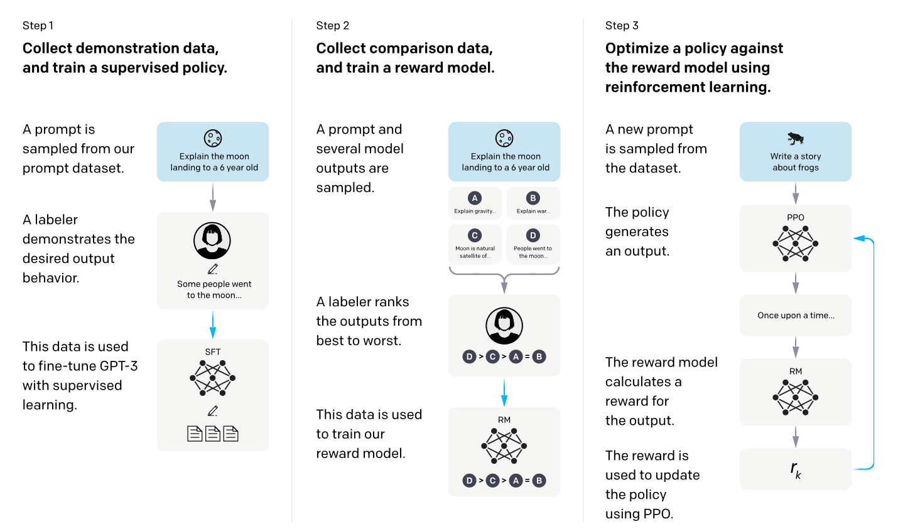
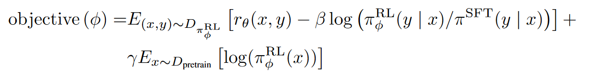

[TOC]

## llm technology report

- Baichuan

  - Baichuan 2: Open Large-scale Language Models
    - 2023.09， https://github.com/baichuan-inc/Baichuan2
    - 数据处理：数据频率和质量，使用聚类和去重方法，基于LSH和dense embedding方法
    - tokenizer：更好的压缩率，对数字的每一位分开，添加空格token
    - 位置编码：7B Rope，13B ALiBi
    - 使用了SwiGLU激活函数，因为SwiGLU是一个双线性层，多引入一个门控矩阵，参数量
      更多，hidden_size从4减少到了8/3
    - 使用了更高效的基于xFormers的attention实现
    - 使用RMSNorm，对transformer的block输入进行了Layer Norm
    - 使用了AdamW优化器，为了稳定训练和提高模型性能，对输出embedding进行了归一化
      即对header进行了归一化；训练中logits值偏大，在推理时，对重复惩罚参数比较
      敏感，因此加入了max-z loss
    - 使用了有监督微调和RLHF

  - Baichuan v1 7b
    - https://github.com/baichuan-inc/Baichuan-7B
    - 数据：开源的中英文数据和互联网数据，使用了启发式的数据过滤，然后使用了去重和
      质量打分策略来进一步筛选数据
    - 分词：重新训练了BPE模型，更好的压缩率；对数字的每一位分开，避免出现数字不一
      致问题；支持UTF-8 character的byte编码，对未知词全覆盖
    - 模型：同LLama，Rope位置编码，SwiGLU，基于RMSNorm的Pre-Norm

  - Baichuan v1 13b
    - 使用ALiBi位置编码，更多的训练数据

- ChatGLM

  - [ChatGLM：千亿基座的对话模型开启内测⸺对应单卡版本开源](https://chatglm.cn/blog)
  
  - GLM
    - GLM: General Language Model Pretraining with Autoregressive Blank Infilling
    - 使用了blank filling的自回归方式来统一所有任务目标。其通过mask spans来自回归的预测被mask的span，非span区域是互见的，span之间的可见性取决于span的随机排列顺序
    - 为了获得更好的生成性能，通过mask更长span，以及对整句进行mask
    - 使用的2D位置编码：被mask的序列绝对位置; 非span区域位置为0，span内部位置从1开始编码
    - https://github.com/THUDM/GLM
    
  - https://github.com/THUDM/GLM-130B
  
  - https://github.com/THUDM/ChatGLM-6B
    - 1T token; 监督微调、反馈自助、人类反馈强化学习
    - Rope; Layer Norm; GLUE激活函数; prefix模型的mask方式
    - 使用2d的position_id和block_position_id：block_position_id是把input的pos_id全部置为0；计算attention时需要把query和key chunk成2块
    
  - https://github.com/THUDM/ChatGLM2-6B
    - 1.4T; 人类偏好对; 使用GLM的混合目标函数
    - 更长的上下文；使用multi-query attention
    - Rope; preNorm; RMSNorm; SwiGLU激活函数(与LLama相同)

  - https://github.com/THUDM/ChatGLM3
    - 更多样的训练数据、更充分的训练步数和更合理的训练策略；采用了全新设计的Prompt格式，支持工具调用、代码执行、Agent
    - 模型配置与chatglm2相同
  
  - 其他开源项目
    - https://github.com/lich99/ChatGLM-finetune-LoRA
      - 基于alpaca数据集，使用Lora技术微调ChatGLM-6B
    - https://github.com/mymusise/ChatGLM-Tuning
      - 基于alpaca数据集，使用Lora技术微调ChatGLM-6B
    - https://github.com/liangwq/Chatglm_lora_multi-gpu
      - 支持多机多卡训练
    - https://huggingface.co/silver/chatglm-6b-slim
      - 是在ChatGLM-6B的基础上通过裁剪词表构建的。因为ChatGLM-6B使用了icetk，在其词表中，前20000个token是预留给图片的
    
    - https://github.com/MediaBrain-SJTU/MedicalGPT-zh
      - 一个基于ChatGLM的在高质量指令数据集微调的中文医疗对话语言模型
    - https://github.com/hiyouga/ChatGLM-Efficient-Tuning
- LLaMA
  - LLaMA: Open and Efficient Foundation Language Models
    - 数据处理：质量过滤，重复过滤
    - 共1.4T tokens，除了高质量的book和wikipedia数据训练两个epoch，其他数据都训练1个epoch
    - 模型：Rope; preNorm; RMSNorm; SwiGLU激活函数

  - Llama 2: Open Foundation and Fine-Tuned Chat Models
    - 相比llama1，数据增加40%，长度增加一倍，使用了group-query attention
    - llama2-chat是在llama2基础版本的基础上使用有监督微调和RLHF
    - llama2-chat使用3w条高质量SFT数据，更小学习率，2epoch，user_prompt不计算loss
    - llama-chat的RLHF训练
       - 使用二分比较模式；为了最大化生成数据的多样性，对同一个prompt，使用不同的模型、使用不同的温度参数；新模型迭代需要使用新模型生成的偏好数据
       - 奖励模型：使用两个奖励模型，helpfulness和safety，使用chat model checkpoint来初始化；奖励模型与chat model不同地方就是分类header替换成regression header，
         损失使用的是binary ranking loss，使用了margin进一步优化
       - 为了提高多轮对话的一致性，提出可Ghost Attention
- llama open source repo
  - https://github.com/tatsu-lab/stanford_alpaca
    - 基于自生成的instructions来微雕LLaMA模型
  - https://github.com/tloen/alpaca-lora
    - 基于low-rank adaption训练的alpaca
    - 即使用了自生成的instruction和low-rank adaption微调/训练的LLaMA
  - https://github.com/Neutralzz/BiLLa
  - https://github.com/starmpcc/CAMEL
  - https://github.com/zjunlp/CaMA
  - https://huggingface.co/IDEA-CCNL/Ziya-LLaMA-13B-v1
    - IDEA研究眼
  - https://github.com/wenge-research/YaYi
  - https://github.com/ymcui/Chinese-LLaMA-Alpaca-2
      - 基于llama，扩增了词表，预训练时使用了lora，同时对embedding和header进行参数调整，预训练之后进行了指令微调
      - 支持CFG解码方案：https://github.com/huggingface/transformers/issues/24536
      - 支持更长文本：插值、ntk等方法
  - https://github.com/ymcui/Chinese-LLaMA-Alpaca
    - 扩充了中文词表，进行了预训练和指令微调
  - https://github.com/hiyouga/LLaMA-Factory
- https://github.com/formulahendry/awesome-gpt
- https://github.com/dandelionsllm/pandallm/
- https://github.com/stability-AI/stableLM/
- https://github.com/FreedomIntelligence/LLMZoo
- https://github.com/project-baize/baize-chatbot/blob/main/README.md
- 超对称大模型：https://bbt.ssymmetry.com/model.html
- https://github.com/LC1332/Luotuo-Chinese-LLM
- MOSS
  - https://github.com/OpenLMLab/MOSS
- OpenAssistant
  - https://github.com/LAION-AI/Open-Assistant 
  - https://huggingface.co/datasets/OpenAssistant/oasst1
  - https://open-assistant.io 
- Vicuna
  - https://vicuna.lmsys.org/
  - https://github.com/lm-sys/FastChat
  - https://chat.lmsys.org/

- BLOOM
  - https://github.com/bigscience-workshop/xmtf
  - https://github.com/LianjiaTech/BELLE

- https://github.com/Muennighoff/sgpt#asymmetric-semantic-search-be
  - GPT sentence embedding for semantic search

- https://github.com/dair-ai/Prompt-Engineering-Guide
  - https://www.promptingguide.ai/
- https://huggingface.co/google/flan-t5-xxl
- https://github.com/nebuly-ai/nebullvm 
  - LLaMA+RLHF
- https://github.com/lucidrains/PaLM-rlhf-pytorch
  - PaLM+RLHF
- https://github.com/togethercomputer/OpenChatKit
  - 指令微调，对话时使用检索结果增强上下文，20b、6b
- https://github.com/bigscience-workshop/xmtf
- https://github.com/LAION-AI/Open-Assistant
  - Open Assistant 是 LAION 机构开源的，旨在训练一个 ChatGPT 的小规模替代版
  - Open-Assistant全流程训练指南:https://zhuanlan.zhihu.com/p/609003237
- https://github.com/CarperAI/trlx
  - trlX is a distributed training framework designed from the ground up to focus on fine-tuning large language models with reinforcement learning using either a provided reward function or a reward-labeled dataset.
- https://github.com/BlinkDL/RWKV-LM
  - 用 RWKV 架构（不是transformer结构）训练的chatgpt
- https://github.com/allenai/RL4LMs
  - 这个库包括了比较多 RL 算法（PPO，NLPO，A2C和TRPO），它论文说在 2000 个实验里做了 RL 在 LLM 上面的训练。RL4LMs当前的计划包括分布式训练更大的模型和新的RL算法
- https://github.com/hpcaitech/ColossalAI/tree/main/applications/ChatGPT
- https://github.com/LianjiaTech/BELLE
  - https://huggingface.co/BelleGroup

- https://github.com/lvwerra/trl
  - 基于GPT2的instructGPT
- https://github.com/HarderThenHarder/transformers_tasks/tree/main/RLHF
  - 基于上面的TRL做的；增加了基于人工打分的Reward模型训练，还提供了Reward数据的标注平台；RM 模型训练：基于 ernie-3.0-base-zh 继续训练的

## paper

- Language Is Not All You Need: Aligning Perception with Language Models
  - [[code]](https://github.com/microsoft/unilm)
  - 提出了一个多模态因果大模型，方法是将图片用clip模型编码成离散的code，当作额外的token的加入到词表中。针对text和image，使用special token了区别模态的类型
  - 使用Magneto来初始化模型，使用xPOS作为位置编码的方法，该方法的好处是解决了传统注意力消散的情况
  
- GLM-130B: AN OPEN BILINGUAL PRE-TRAINED MODEL
  - ICLM  [[code]](https://github.com/THUDM/GLM-130B/)
  - GLM使用了自编码和自回归的方式进行预训练  
  - 预训练方式1：自编码使用blank infilling的方式训练，即提取spans，并替换成mask，使用自回归的方式预测mask，spans的双向可见性取决于spans的随机排列顺序。每个样本对应唯一一个预训练任务，两种预训练任务使用不同mask token；预训练任务2：使用了多任务指令预训练   
  - 每个样本对应唯一一个预训练任务，两种预训练任务使用不同mask token  
  - 为了使得LLM的训练稳定，使用了DeepNorm；使用了三种训练策略；使用旋转位置编码，理论上支持无限长；FFN使用Gelu激活函数   
  - 训练集的95%使用blank filling任务训练，分别占30%、70%，训练集的另外5%来自于各个NLP任务指令数据集，通过转化成prompt的方式构建   
  - GLM的int4量化模型performance未明显下降，可以用4*3090运行
  
- FINETUNED LANGUAGE MODELS ARE ZERO-SHOT LEARNERS
  
- Training language models to follow instructions with human feedback
  - 使用人工编写的prompt数据，基于GPT3模型进行再训练，得到一个增强的预训练语言模型 
  - 基于1中训练好的预训练语言模型以及构建好的prompt集，使用beam-search等生成prompt的多个回复结果，然后人工对生成的多个结果排序，然后基于该数据训练了一个6B的打分模型，使用的是pair-wise的ranking loss  
  - 基于PPO算法训练强化学习模型，模型使用1中预训练好的模型进行初始化，给定prompt生成输出，然后用2中打分模型计算得分，然后优化强化学习模型。然后再使用强化学习模型生成，再打分。优化目标函数中添加了自回归语言模型的loss 
  - 
  - 

- GLM: General Language Model Pretraining with Autoregressive Blank Infilling
  - ACL  [[code]](https://github.com/THUDM/GLM)
  - 使用了blank filling的自回归方式来统一所有任务目标。其通过mask spans来自回归的预测被mask的span，非span区域是互见的，span之间的可见性取决于span的随机排列顺序  
  - 为了获得更好的生成性能，通过mask更长span，以及对整句进行mask  
  - 使用的2D位置编码：被mask的序列绝对位置，非span区域位置为0，span内部位置从1开始编码  

- A General Language Assistant as a Laboratory for Alignment
  - 偏好模型是在序列的最后一个token上加value head，value head负责预测一个标量值来表示得分；模仿学习是只用good example来微调模型  
  - 排序偏好模型相比二进制偏好模型有更好的效果  
  - context distillation: prompt会减少输入的长度等缺点，使用了一种基于KL的loss来对prompt微调  
  - 偏好模型预训练的第二个阶段，使用二进制判别的预训练方法相比排序偏好方法有更好的收益

