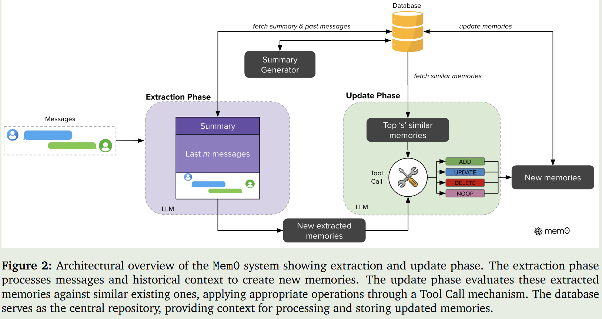
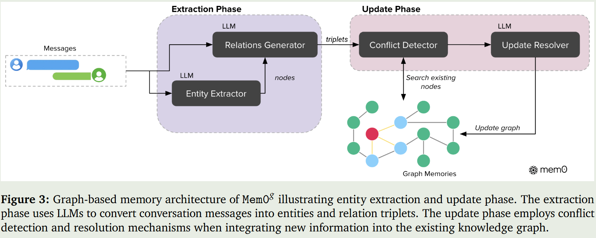
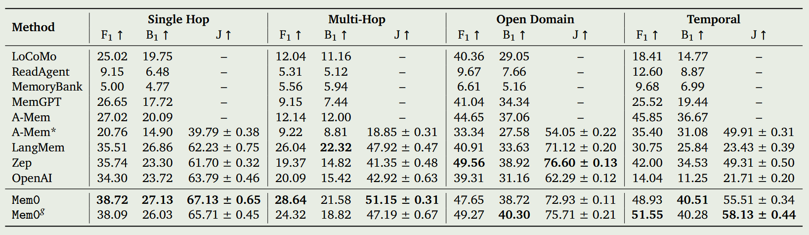
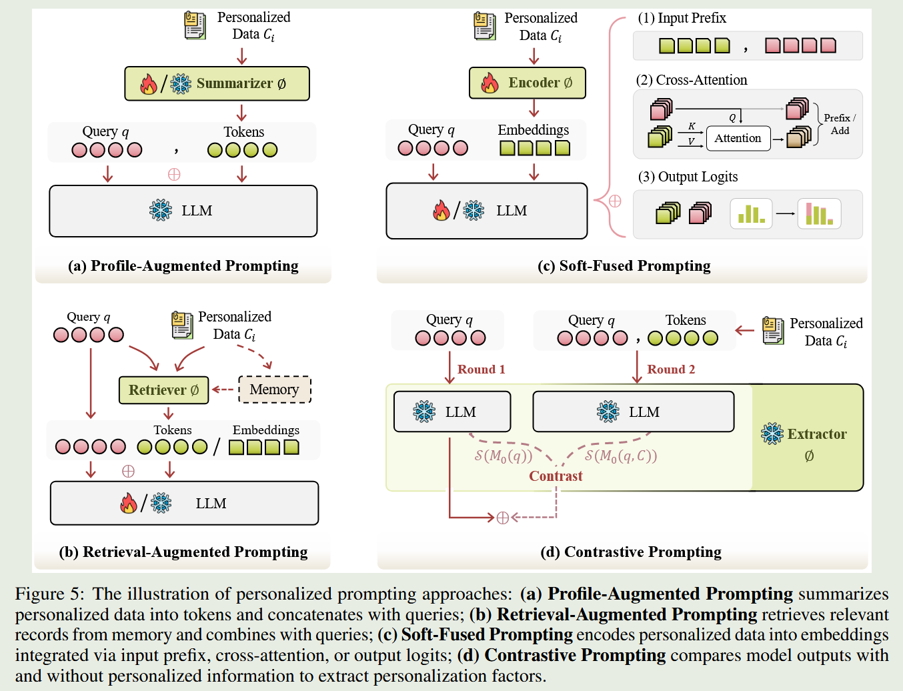

[TOC]

# paper

- Remember Me, Refine Me: A Dynamic Procedural Memory Framework for Experience-Driven Agent Evolution

  - 2025.12

- Memory-R1: Enhancing Large Language Model Agents to Manage and Utilize Memories via Reinforcement Learning

  - 2025.08

- MemAgent: Reshaping Long-Context LLM with Multi-Conv RL-based Memory Agent

  - 2025.07
  - 使用强化学习的方法对固定长度的记忆进行更新

- mem0：Mem0: Building Production-Ready AI Agents with Scalable Long-Term Memory

  - 2025.04, https://github.com/mem0ai/mem0

  - mem0：基于对话摘要、上下文对last 对话pair进行以及抽取；从记忆系统中检索top-n，使用function call对记忆进行增删改操作

    

  - mem0 graph: 从query中抽取三元组，根据实体获取图谱中的候选三元组，使用query匹配出最相近的候选三元组，使用LLM更新图谱

    

  - 回答问题时，检索相关的记忆，不使用任何多轮上下文，直接回答问题。在LLM-As-Judge以及效率等方面超越了很多Baseline方法

    

- Understanding the Role of User Profile in the Personalization of Large Language Models

  - 2024.06，
  - 背景：利用用户画像对LLM进行个性化定制，已被证明能提升其在多种任务上的性能。然而，用户画像的具体作用及其对LLMs的影响机制仍不明确。
  - 论文首先证实，用户画像的有效性主要源于个性化信息，而非语义信息。此外，论文还探究了用户画像如何影响LLMs的个性化。在用户画像中，用户生成或认可的历史个性化回应在LLMs的个性化过程中起着关键作用。这一发现为LLMs在有限输入长度的限制下整合更多用户画像提供了可能。
  - 至于用户画像的位置，整合到输入上下文不同位置的用户画像对个性化的贡献并不相同。相反，越靠近开头的用户画像对LLMs的个性化影响越大。研究结果揭示了用户画像在LLMs个性化中的作用，并展示了整合用户画像如何影响性能，为有效利用用户画像提供了见解。

- MemGPT: Towards LLMs as Operating Systems

  - 2023.10

- MemoryBank: Enhancing Large Language Models with Long-Term Memory

  - 2023.05，AAAI2024
  - MemoryBank 系统通过一套完整的长期记忆流水线增强大语言模型的持续对话能力。系统首先对历史对话进行精细化存储，每条对话均附带事件时间戳，并按天将原始对话转化为结构化的事件（event），再逐级摘要为更高层次的长期记忆表示。
  - 在此基础上，系统从对话中持续抽取用户的个人特质与情感特征，先形成每日用户画像，再进一步聚合为稳定的长期用户个性模型。
  - 在交互阶段，MemoryBank 通过双塔式稠密检索模型召回与当前上下文最相关的历史记忆；
  - 在记忆更新阶段，引入基于艾宾浩斯遗忘曲线的机制，使被频繁调用的记忆得到强化、长期未使用的记忆自然衰减，从而实现接近人类的记忆保留与遗忘过程。该设计使 AI 能在长期交互中保持上下文连贯性，逐步形成准确的用户画像，并提供更加个性化、自然的对话体验。

# Survey

- https://github.com/liyongqi2002/Awesome-Personalized-Alignment
- A survey of personalized large language models: progress and future directions
  - 2025
- A Survey on the Memory Mechanism of Large Language Model based Agents
  - 2024.04
- When Large Language Models Meet Personalization: Perspectives of Challenges and Opportunities
  - 2023.07，survey
  - 11.3节提及了长对话历史建模的三种方法：检索、摘要、使用层次模型或者记忆增强模型

# Taxnomy

基于提示prompting的个性化大模型生成方法涉及到传统的prompt提示方法、基于RAG检索的提示方法、基于软提示的方法以及对比提示方法。如图所示：

## 传统提示方法

- Once: Boosting content-based recommendation with both open-and closed-source large language models

  - 2024

  - 通过从用户的浏览历史中总结感兴趣的主题和地区来创建用户档案

- PAG：Integrating Summarization and Retrieval for Enhanced Personalization via Large Language Models
  - 2023，
  - 针对传统检索式个性化的信息丢失、深层理解不足和冷启动问题，引入 LLM 生成任务感知的用户摘要。
  - 摘要通过离线生成并存储，避免增加运行时延迟。

## 基于RAG检索的方法

- MemoRAG: Boosting Long Context Processing with Global Memory-Enhanced Retrieval Augmentation
  - 2025
  - 核心是内存模型训练，包括三个阶段：预训练、有监督微调、生成反馈强化学习
  - 预训练：对输入长文本 C，通过KV 压缩技术生成紧凑的全局内存，保留文本高层语义。具体是最大化 “基于内存 token 预测下一个原始 token” 的概率，优化仅新增的内存 token 权重（冻结 LLM 基础参数）。
  - 有监督微调：接收任务查询 q 后，内存模型生成 草稿答案线索 y，检索器 以 y 为查询，从 C 中定位相关证据。训练是基于人工标注的 “查询 - 线索 - 答案” 样本，让内存模型学习生成与任务匹配的线索。
  - 生成反馈强化学习：对同一查询生成多个线索，根据线索引导检索后生成答案的质量进行排序
- HYDRA: Model Factorization Framework for Black-Box LLM Personalization

  - 2024.06
  - 方法：不仅用到了历史用户行为模式数据，而且也用到了所有用户共享通用知识
- Llm-based medical assistant personalization with short-and long-term memory coordination
  - 2023，NAACL
  - 整合了多个记忆类型，包括工作记忆、短期记忆和长期记忆
    - 工作记忆先接收每轮对话信息并生成笔记，过滤冗余后将有用知识传递给短时记忆
    - 短时记忆存储该知识并记录访问频率，达到预设阈值后，将其转移至长时记忆
    - 工作记忆每轮刷新、短时记忆定期刷新，长时记忆仅新增不删除，完成从临时缓冲到长期存储的转化
- LaMP: When Large Language Models Meet Personalization
  - 2023.04，google
  - 提出了个性化语言模型评估的benchmark，以及用户的多条profile相关数据集（对话历史数据）
  - 使用一个reranker对检索结果进行排序。

## 基于软提示的方法

这类方法是把个性化数据压缩到soft embeddings中，这些soft embeddings是使用用户特征编码器获取。在使用时，这些soft embeddings可以用在输入层、交叉注意力层以及调整输出logits等地方。

- PPlug：LLMs + Persona-Plug = Personalized LLMs
  - 2024，
  - 使用用户行为编码器将每个用户行为数据编码成稠密向量，用户行为编码器使用小型预训练模型如BGE。
  - Input-aware Personal Aggregator（输入感知个性化聚合器）：使用与任务适配的微调编码器对用户输入编码成向量，使用余弦相似度计算用户输入向量和用户行为向量的关联度，即每条用户行为的得分。使用多层感知机将用户行为向量投影到大模型表示空间，然后再进行加权，得到最终的用户个人嵌入。
  - 使用把用户个人嵌入附加到用户输入，来引导LLM进行个性化内容生成。
- GSMN：Personalized response generation via generative split memory network
  - 2021，NAACL
  - 该方法从个性化数据中检索相关信息，将其编码为软嵌入，并将其与查询向量一起用于注意力机制中。
  - 之后，将生成的嵌入与大语言模型（LLM）生成的嵌入进行拼接，修改最终的logits以生成更具个性化和上下文相关性的响应。

## 对比提示方法

对比提示的核心见解是利用LLM的两条前向路径来生成包含和不包含个性化信息的对比对。通过比较有个性化和无个性化的模型状态S，它能识别出影响个性化的因素，从而实现对模型个性化程度的动态调整。这里用到了两种主流的模型状态：隐藏状态（表征）和Logits（预测分布）。

# Blog

- [HaluMem：揭示当前AI记忆系统的系统性缺陷，系统失效率超50%](https://mp.weixin.qq.com/s/HWbCFOF-RGRXBO8hUkg5pQ)
- [ChatGPT 记忆系统](https://mp.weixin.qq.com/s/xZY_3MBrrYL0lsRZv8e7SQ)
- [模型如何避免“千人一面”？个性化开发的破局之道](https://mp.weixin.qq.com/s/GESXfcjsmm164EVcF60Dkw)
- [大模型Agent长期记忆、动态进化与个性化算法介绍](https://mp.weixin.qq.com/s/KKzbvGdo9_sgynHa3eVXXw)
- [ICLR 2025 | Oral 大型语言模型是否能识别你的偏好？——评估LLMs的个性化偏好遵循能力](https://mp.weixin.qq.com/s/9sFob__-Gv9msQhoJgyEQQ)
  - 该方法主要用来评估 在提供了用户个性化信息（比如通过prompt、RAG等方法）的前提下，大模型遵循用户偏好的能力。