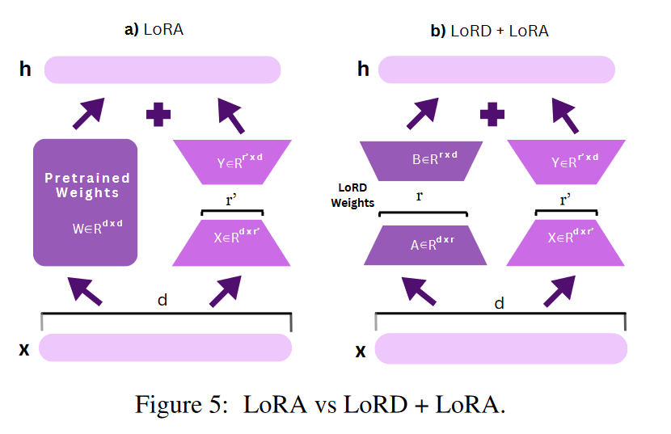

# Paper

## LLM Low-rank-decomposition

- ASVD: Activation-aware Singular Value Decomposition for Compressing Large Language Models
  - 2023.12
  - ASVD: 这是一种无需训练的方法，通过考虑激活分布来调整权重矩阵，从而更有效地管理激活异常值，提高分解的准确性和效率
  - Sensitivity-aware Truncation Rank Searching (STRS)：这种方法评估每层对分解的敏感性，并为每层分配一个合适的秩（rank），以实现最优的层特定分解
  - 分解过程：ASVD通过奇异值分解（SVD）将权重矩阵分解为U、Σ、V三个矩阵，然后通过迭代校准过程来确定每个层的最优秩

- LORD: Low Rank Decomposition Of Monolingual Code LLMs For One-Shot Compression
  - 2023.09, 
  - LoRD：使用SVD对大模型进行分解，保留最大r个奇异值和相应的奇异矩阵
  - 

- TensorGPT: Efficient Compression of the Embedding Layer in LLMs based on the Tensor-Train Decomposition
  - 2023.07,
  - 提出了一种基于Tensor-Train Decomposition(TTD)的压缩大型语言模型中嵌入层的方法
  - 它通过TTD分解将每个token嵌入视为矩阵乘积态（MPS），实现参数数量的显著减少
  - 该方法利用低秩张量格式存储嵌入，降低了存储复杂性，并通过分布式计算提高了计算效率，使得模型能够适应词汇表的变化并部署在低端设备上