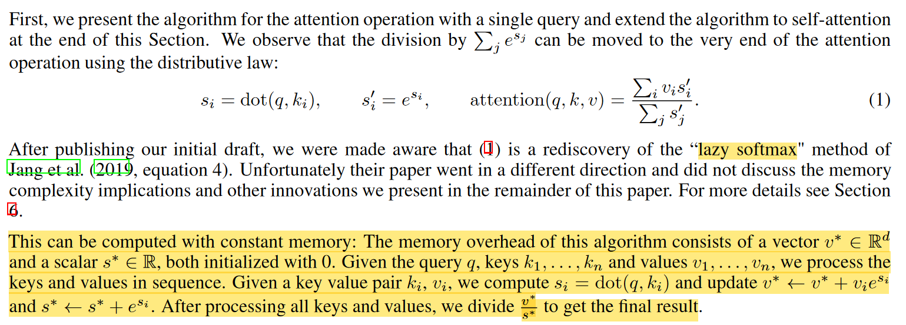

<!-- START doctoc generated TOC please keep comment here to allow auto update -->
<!-- DON'T EDIT THIS SECTION, INSTEAD RE-RUN doctoc TO UPDATE -->
**Table of Contents**  *generated with [DocToc](https://github.com/thlorenz/doctoc)*

- [推理框架](#%E6%8E%A8%E7%90%86%E6%A1%86%E6%9E%B6)

<!-- END doctoc generated TOC please keep comment here to allow auto update -->

- flash-attention
  - https://github.com/Dao-AILab/flash-attention
  - llama使用flash-attention：https://github.com/lm-sys/FastChat/blob/main/fastchat/train/llama_flash_attn_monkey_patch.py#L79

- [Multi Query Attention和Group-Query Attention介绍](https://mp.weixin.qq.com/s/wOyDpxcxKATxGrP8W-1w2Q)

- Efficient Streaming Language Models with Attention Sinks

- [Transformer参数量、计算量、显存占用分析](https://mp.weixin.qq.com/s/4_6J7-NZML5pTGTSH1-KMg)

- SELF-ATTENTION DOES NOT NEED O(n2) MEMORY
  - 将self-attention的内存占用优化到了O(logn)
  - 考虑一个query和长度为n的key、value列表。attention的计算可以表示为分子和分母的迭代计算，而不需要保存中间计算结果，即i=i+1
  - 传统attention的计算会减去一个最大值防止溢出，新的懒计算的方法无法使用该方法。维护一个当前时刻的最大值，来更新计算结果
  - 

    
Image 

    
    

# 推理框架

- https://github.com/microsoft/DeepSpeed/tree/master/blogs/deepspeed-fastgen

- https://github.com/ModelTC/lightllm

- https://github.com/NVIDIA/FasterTransformer
- https://github.com/NVIDIA/TensorRT-LLM

- https://github.com/Jittor/JittorLLMs

- https://github.com/InternLM/lmdeploy/

- [大语言模型推理性能优化汇总](https://mp.weixin.qq.com/s/9mfx5ePcWYvWogeOMPTnqA)

- Deepspeed Inference
  - https://www.deepspeed.ai/tutorials/inference-tutorial/

- vllm
  - https://github.com/vllm-project/vllm
  - 高效的kv-cache管理，基于pageAttention

- 大模型部署的方案
  - https://mp.weixin.qq.com/s/hSFuULV-7bykz-zRmG5CXA

