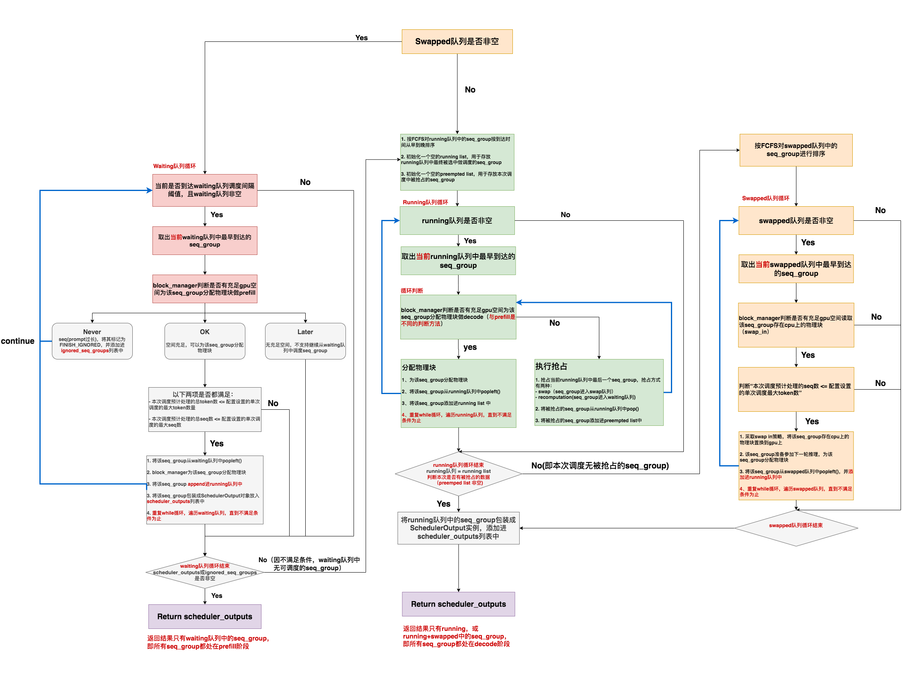

[TOC]

## Vllm

- https://github.com/vllm-project/vllm
- 高效的kv-cache管理，基于pageAttention
- [vLLM 源代码分析](https://zhuanlan.zhihu.com/p/641999400)
- [大模型推理框架 vLLM 源码解析（一）：框架概览](https://zhuanlan.zhihu.com/p/681402162)
- [大模型推理框架 vLLM 源码解析（二）：Block 模块分配和管理](https://zhuanlan.zhihu.com/p/688660090)

### vllm参数理解

- 模型参数、vllm日志理解：
  - https://github.com/vllm-project/vllm/issues/3561
- max_num_batched_tokens  和 max_num_seqs

  - https://github.com/vllm-project/vllm/issues/2509
  - https://github.com/vllm-project/vllm/issues/2492
  - 只与prefilling stage有关，与解码阶段无关，这两个参数决定了prefilling stage的batchsize

### 充分利用KV cahe，流量尽量打到同一个服务器上

***User: 带状态的多实例，同一个用户的流量如何尽量打到同一个实例上***

Kimi: 要实现同一个用户的流量尽量打到同一个实例上，通常需要采用会话保持（Session Affinity）或者会话粘滞（Session Stickiness）的策略。以下是一些常见的方法和实践：

1. **使用Cookie进行会话保持**

  通过在用户的浏览器中设置一个持久化的Cookie，可以确保用户的请求总是被路由到同一个后端实例。这种方法简单易行，但需要注意的是，Cookie可能会被用户拒绝或者在某些情况下不被发送。

2. **基于IP地址的会话粘滞**

  通过检查用户的IP地址，可以将来自同一IP地址的请求路由到同一个后端实例。这种方法不需要用户的合作，但可能在多用户共享一个IP地址（如NAT环境下）时失效。

3. **基于HTTP头部的会话粘滞**

  类似于IP地址的方法，可以通过检查和操作HTTP请求头部（如User-Agent）来实现会话粘滞。这种方法同样不需要用户的合作，但也可能存在准确性问题。

4. **应用层的会话保持**

  在应用层实现会话保持，例如通过在应用中维护一个用户会话ID，并将该ID用于决定将请求路由到哪个实例。这通常需要对应用代码进行一定的修改。

5. **负载均衡器的会话保持功能**

  许多负载均衡器（如Nginx、HAProxy等）都提供了会话保持功能，可以在负载均衡器层面实现用户流量的分配。这通常涉及到使用特定的算法或插件来识别和维护会话状态。

6. **分布式缓存系统**

  利用Redis、Memcached等分布式缓存系统，可以在多个实例之间共享用户的会话信息。这样即使用户的请求在多个实例间切换，也能够保持会话的连续性。

7. **数据库会话存储**

  对于需要频繁读写会话信息的应用，可以考虑将用户会话存储在数据库中。这样可以通过数据库的持久化和一致性保证来实现会话的跨实例共享。

8. **DNS轮询**

  通过DNS轮询（Round Robin）可以将用户的请求分散到多个实例上，但这通常不是会话保持的目的。不过，可以在DNS层面做一些优化，比如根据用户的地理位置信息来分配最近的实例。

9. **应用容器化和服务网格**

  使用容器化技术（如Docker、Kubernetes）和服务网格（如Istio）可以更好地控制服务的路由和流量管理。服务网格可以提供细粒度的流量控制，帮助实现复杂的路由策略，包括会话保持。

在实施上述策略时，需要考虑到系统的整体架构、应用的需求、用户的体验以及系统的可扩展性和可靠性。通常，最佳实践是结合多种方法，以达到最佳的会话保持效果。同时，还需要考虑到系统的故障转移和恢复能力，确保在某个实例不可用时，用户的会话不会丢失，或者能够快速恢复。

***User: 负载均衡器的会话保持功能，这种方式如何操作，具体一点***

Kimi: 负载均衡器的会话保持功能是一种确保来自同一用户的请求能够被定向到同一个后端服务器实例的技术。这种功能对于维护用户会话状态特别重要，尤其是在涉及到用户登录、购物车、游戏进度等需要保持状态的Web应用中。以下是一些具体的操作方法：

1. 使用Nginx负载均衡器

Nginx是一个高性能的HTTP和反向代理服务器，它支持会话保持功能。在Nginx的配置文件中，可以通过以下方式实现会话保持：

```text
http {
    upstream backend {
        server backend1.example.com;
        server backend2.example.com;
        # 会话保持基于Cookie
        sticky_cookie_name myapp_session;
    }

    server {
        listen 80;

        location / {
            proxy_pass http://backend;
            # 其他代理设置...
        }
    }
}
```

 在这个配置中，`upstream` 指令定义了一个后端服务器组，`sticky_cookie_name` 指令指定了一个用于会话保持的Cookie名称。当Nginx接收到一个请求时，它会检查该请求是否包含名为`myapp_session`的Cookie。如果包含，Nginx会将请求转发到保存有相应会话的服务器；如果不包含，Nginx会创建一个新的会话Cookie，并将其与一个随机的后端服务器关联。

2. 使用HAProxy负载均衡器

HAProxy是另一个流行的高性能TCP/HTTP负载均衡器。在HAProxy中，会话保持可以通过`cookie`参数实现：

在这个配置中，`frontend` 部分定义了一个监听80端口的前端，`backend` 部分定义了一个后端服务器组。`cookie` 指令用于创建一个名为`MYAPP`的Cookie，并将其用于会话保持。`balance source` 表示根据客户端的源IP地址来分配请求。

**注意事项：**

\- **性能考虑**：会话保持可能会影响负载均衡器的性能，因为需要额外的处理来维护会话状态。

\- **可用性和故障转移**：在设计会话保持策略时，需要考虑到后端服务器的可用性和故障转移。如果一个服务器实例失败，负载均衡器需要能够将用户的会话转移到其他健康的服务器实例。

\- **安全性**：使用基于Cookie的会话保持时，应确保Cookie的安全性，比如设置`Secure`和`HttpOnly`标志。

\- **配置管理**：负载均衡器的配置应该定期进行审查和更新，以确保会话保持策略的正确性和安全性。

通过上述方法，可以有效地在负载均衡器中实现会话保持功能，从而确保用户在与Web应用交互时能够获得一致的体验。

### vllm调度器策略流程图

