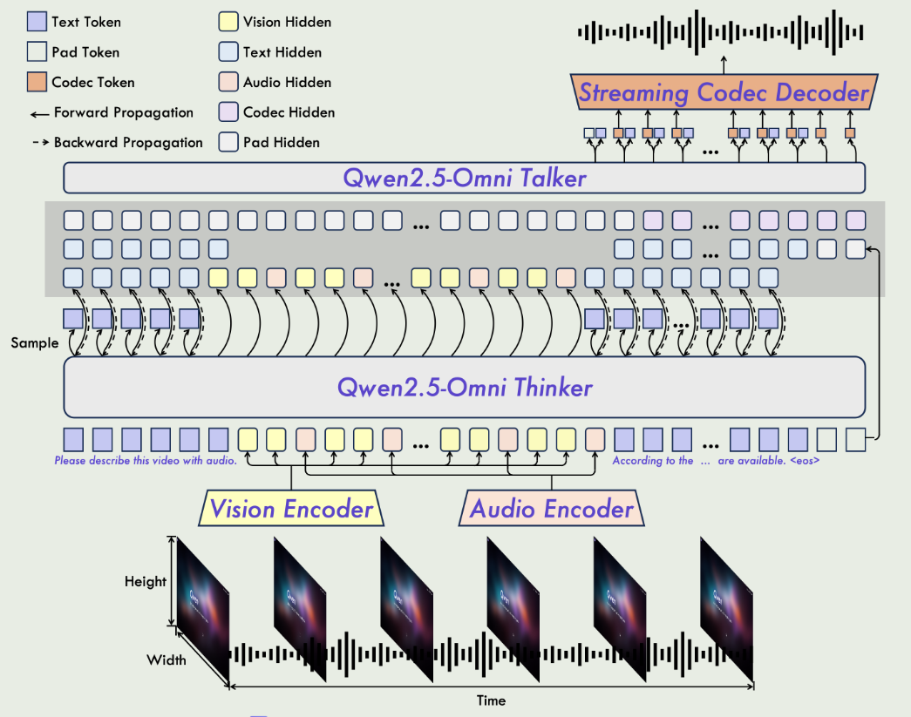
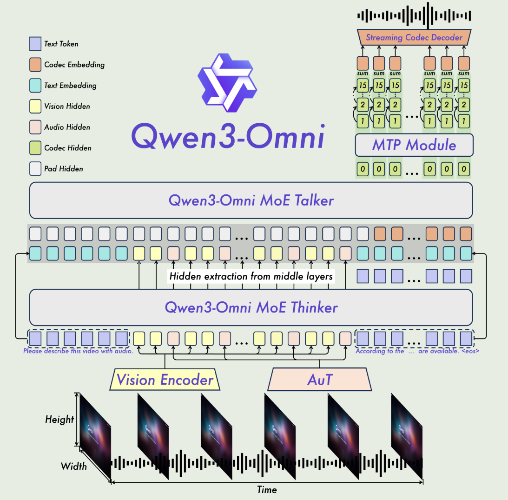
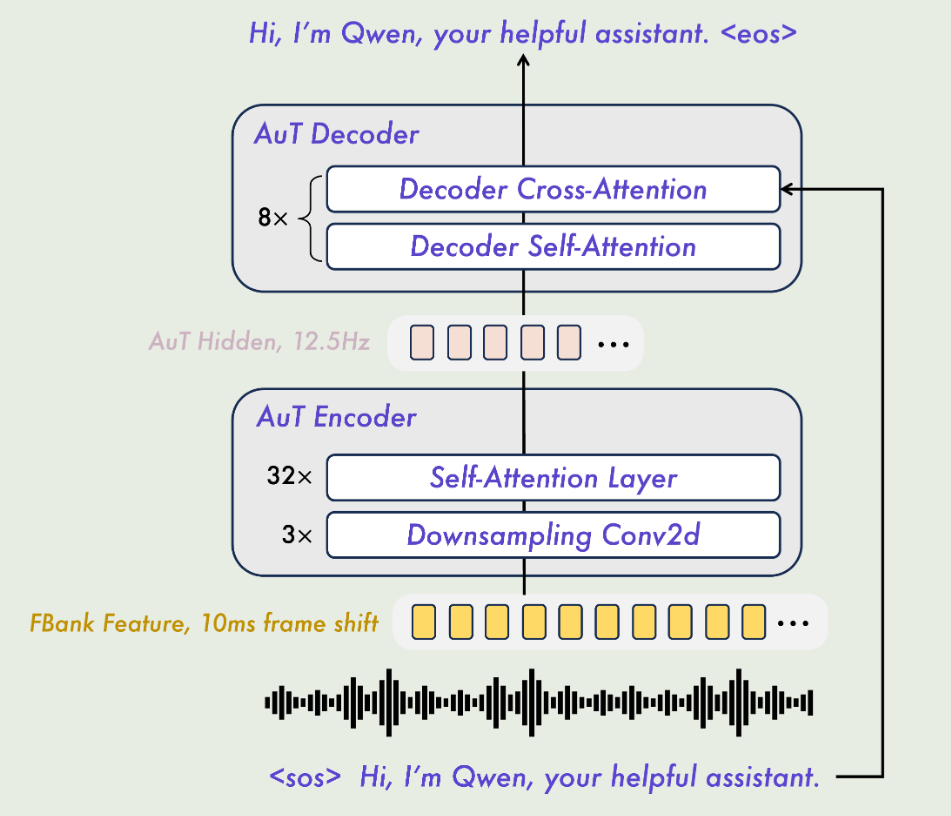

[TOC]

# Qwen2.5-Omni

Qwen2.5-Omni是一个统一的单一模型能够处理多种模态，并以流格式同时生成文本和自然语音响应。该模型架构如下图所示，主要由Thinker和Talker组成。

## Thinker

Thinker包含了基础大模型组件，audio encoder和vision encoder，接受text token、audio token以及visual token等作为输入。

Thinker是常见的大模型架构，主要用来生成文字回复，以及编码高层的语义表示，以供Talker使用。

预训练开始时，基本模型结构使用Qwen2.5模型进行参数初始化，vision encoder使用Qwen2.5-VL进行初始化，audio encoder使用Whisper-large-v3进行初始化。

### TMRoPE

Thiker的输入模态包含文本、视觉和语音，如何建模不同模态的位置信息信息呢？

论文提出了音频模态和视频模态时间交错算法TMRoPE。TMRoPE是一种编码了3D位置信息的多模态旋转位置编码算法，包括的位置信息有：时间、宽、高等三种信息。

传统的一维的旋转位置编码可以简单看作对embedding向量的两两一组进行旋转，而3D旋转位置编码则是六个为一组进行旋转。

论文将每40ms的音频帧作为一个时序位置，对于视觉token的宽和高的位置信息则使用该视觉token所在图像中的位置。

当每种模态在组织在一起作为模型输入，每种模态的位置ID使用增量编码的方式。

为了更好的表示视频信息，论文将视频中的视觉信息和音频信息按照2s切块，然后交互排列在一起。

## Talker

Talker接收Thinker的high-level的上下文语义表示以及采样的token embedding信息。

为了降低初始数据包延迟，使用了Chunked-prefill机制。audio encoder把full attention改成2s内的audio token才会计算attention，vision encoder则将相邻的visual token使用MLP网络合并成一个。

为了支持语音的流式生成，论文使用滑动窗口注意力的Flow-Matching DiT模型，该模型将输入编码经过一个Flow-Matching组件和BigVGAN组件，生成梅尔频谱图，再转成语音波形。

## 预训练

第一阶段：冻结大模型参数，使用audio-text和image-text数据训练vision encoder和audio encoder

第二阶段：训练所有模型参数，使用大量的多模态数据集进行学习

第三阶段：使用32k长度的数据进行训练，使得模型理解复杂的长序列数据

## 后训练

使用多种类型混合模态数据进行训练。在训练Talker过程中，使用了两个阶段，一是训练上下文连续对话能力，二是使用DPO进行离线RLHF学习。

# Qwen3-Omni

Qwen3-Omni达到了同样模型尺寸的单模态模型的效果，特别在语音能力上更加突出。

相比与Qwen2.5-Omni，Qwen3-Omni则使用了MoE Thinker-Talker架构。

Talker生成音频不再以Thinker的高级文本表征为条件，而是只以视觉和音频特征为条件。

由于文本表征是分离的，Thinker和Talker可以使用不同的prompt，独立控制Thinker的回应风格和Talker的音频风格。

Talker使用了多码书自回归生成范式，Talker首先生成一个码书帧，然后使用MPT模块生成剩下的码书。

最后阶段的语音合成使用轻量级的因果ConvNet网络。

## 相比上个版本的主要提升

支持对超过40分钟的输入进行音频理解；

扩展了语言覆盖范围，涵盖119种书面语言，在理解和生成方面分别支持19种和10种口语；

提出了一种推理模型，能够实现全模态推理，包括音视频和纯音频场景；

改进了流式传输性能，端到端延迟低至234毫秒。

## Audio Transformer(AuT)

AuT是一个encoder-decoder架构，使用20M hours的音频数据进行训练。在把音频输入self-attention之前，使用Conv2D模块将音频降采样8倍。训练完之后使用AuT的encoder作为Qwen3-Omni的audio encoder。

## 流式多码本编解码器生成
为了减少用户接收首个生成数据包的等待时间，降低首包延迟，采用了“仅左上下文”的多码本生成机制。

Talker生成首个token后，MTP模块立即预测当前帧的剩余token；这些token由“仅关注左上下文”的流式多码本编解码器解码器解码为波形。Qwen2.5-Omni需等待Talker提供足够块上下文后才能合成波形；Qwen3-Omni在Talker生成每个token后即可立即输出波形，显著降低首包延迟。

在**Qwen2.5-Omni**中，Talker在生成波形时需要等待足够的块上下文，因为模型采用的是块级注意机制。在这种机制下，为了确保每个生成的波形能够保持上下文的一致性和准确性，Talker必须等到整个块的表示都生成完毕。这意味着，当Talker生成波形时，它必须等待足够数量的前后内容（通常是2秒或更多的块数据）来确保输出的自然性和连贯性。这种设计确保了语音生成时不会出现明显的断裂或不连贯，但也导致了较高的首包延迟。

然而，**Qwen3-Omni**在此方面做出了优化，允许Talker在生成每个token后即刻输出波形。这种改进是通过引入多码本自回归生成机制（multi-codebook autoregressive generation）来实现的。在Qwen3-Omni中，Talker不再依赖大块上下文的积累，而是通过生成每个token的残差码本，并利用MTP模块（Multi-Token Prediction module）预测当前帧的余部分，然后直接通过Code2Wav解码器将其转换为波形。这种方法不再需要等到整个块的数据积累完成，而是每生成一个token就可以立即生成对应的音频。

## 轻量级MTP和ConvNet模块

MTP是一个轻量级的固定step自回归dense transforemer网络结构，支持高效的批量推理。

基于ConvNet的codec decoder基于卷积网路，同样支持高吞吐量。

## 预训练

使用了与Qwen2.5-Omni相同的三阶段训练。

在第一个阶段，与Qwen2.5-Omni不同的是，Qwen3-Omni摒弃了联合训练vision/audio encoder和adapter，论文提到联合训练的方式可能会使得encoder去补偿大模型的局限性。

在第三个阶段，Qwen3-Omni使用更长的上下文进行训练。

## 后训练

### Thinker

监督微调（SFT）： 第一阶段通过针对性的指令优化，弥合预训练表示和下游任务要求之间的差距。

强到弱蒸馏： 第二阶段采用强到弱蒸馏流程，包括两个主要阶段。

GSPO增强： 最后，利用GSPO全面提升模型在文本、图像、视频和音频等多模态任务中的能力和稳定性。对于这些任务的反馈，采用了两种奖励方式：基于规则的奖励和基于模型的奖励。

### Talker

第一阶段使用大量的多模态到语音数据训练模型基本的从多模态表示到生成语音能力。

第二阶段实施CPT模块的持续训练，缓解预训练阶段由于噪声数据引起的幻觉问题

第三阶段则使用复杂的长上下文数据进行微调

第四阶段上述基础模型上应用了说话人微调，使Talker能够采用特定的声音，同时改善其语音响应的自然度、表现力和可控性。

