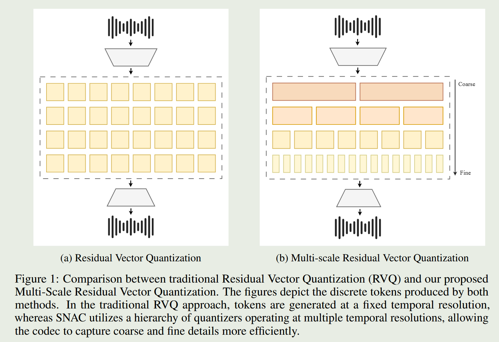
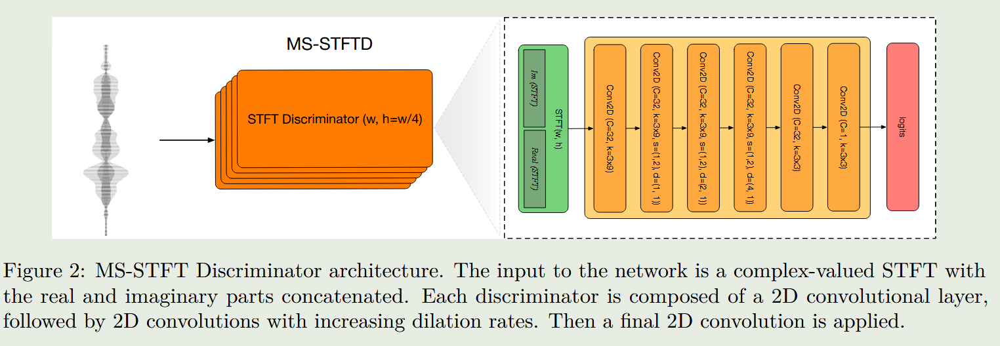
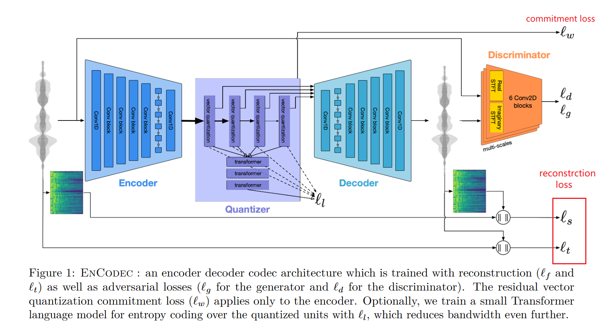

[TOC]

# Audio tokenizer

- higgs audio

  - https://huggingface.co/bosonai/higgs-audio-v2-tokenizer
  - https://github.com/boson-ai/higgs-audio
- [blog](https://zhuanlan.zhihu.com/p/1970905557931106554)
- SNAC: multi-scale neural audio codec

  - 2024.10
  - SNAC扩展了RVQGAN，使用了多尺度RVQ：在每一次残差量化中，基于一定的下采样因子对残差进行下采样，然后执行lookup。为了执行下一次的残差量化，需要再进行上采样，并计算下一次的量化残差。下采样使用了均值pooling，上采样则使用了最近邻插值。论文使用的下采样因子是8、4、2、1，具体如下图

    
  - 为了增加随机性，增强decoder的表达能力，在上采样层之后添加了高斯噪声，实验发现提高重建质量和码本利用率。
  - SNAC使用了深度可分离卷积，使模型轻量化的同时也提高了训练稳定性。
  - SNAC在最低的时序分辨率处使用了局部窗口注意力机制。
- SpeechTokenizer: Unified Speech Tokenizer for Speech Large Language Models

  - 2023.08，ICML2024，Fudan

  - 为了评估语音令牌对于构建语音语言模型的适用性，作者建立了第一个基准测试SLMTokBench

  - 提出了SpeechTokenizer，这是一个为语音大型语言模型设计的统一语音分词，基于RVQ-VAE，它采用编码器-解码器架构，并结合残差向量量化（RVQ）技术

  - 基于SpeechTokenizer，作者构建了一个统一的语音语言模型（USLM），它结合了自回归和非自回归模型
- High-Fidelity Audio Compression with Improved RVQGAN

  - 2023.06，DAC，https://github.com/descriptinc/descript-audio-codec
  - 对比EnCodec、SoundStream等基于GVQGAN框架的音频压缩算法，论文提出的DAC具有更低的码率（8kbps），并缓解了音调伪影，音高，周期性伪影以及高频建模不完善的问题。
  - 音频存在明显的周期性，传统的激活函数如Leaky ReLUs无法有效外推周期性信号，使用了BigVGAN中的Snake激活函数：$\text{snake}(x) = x + \frac{1}{\alpha} \sin^2(\alpha x)$
  - 原始的向量量化的码本利用率不高，该论文尝试了基于K-Means的码本初始化方法以及随机重启机制，虽然一定程度缓解但仍然存在部分码本未被利用的问题。论文引入了两个tricks：第一个是因子分解解耦lookup和embedding，使用低维的码本lookup，embedding则使用正常维度的码本。第二个是使用L2归一化的码本，可以提高稳定性和质量。
  - 不同于SoundStream为了动态比率对每个样本都采样不同的量化器数量，论文只对以0.5概率采样到的样本执行动态比率量化
  - MS-STFT判别器通过在多个时间-频率尺度上对音频的复数 STFT 进行判别，联合刻画音频的细节纹理与长程结构。 它由多个结构相同的子判别器组成，分别处理不同窗口长度的 STFT 特征，利用带时间维空洞卷积的 2D CNN 提取多尺度时频模式。该方法能显著增强对高频细节和瞬态结构的感知能力，从而提升生成音频的真实度与清晰度。如下图：

    
  - 损失设置

    - 联合使用Mel重构损失和多尺度STFT频谱损失，基于L1计算Loss
    - 基于 HingeGAN 的对抗损失，结合多周期波形判别器与多频带多尺度 STFT 判别器，从时域与频域同时约束生成音频的真实性；同时引入 L1 特征匹配损失，对齐真实与生成样本在判别器中间特征层的分布
    - 码本学习的loss：码本损失+commitment损失
    - 启发式的损失加权
    
  - 实验结果显示，在各种比率上超越了EnCodec、Lyra、Opus等方法
- Large-scale Contrastive Language-Audio Pretraining with Feature Fusion and Keyword-to-Caption Augmentation

  - https://github.com/LAION-AI/CLAP
  - 通过text-audio对比学习的方式进行audio的表示学习

- High Fidelity Neural Audio Compression

  - 2022.10，Meta，EnCodec
  - https://github.com/facebookresearch/encodec
  - 该方法的encoder使用了卷积+LSTM网络+1D卷积，decoder使用了1D卷积+LSTM网络+时序卷积
  - 

- SoundStream: An End-to-End Neural Audio Codec

  - 2021.07，

  - VQ面临一个问题，如果要更加准确的表征音频片段，那就是它需要一个庞大的码本(codebook)来进行工作

  - 本工作提出了RVQ，RVQ是VQ的一个变种，它在多级量化过程中被使用。

  - 在第一级，使用标准的VQ过程来量化信号，然后计算出原始信号与第一级量化后的信号之间的残差，对这个残差再进行一次或多次量化，以进一步减小量化误差，每一级都会产生一个新的残差，然后对新的残差继续量化，这样做可以逐步细化量化结果，提高最终的重建质量。

- Neural Discrete Representation Learning

  - 2017，VQ-VAE，

  - 将输入x编码为离散的向量，计算离散向量，映射到离散潜在嵌入空间e中的最近向量，映射结果输入到decoder解码出x'
    - 模型训练的损失：
      - 向量量化损失：使用l2范数来计算编码器输出和最近嵌入向量之间的距离，并通过梯度下降来最小化这个距离，在反向传播中更新离散潜在嵌入空间e；
      - 重建损失，即输入和输出的均方误差损失；
      - 为了确保编码器的输出不会无限制地增长，并且嵌入空间的体积保持稳定，引入了承诺损失（commitment loss），这有助于模型更坚定地选择特定的嵌入向量，类似正则项

  - 参数更新：编码器参数更新依赖于重建损失和承诺损失，解码器参数仅依赖于重建损失进行更新，离散潜在嵌入空间的更新主要依赖向量量化损失