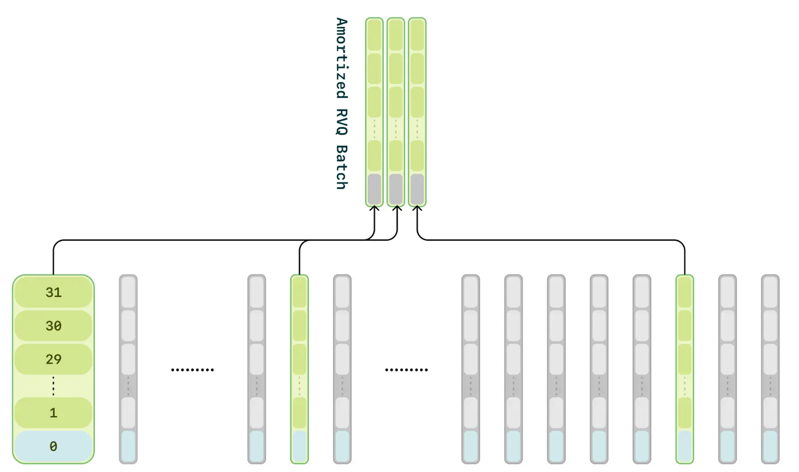

[TOC]

# Paper

- Step-Audio: Unified Understanding and Generation in Intelligent Speech Interaction
  - 2025.02，阶跃星辰
  - code：https://github.com/stepfun-ai/Step-Audio
  - 论文贡献
    - 开源130B统一end2end的语音对话模型Step-Audio-Chat，支持各种语音任务。支持多感情、多中声音模式、方言以及角色扮演等。
    - 基于130B模型蒸馏的数据训练并开源了TTS-3B模型
  - Step-Audio-Chat使用了语音输入，文本输出，TTS的框架，本质上仍然是一个级联式的语音大模型
    - 
  - Tokenizer
    - 使用了双码书语音tokenizer框架。linguistic tokenizer使用了Paraformer模型的encoder。semantic tokenizer使用了CosyVoice的tokenizer。
    - 为了有效整合这两种tokenization方案，使用了token-level交错排列输入的方式。
  - LLM
    - 基于Step-1模型进行语音继续预训练
  - Speech Decoder
    - 由一个3B的语言模型，一个flow-matching模型和一个mel-to-wave的vocoder组成
    - speech decoder使用了dual-code交错排列方法，更好的整合linguistic和semantic特征。
  - 实时推理系统
    - 投机回复生成
    - 对话管理：历史对话中使用音频的转录文本
    - 流式的audio tokenizer：利用固定时间段分割语音

- MinMo: A Multimodal Large Language Model for Seamless Voice Interaction
  - 2025.01，通义实验室
  - demo：https://funaudiollm.github.io/minmo/
  - MinMo基于LLM利用了轻量级的模块对齐方法，包括Voice Encoder、LLM、Voice Decoder，全双工预测模块等。MinMo是一个完全end2end的语音大模型
  - MinMo的模型架构图
    - 
  - 使用SenseVoice-large encoder作为Voice Encoder，然后使用Input Project将audio token投影。Input Project由两层的Transformer和一层的CNN组成。
  - 使用Qwen2.5-7B-instruct模型作为LLM
  - 生成时，将每5个token和相应的hidden state送入到Ouput Projector中，Output Projector由一层线性层组成。
  - 然后送入到Voice Token LM中，Voice Token LM使用的是CosyVoice2模型。Voice Token LM自回归的生成15个speech token，使用Token2way Synthesizer生成最后的输出音频。Token2way Synthesizer由一个将token转为梅尔谱信息，一个将梅尔谱转为声音波形的vocoder等组成
  - Full Duplex Predictor由一个单层Transformer和softmax组成，主要是进行实时判断是否要加入对话以及中断对话

- https://github.com/OpenBMB/MiniCPM-o

  - 2025.01
  - 在时间维度上将不同模态的输入/输出流分割成小块，并以块为单位进行编码/解码以实现更低的延迟。对于语音生成来说，我们设计了一种新颖的流式注意力策略使解码器能够在接收到第一个文本块时就开始生成音频。
  - 借鉴通信领域的时分复用技术，我们将每个模态的信息流分割成小块（每秒一块），并将同一秒内的所有模态信息组合成一个紧凑的序列单元输入给大语言模型主干。
  - 大语言模型和语音解码器则以混合方式连接：
    - speech embedding 连续特征控制语音、情感、口音及其他细粒度语音特征。在训练过程中，来自语音解码器的梯度会反向传播到包含大语言模型主干和音频编码器的整个模型参数。模型通过端到端方式训练，没有使用任何中间损失和监督
    - 将来自大语言模型的文本输入到语音解码器，来提供更好的语义控制和训练数据效率
  - 模型架构
    - 

  

- SesameAILabs csm模型

  - 2025，SesameAILabs 
  - code: https://github.com/SesameAILabs/csm
  - [模型介绍](https://www.sesame.com/research/crossing_the_uncanny_valley_of_voice)
  - version1
    - 首先使用多模态backbone处理交错的text和audio，来生成第0个codebook
    - 然后使用audio decoder建模剩下的N-1个codebook，audio decoder对每个codebook使用了不同的线性头。
    - 该版本在训练时占用较大的显存
    - 
  - version2
    - 为了减少计算负担，只训练音频帧的1/16，注意需要对每帧的第0个codebook进行训练
    - 在训练过程中，该方法的decoder loss未出现显著变化
    - 

- LLaMA-Omni: Seamless Speech Interaction with Large Language Models

  - 2024.09, ICLR
  - LLaMA-Omni同时生成语音token和文本token，使用两阶段训练
    - 

- GLM-4-Voice
  - 2024.12，智谱AI
  - code：https://github.com/THUDM/GLM-4-Voice
  - 使用了单码本的speech tokenizer，从而避免推理时需要解码多层的语音token，提高效率
  - 模型对输入和输出使用了统一的speech表示，方便预测下一个token、也提高了非监督预训练的效率
  - speech tokenizer和speech decoder架构
    - 

- Advancing Speech Language Models by Scaling Supervised Fine-Tuning with Over 60,000 Hours of Synthetic Speech Dialogue Data
  - 2024.12

- Scaling Speech-Text Pre-training with Synthetic Interleaved Data
  - 2024.11

- Generative Spoken Dialogue Language Modeling
  - 2022.03

- https://github.com/baichuan-inc/Baichuan-Audio