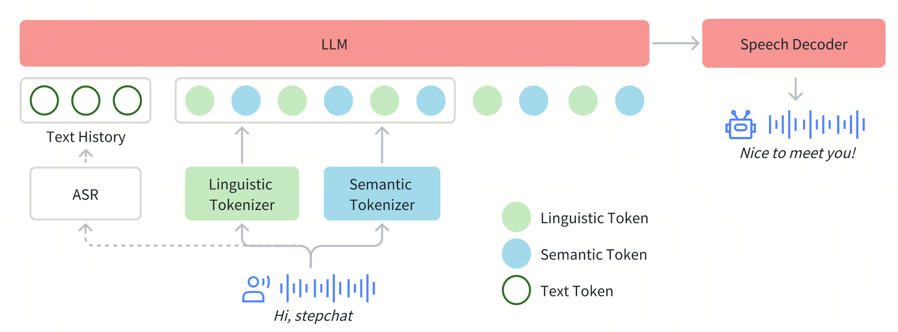
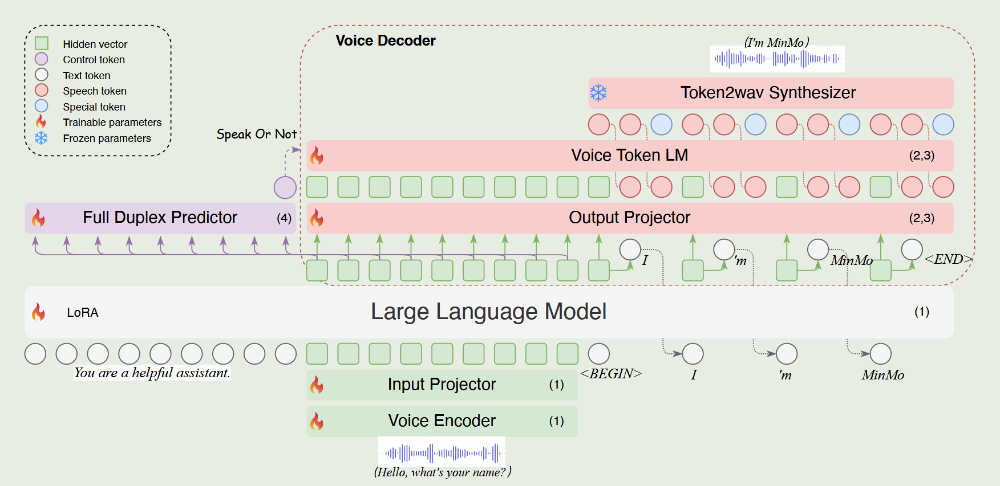
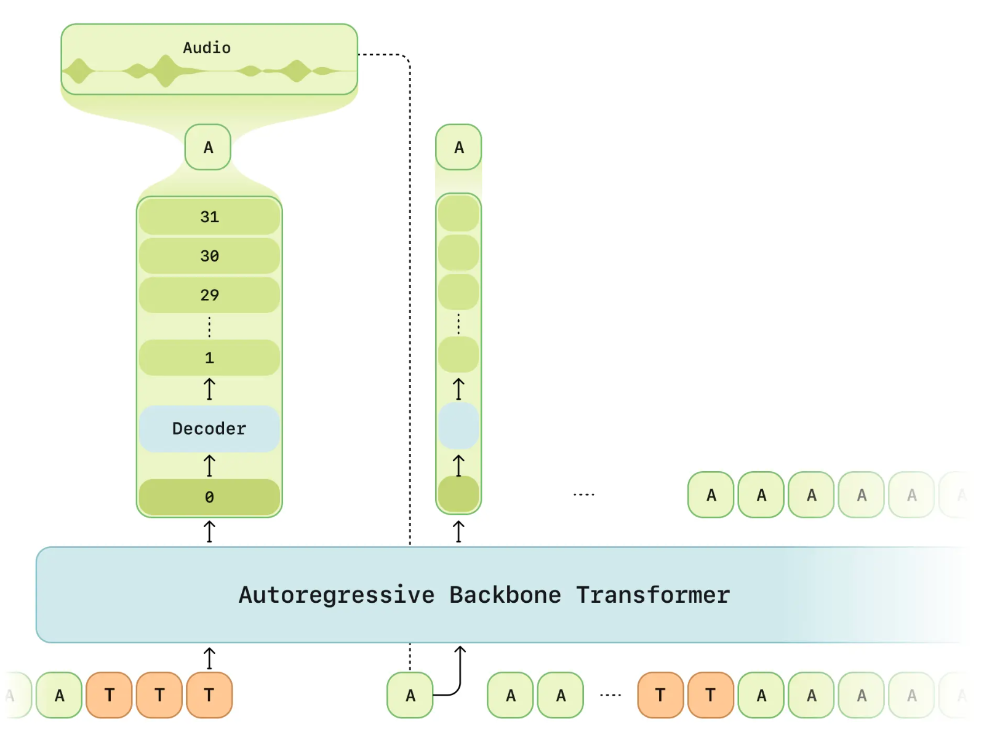
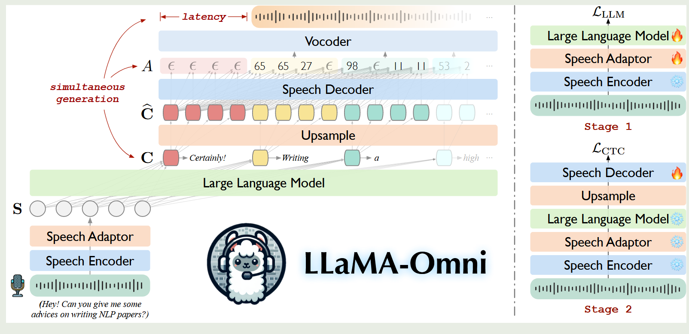
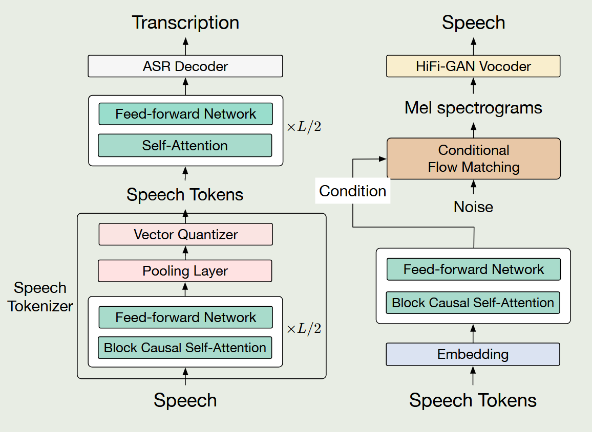
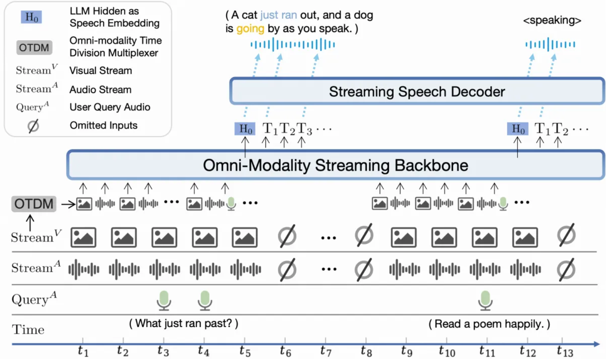

[TOC]

## Resource

- Conversational speech generation
  - https://www.sesame.com/research/crossing_the_uncanny_valley_of_voice#demo
  - https://github.com/SesameAILabs/csm

## Paper

- Full-Duplex-Bench: A Benchmark to Evaluate Full-duplex Spoken Dialogue Models on Turn-taking Capabilities
  - 2025.03
  - codes: https://github.com/DanielLin94144/ Full-Duplex-Bench
  - 提供了全双工语音大模型对话交互能力评估的benchmark，从一下4个维度进行评估：pause handling（用户停顿时保持沉默）、backchanneling（用户说话时模型给与及时的肯定信号）、smooth turn taking（模型及时接管对话）、user interruption
  
- Audio Flamingo 2: An Audio-Language Model with Long-Audio Understanding and Expert Reasoning Abilities
  - 2025.03
  
- Step-Audio: Unified Understanding and Generation in Intelligent Speech Interaction
  - 2025.02，阶跃星辰
  - code：https://github.com/stepfun-ai/Step-Audio
  - 论文贡献
    - 开源130B统一end2end的语音对话模型Step-Audio-Chat，支持各种语音任务。支持多感情、多中声音模式、方言以及角色扮演等。
    - 基于130B模型蒸馏的数据训练并开源了TTS-3B模型
  - Step-Audio-Chat使用了语音输入，文本输出，TTS的框架，本质上仍然是一个级联式的语音大模型
    - 
  
- MinMo: A Multimodal Large Language Model for Seamless Voice Interaction
  - 2025.01，通义实验室
  - demo：https://funaudiollm.github.io/minmo/
  - MinMo基于LLM利用了轻量级的模块对齐方法，包括Voice Encoder、LLM、Voice Decoder，全双工预测模块等。MinMo是一个完全end2end的语音大模型
  - MinMo的模型架构图
    - 
  
- SesameAILabs csm模型
  
  - 2025，SesameAILabs 
  - code: https://github.com/SesameAILabs/csm
  - [模型介绍](https://www.sesame.com/research/crossing_the_uncanny_valley_of_voice)
  - version1
    - 首先使用多模态backbone处理交错的text和audio，来生成第0个codebook
    - 然后使用audio decoder建模剩下的N-1个codebook，audio decoder对每个codebook使用了不同的线性头。
    - 该版本在训练时占用较大的显存
    - 
  - version2
    - 为了减少计算负担，只训练音频帧的1/16，注意需要对每帧的第0个codebook进行训练
    - 在训练过程中，该方法的decoder loss未出现显著变化
  
- LLaMA-Omni: Seamless Speech Interaction with Large Language Models

  - 2024.09, ICLR
  - LLaMA-Omni同时生成语音token和文本token，使用两阶段训练
    - 

- GLM-4-Voice
  - 2024.12，智谱AI
  - code：https://github.com/THUDM/GLM-4-Voice
  - 使用了单码本的speech tokenizer，从而避免推理时需要解码多层的语音token，提高效率
  - 模型对输入和输出使用了统一的speech表示，方便预测下一个token、也提高了非监督预训练的效率
  - speech tokenizer和speech decoder架构
    - 

- Advancing Speech Language Models by Scaling Supervised Fine-Tuning with Over 60,000 Hours of Synthetic Speech Dialogue Data
  - 2024.12

- Scaling Speech-Text Pre-training with Synthetic Interleaved Data
  - 2024.11

- Generative Spoken Dialogue Language Modeling
  - 2022.03

- https://github.com/baichuan-inc/Baichuan-Audio

- https://github.com/OpenBMB/MiniCPM-o
  - 直接通过编码后的音频特征将音频编码器与大语言模型连接起来
  - 大语言模型和语音解码器则以混合方式连接：
    - speech embedding 连续特征控制语音、情感、口音及其他细粒度语音特征。在训练过程中，来自语音解码器的梯度会反向传播到包含大语言模型主干和音频编码器的整个模型参数。模型通过端到端方式训练，没有使用任何中间损失和监督
    - 将来自大语言模型的文本输入到语音解码器，来提供更好的语义控制和训练数据效率
  - 模型架构
    - 

  