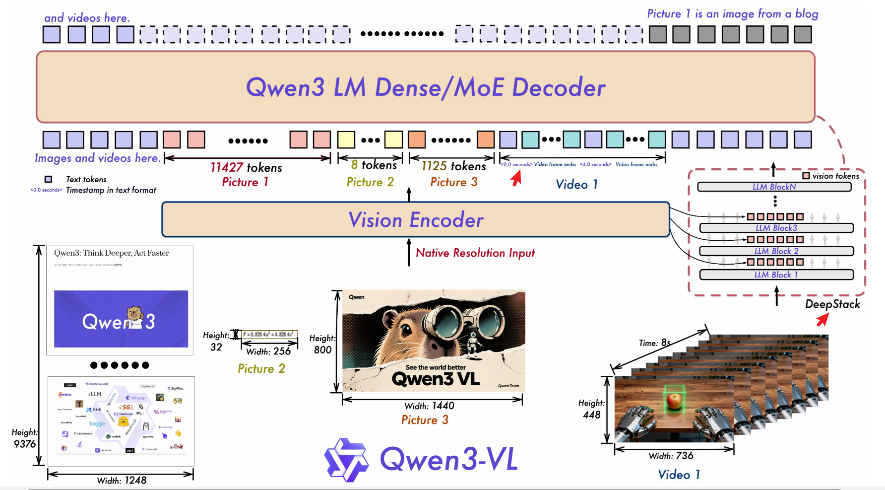
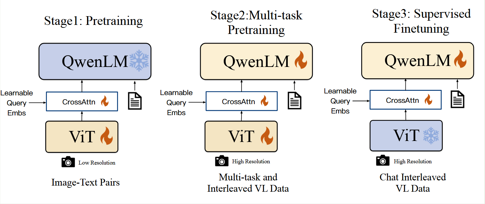

[TOC]

# VLM

- Qwen3-VL Technical Report
  - 2025.11
  - 使用了交错式 MRoPE。原始设计中，将嵌入维度均匀划分成3个子空间，每个子空间分配不同的旋转频率，研究表明这会导致频率谱分布不均衡。交错式 MRoPE 使得这三个分量（time、width、high）交错式排列，确保了每个空间轴在低频和高频都得到均匀表示。
  - 使用了DeepStack技术，将不同层次的视觉信息融入到 LLM 主干中。
  - 使用显式的时间 token 替代Qwen2-VL中通过绝对位置编码实现的绝对时间对齐。
  - 

- Qwen2.5-VL
  - 相比Qwen2-VL，Qwen2.5-VL做了如下提升：
    - 直接使用物体定位的实际坐标，而不对坐标进行归一化，使得模型能够直接学习图像的尺度。
    - 在时间维度上，使用了绝对位置编码，同时引入了动态帧技术，每秒随机动态采样帧序列，使得模型通过不同时间 ID 的间隔，来学习时间的节奏。
    - 从头训练了vision encoder ViT模型，为了提升性能，模型只有4层计算全注意力，其余使用滑动窗口注意力。
  - 训练方式和Qwen2-VL保持一致。
- Qwen2-VL: Enhancing Vision-Language Model’s Perception of the World at Any Resolution
  - 2024.09
  - 相比Qwen-VL只支持图像的单一分辨率，Qwen2-VL 支持任意的分辨率。
  - vision encoder 使用了 RoPE 位置编码；LLM 主干的输入使用了 3D-RoPE
  - 视觉输入投影层使用了一种更简单的压缩方法：将空间位置临近的 patch 块进行拼接，然后使用两层的 MLP 进行线性变换。
  - 统一了视频和图像的理解框架，能混合输入视频和图像。对于视频，每秒采样两帧，对于图像，则复制一份构成两帧，使用 3D 卷积进行特征抽取。
  - Qwen-VL整体训练样本1.4B左右，Qwen2-VL则达到了1.4T。
- Qwen-VL: A Versatile Vision-Language Model for Understanding, Localization, Text Reading, and Beyond
  - 2023.08
  - 模型和训练如图所示。
  - 为了缓解模型压缩过程中损失详细的位置信息，在 cross-attention 结构中的 key 和 value 对中添加了 2D 的绝对位置编码信息。
  - 