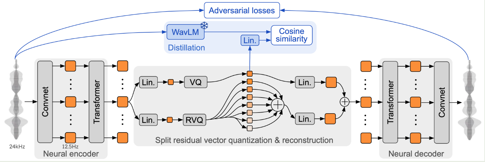
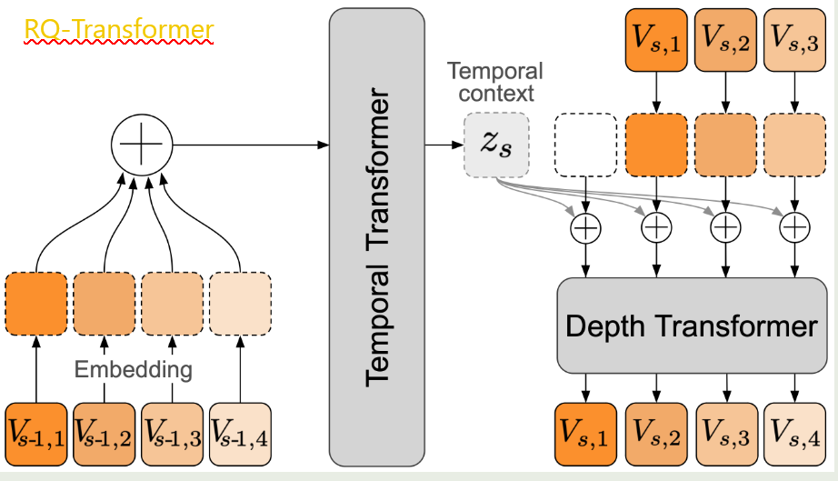
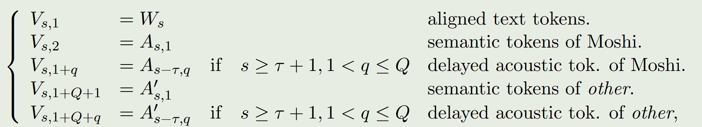
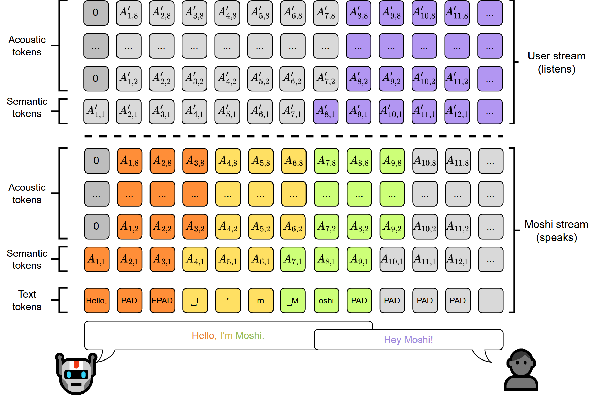
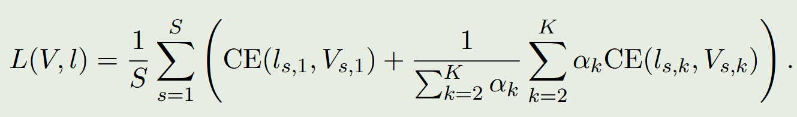
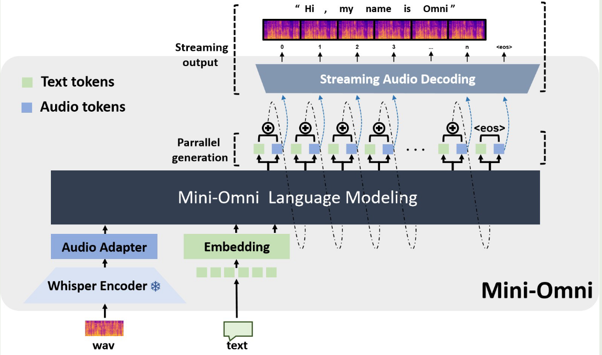
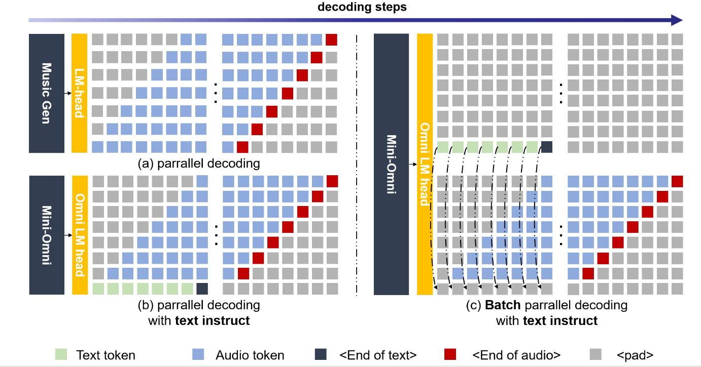

[TOC]

## gpt-4o-liked models

- LLaMA-Omni
  - [Code](https://github.com/ictnlp/LLaMA-Omni), [Paper: LLaMA-Omni: Seamless Speech Interaction with Large Language Models](https://arxiv.org/pdf/2409.06666)

### VITA

- 2024.08，[Code](https://github.com/VITA-MLLM/VITA), [Paper: VITA: Towards Open-Source Interactive Omni Multimodal LLM](https://arxiv.org/pdf/2408.05211)
- 大模型指令微调
  - 模型使用了Mixtral 8x7B，为了对中文有更好的支持，扩充了词表，并使用了5M的合成双语数据进行指令微调
- 多模态对齐
  - 该阶段主要是为了对齐文本模态和其他模态
  - 视觉模态对齐
    - Visual Encoder使用InternViT-300M-448px，来对image、video进行encoding
    - 对齐过程中只训练连接器部分
    - 该阶段使用了大量的多模态数据集，query中不包含语音模态数据
  - 音频模态对齐
    - Audio Encoder使用了梅尔普特征，然后使用4×CNN进行下采样，接着使用24层的transformer，最后使用两层mlp最为连接器
    - 对齐过程使用了ASR任务和音频描述任务
- 多模态指令微调过程
  - 数据源与对齐阶段的数据相同，做了一些改变。将一半的问题用GPT-SoVITS工具转成语音作为输入，另外一半的问题作为纯文本直接作为输入
  - 为了避免不同类型的数据引起的冲突，针对不同模态类型的输入数据设置了不同的system prompt
  - Noisy Audio Construction: 从现有的多模态或者多模态QA数据中采样474K的答案，这些答案的长度分布与有效的问题近似，然后将答案用TTS工具转成语音，构建出拒答语音数据，也就是噪声语音数据
  - 训练过程：为了对不同模态类型的输入进行更好的交互，在训练时，针对不同的输入模态类型，在答案的开始位置添加相应的特殊token，语音query添加<1>，噪声语音query添加<2>，纯文本query<3>
  - 模型无法输出语音，需要TTS转成语音
- 双工交互
  - 使用了VAD模型SileroVAD，确定音频内容是否构成人类的声音
  - 噪声过滤：使用了状态token <2> 来判断输入音频是否时有效的query
  - 声音打断交互：同时部署两个模型，生成模型用来回复用户的query，而监测模型同时监测环境声音，当监测到有效的query时，生成模型终止回复，并将上下文提供给监测模型，监测模型开始对新query进行回复，而生成模型对环境生成进行监测，二者完成了身份的互换。

### Moshi

- [Code](https://github.com/kyutai-labs/moshi), [Paper: Moshi: a speech-text foundation model for real-time dialogue](https://kyutai.org/Moshi.pdf)

- **整体概述**
  
  - Moshi是一个多流语音到语音Transformer模型，能够实现与用户的全双工语音对话。它基于Helium构建，是一个从零开始创建的文本大型语言模型（LLM）
  - 引入了“Inner Monologue”，使得在训练和推断过程，该过程中同时处理文本和音频标记，使模型可以利用文本模态的知识，但仍保持为一个语音到语音系统
  - 设计为多流架构，允许模型同时进行说话和聆听，不需要明确地控制讲话轮次，以支持实时对话
  - 提出了Mimi，一种神经音频编码器，通过残差向量量化（RVQ）和知识蒸馏技术将语义和声学信息整合进单一tokenizer中，以高效且高质量地捕捉用户输入音频并输出声音
  
- **Helium大语言模型**
  
  - Helium是基于Transformer的自回归语言模型，做了如下改进：在attention block，feed-forward block以及output layer之前使用了RMS Norm；使用RoPE旋转位置编码；在feed-forward block中，使用门控线性单元GLU；tokenizer使用了unigram model（from sentencepiece）
  - 预训练数据只保留了英文数据，做了数据去重和质量过滤
  
- **Audio Tokenization**
  
  - 背景：
    - 声学token表征了音频细节信息，可以用来重建高质量的音频。声学token一般有下面几个用处：与text结合生成语音（即ASR），与text结合生成音乐，与语义token结合进行无条件的音频生成。
    - 声学token无法重建高质量的音频，而是与人类语言内容相关，因此与语言模型的token更加相似。语义token主流是使用双向transfomer模型建模，无法支持流式任务。
  - 基于背景介绍中存在的问题，文章提出了Mimi音频编解码器，核心是将支持语义token编码的双向模型蒸馏到单向因果模型中。
  - Mimi编码器使用了时序卷积网络对输入音频进行encoding，得到隐式表征。接着使用残差向量量化RVQ将隐式表征离散化为codebook中的向量（RVQ具体方法可以学习相关论文）
  - 在量化前和量化后添加了8层的casual transformer层，为了稳定训练，使用了LayerScalue初始化方法
  - 如何蒸馏？论文将WavLM语义信息蒸馏到了RVQ的第一层中，方法是计算RVQ首次量化输出的embedding和WavLM的embedding的cosine举例，作为训练loss的一部分。因此第一个量化层保留语义token信息，而声学token则在RVQ的其他量化层进行了保留。

- **音频生成建模**

  - 首先论文尝试说明了Mimi编解码器的audio token相比text token的压缩率很低。对于codebook为8的12.5Hz的音频，1秒的音频生成需要模型生成100个audio token，这在推理时是不可接受的。相反，每秒钟的音频只需要3-4个text token。
  - 根据前文我们知道，音频编码之后的每个step有Q个量化向量组成（Q是codebook的数量），论文使用RQ-Transformer来建模。
  - RQ-Transformer：同时在时序方向和深度方向对数据进行建模。在Moshi中，时序方向对应时间步，而深度方向对应RVQ模块的多层量化向量
  - 前面已经提及，Q为8的codebook中，第一个codebook对应语义token信息，其他的codebook对应着声学token信息。论文发现，对声学token信息进行delay可以提供更稳定的语音生成效果。
  - 将Moshi和用户的音频同时建模，并且对每个音频流都使用了声学token信息delay。两个音频流的audio token直接进行拼接，如果使用了Q个codebook，那么量化向量的数量为2Q，此时RQ-Transformer的每个step输入时2Q个量化向量
  - **论文提出了”Inner Monologue“方法**
    - 即相比只使用audio token，同时使用audio的转录文本信息，能够增加生成音频的质量。只对Moshi的音频进行了转录，不对用户的音频进行转录，因为推理时对用户的音频进行转录需要额外的ASR进行语音识别。

    - 为了将text token与audio token进行对齐，使用whisper对语音进行识别，获取识别文字的时间窗口，从而对应到audio token，未被text token覆盖到的时间窗口使用PAD token来表示，并在下一个text token前添加EPAD，表示padding的截止符。

    - 通过在text token和audio token引入delay，这种delay可以将一个模型被另外一个模态支配。如果text token在audio token的前面，那么text便由audio决定，此时可以衍生出ASR系统；反之，如果audio token在text token的前面，那么audio便由text决定，此时可以衍生出TTS系统。因此只需要改变delay的方向，可以支持不同的系统，而不需要改变训练的Loss。

    - 由于引入了”Inner Monologue”，即Moshi音频的text输入，此时RQ-Transformer的每个step输入时2Q+1个量化向量，如下图：

  - **Moshi的联合多个sequence的表征**，如下图：

  - **推理过程**
    - 在推理时，我们对与Moshi输出的所有子序列索引 $V^{s,k}$ 中进行采样：即，对于k=1是对应于Moshi讲话的文本标记，而对于k∈{2,..., 2+Q}则是Moshi的音频标记。在推理环境中，来自用户的音频标记（k>2+Q）的预测实际上是被忽略的，因为使用的是实际的用户音频。
    - 用户和Moshi之间的轮次转换没有明确的界限：Moshi可以在任何时候说话和倾听，必要时甚至可以同时进行。特别是当用户说话而Moshi保持沉默时，Moshi流对应的音频标记解码为“自然静音”，一种接近静音的波形，而不是具有固定、明确定义的值；同时，Moshi的文本流将填充PAD标记。

- **训练数据**

  - 纯文本数据
  - 音频数据
    - 收集了7M小时的音频数据，并且用whisper进行了转录。基于该数据进行audio预训练，该预训练阶段只使用了单流模式，以及转录的文本流模态
    - 为了实现双流，使用了2000小时的Fisher语音对话数据进行了训练。
    - 我们收集了多对参与者之间 170 小时对话，每个说话者使用单独的通道进行记录，以便提供一个小的数据集，用于对模型进行微调，以提高仅使用 Fisher 时获得的质量。我们将这个数据集称为有监督的多流数据集。我们不会直接在这个数据集上训练 Moshi，而是使用它来训练一个逼真的多流文本到语音（TTS）模型

  - Speech-Text指令数据
    - 传统的文本指令数据不适合语音对话模型，因此使用Helium和真实对话的转录生成了真正的AI与用户的交互数据。

- **训练loss**

  - 计算ground-truth离散token的$V_{s,k}$和估计的logits$l_{s,k}$的交叉熵损失
  - 给与text token同等的重要性，对于语义token给与的重要性系数是100，对于声学token给与的重要性系数是1

  

### Mini-Omni

- [Code](https://github.com/gpt-omni/mini-omni), [Paper: Mini-Omni: Language Models Can Hear, Talk While Thinking in Streaming](https://arxiv.org/pdf/2408.16725)

- Mini-Omni概述

  - Mini-Omni的基本思想是通过文本来指导音频的生成，这种方法基于假设：text token有更高的信息密度，可以使用更少的token表示相同的信息。
  - 生成音频token时以对应文本token为条件，类似在线语音合成系统，且生成音频前用 N 个pad token填充，确保先产生文本token
  - 模型可依据说话者和风格的embedding，控制说话者特征和风格元素
  - 
  
- 将audio token和text token合并成新的词表，生成时同时预测audio token和text token，Loss如下

  

- 音频解码策略

  - 理解这部分之前，首先要熟悉audio token。音频编解码器一般使用残差向量量化RVQ对音频特征进行离散化，经过多层量化之后，audio token由Q个向量组成，Q是codebook的数量。

  - 解码时可以顺序进行，但是对于实时音频生成任务来说，并行解码是一种更合适的方案。建议看下MusicGen这篇论文，能够对并行解码有更深刻的理解。

  - **Text-delay Parallel Decoding**：Mini-Omni概述部分提及到，使用了文本知道音频生成的方法。具体实现是对text token和audio token同时解码，并加入delay机制，使得text token先生成，来指导音频的生成

  - **Batch Parallel Decoding**

    - 进一步增强模型在对话中的推理能力，最大化其基于文本的能力转移，研究人员尝试使用Batch Parallel Decoding
    - 鉴于模型在文本模态中表现更强，他们将单个输入的推理任务扩展到批次大小为2：一个样本同时需要文本和音频响应，另一个样本只需要文本响应，重点放在基于文本的音频合成上。
    - 第一个样本的文本标记输出被丢弃，而第二个样本的文本输出则嵌入到第一个样本相应的文本标记位置。与此同时，第一个样本的音频流使用了第二个样本纯文本响应的内容；这一过程被称为批处理并行解码。
    - 通过这种方法，几乎可以完全以最小资源开销将模型基于文本的能力转移到音频模态，显著增强了它在新模态下的推理能力。

  - Parallel Decoding和Batch Parallel Decoding的图解

    

- 训练
  - 模态对齐：对模型进行freeze，主要训练两个adapter，训练任务有ASR和TTS
  - 适应性训练：主要训练模型的文本生成能力，因为音频的生成主要依赖于生成的文本。训练的任务有：speech recognition, spoken question answering, and text response tasks
  - 多模态微调：使用更加全面的数据，对模型的所有参数进行微调

