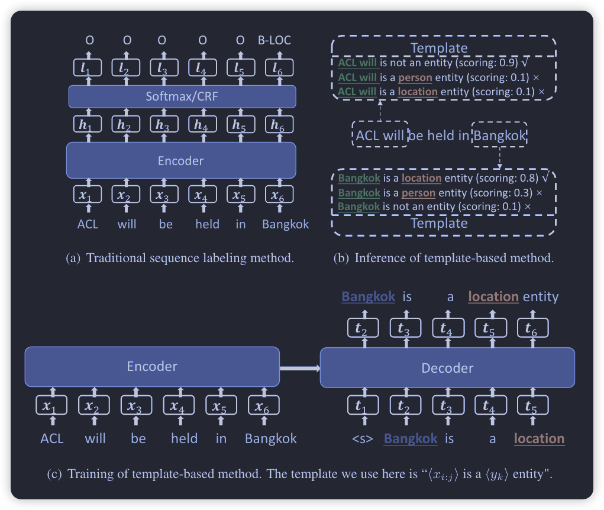

<!-- START doctoc generated TOC please keep comment here to allow auto update -->
<!-- DON'T EDIT THIS SECTION, INSTEAD RE-RUN doctoc TO UPDATE -->
**Table of Contents**  *generated with [DocToc](https://github.com/thlorenz/doctoc)*

- [Repo](#repo)
  - [地址解析](#%E5%9C%B0%E5%9D%80%E8%A7%A3%E6%9E%90)
- [Paper](#paper)
  - [Chinese datasets](#chinese-datasets)

<!-- END doctoc generated TOC please keep comment here to allow auto update -->

# Repo
- GlobalPointer：用统一的方式处理嵌套和非嵌套NER https://github.com/bojone/GlobalPointer
- https://github.com/lonePatient/BERT-NER-Pytorch
- https://github.com/fastnlp/TENER
- https://github.com/SadeemAlharthi/Arabic_Question-Answering_System_Using_Search_Engine_Techniques
- https://github.com/LeeSureman/Flat-Lattice-Transformer
- https://github.com/FuYanzhe2/Name-Entity-Recognition
- https://github.com/loujie0822/DeepIE
- https://github.com/hecongqing/CCKS2019_EventEntityExtraction_Rank5
- 

## 地址解析
- https://github.com/modood/Administrative-divisions-of-China
  - 中文地址多级标准数据库
- https://github.com/xiangyuecn/AreaCity-JsSpider-StatsGov
  - 中文地址多级标准数据库
- https://huggingface.co/cola/chinese-address-ner
- https://github.com/youzanai/trexpark
  - 有赞开源：收货地址预训练语言模型
- https://www.kaggle.com/competitions/scl-2021-ds/overview/description
  - Kaggle比赛
- https://github.com/leodotnet/neural-chinese-address-parsing
  - This page contains the code used in the work "Neural Chinese Address Parsing" published at NAACL 2019.

# Paper
## NER
### 2022
- NFLAT: Non-Flat-Lattice Transformer for Chinese Named Entity Recognition
  - 

    
阅读笔记: 

    1. 提出了一种non-flat-lattice transformer结构来建模中文ner，相比flat-lattice模型，更少的计算量、占用更少的显存和支持处理更长的文本   
    2. 将char embedding（原始文本）作为Q，word embedding作为K、V，基于一种InterAttention结构做attention计算。   
    3. InterAttention结构：Q加上可学习的参数再与K和相对距离矩阵相乘，相对距离矩阵是char位置和word起始位置的相对位置embedding的concat，然后再进行FFN，LN等   
    4. 在InterAttention结构基础上stack上几层transformer网络，使得信息进一步融合
    
    

### 2019
- Hierarchically-Refined Label Attention Network for Sequence Labeling
  - EMNLP 
  - 

    
阅读笔记: 

    1. 相较于CRF，LAN能够捕捉更长期的标签依赖，更快的解码速度   
    2. 基于BiLSTM网络，将BILSTM的隐层输出H作为Q，label embedding作为K，V，使用多头的自注意力网络，得到的输出再cancat上input的embedding   
    3. 最后直接使用自注意力得分，得到最后的输出   
    
    

## few-shot ner
### 2022
- Label Semantics for Few Shot Named Entity Recognition
  - ACL 
  - 

    
阅读笔记: 

    1. 使用BERT双塔模型，一个BERT对文档进行encoding，另外一个BERT对label的description进行embedding（如B_PER: begin person, I_PER:inside person）   
    2. label description的embedding方式：使用cls的embedding，使用引入上下文的label embedding（person is very good at playing basketball，然后获取person的embedding）   
    3. 使用dot product计算token embedding和label description embedding的相似度   
    
    

- Template-free Prompt Tuning for Few-shot NER
  - NAACL  [[code]]()
  - 

    
阅读笔记: 

    1. 使用预训练语言模型的单词预测范式来预测实体对应的label word，非实体部分预测是其本身   
    2. label word是通过class标签映射过去的word集合，比如PER：John，Steve，POS：china，japan等   
    3. label word的构建：通过知识库和远程监督的方法构造伪数据集，使用预训练模型获取topn的实体，然后基于统计和LM获取的实体构建label word   
    
    

### 2021
- Template-Based Named Entity Recognition Using BART
  - ACL Findings  [[code]](https://github.com/Nealcly/templateNER)
  - 

    
阅读笔记: 

    1. 将source文本作为encoder的输入，构建template，并输入实体span和相应的label，作为decoder的target文本   
    2. 推理时，使用BART模型对所有候选实体构成的target文本进行打分，使用最高得分作为实体的标注结果   
    3. 训练：领域内，标签不均衡的情况；领域迁移，先在其他领域的丰富数据上训练，然后在少样本领域数据上fitune  
    4. 4. 持续学习的能力
    
    

## data-augmentation
### 2022
- MELM: Data Augmentation with Masked Entity Language Modeling for Low-Resource NER
  - ACL  [[code]](https://github.com/RandyZhouRan/MELM/)
  - 

    
阅读笔记: 

    1. 提出了一种低资源下NER任务的数据增强方法   
    2. 对实体进行mask，并对实体的每个token的首尾添加label，label的embedding使用标签文本的embedding结果，目的是为了是模型生成类别属于改标签的实体   
    3. 基于2中的数据进行模型的预训练，预训练只对实体的token进行mask，并应用了一种基于高斯概率分布的mask策略   
    4. 用只使用了原始数据集训练的模型对增强好的数据进行过滤，保留预测label和gt label相同的数据集
    
    

# Dataset
## english datasets

- CoNLL-2003命名实体数据集
  - 两种语言:英语和德语, 数据量1w+, 实体：地名、人名、组织名...

## chinese datasets

- NER数据集下载链接：
  - https://github.com/GuocaiL/nlp_corpus
  - aliyun: https://tianchi.aliyun.com/dataset/145108
  - https://github.com/liucongg/NLPDataSet
    - 包括中文摘要数据集、中文片段抽取式阅读理解数据集（QA）、中文文本相似度数据集和中文NER数据集

- CLUENER2020: https://www.cluebenchmarks.com/introduce.html
- MSRA数据集：https://modelscope.cn/datasets/damo/msra_ner/summary
- 中药说明书实体识别2020: https://tianchi.aliyun.com/dataset/86819
- CBLUE
  - https://github.com/CBLUEbenchmark/CBLUE
  - 中文医学命名实体识别数据集(CMeEE): https://tianchi.aliyun.com/dataset/144495?spm=5176.12282016.0.0.432a4f03lzLpsw
- weibo命名实体识别数据集
  - https://modelscope.cn/datasets/damo/weibo_ner/summary
- boson数据
  - https://github.com/InsaneLife/ChineseNLPCorpus/tree/master/NER/boson
- 人民日报数据集。
  - 人名、地名、组织名三种实体类型 
  - 1998：[https://github.com/InsaneLife/ChineseNLPCorpus/tree/master/NER/renMinRiBao](https://github.com/InsaneLife/ChineseNLPCorpus/tree/master/NER/renMinRiBao) 
  - 2004：https://pan.baidu.com/s/1LDwQjoj7qc-HT9qwhJ3rcA password: 1fa3
- MSRA微软亚洲研究院数据集: https://tianchi.aliyun.com/dataset/144307?spm=5176.12282016.0.0.432a4f03LnyjOw