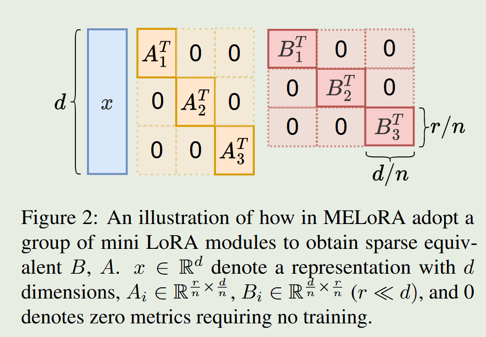
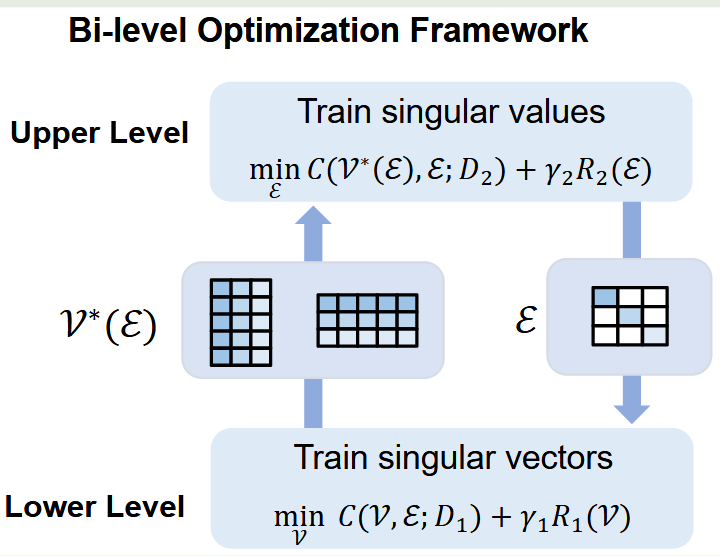

[TOC]

# Lora-related

- MELoRA: Mini-Ensemble Low-Rank Adapters  for Parameter-Efficient Fine-Tuning
  - 2024.06, ACL2024
  
  - 提出了MELoRA方法，具体是构建n个mini LoRA，通过对角线concat的方式将这n个mini LoRA拼接，一定程度上类似sparse LoRA的思想，但是计算方式是不同的。

  - 从理论上证明了MELoRA的秩可以表示为n个mini LoRA秩的加和，因此该方式在保持秩不变的同时可以减少训练参数量
  
  - 
  
- Random Masking Finds Winning Tickets for Parameter Efficient Fine-tuning
  - 2024.05, ICML 2024
  - 提出一种基于参数随机mask的参数有效性微调方法，即随机对模型参数进行mask，只对未进行mask的参数进行调整
  - 该方法随着微调参数的减少，使用更大的学习率，达到更好的效果，如1e-1

- PiSSA: Principal Singular Values and Singular Vectors Adaptation of Large
  - 2024.04, 
  - 通过将模型权重分解用SVD分解，将主要的特征值和特征向量用lora进行微调，其余的特征值和特征向量保持不变
  - 实验证明了对主要的特征值和特征向量进行微调，相比微调中间或者次要特征值和特征向量，可以获得更好的效果
  - code: https://github.com/GraphPKU/PiSSA

- HydraLoRA: An Asymmetric LoRA Architecture for Efficient Fine-Tuning
  
  - 2024.04
  
  - 目标：在高效利用参数的同时，如何设计出能够适配复杂数据且性能优越的微调架构

  2. 不对称结构设计：在传统LoRA架构中，通过共享一个核心矩阵（A矩阵）来捕获通用知识，同时引入多个专门的B矩阵来处理数据的不同内在组件（如子域或任务）
  
  3. 自动化组件识别：利用K-means和专家混合方法自动区分数据中的内在组件，无需依赖领域知识。注意是将一个数据集进行聚类的划分，主要是为了训练路由
  4. 动态推理能力：通过可训练的路由器，在推理阶段动态选择不同的B矩阵以适应输入任务。
  
- ALoRA: Allocating Low-Rank Adaptation for Fine-tuning Large Language Models
  - 2024.03, NAACL 2024
  - ALoRA的模型机构类似SVD分解的结构
  - 动态调整内在秩：与传统的低秩适应（LoRA）方法不同，ALoRA 允许在微调过程中动态调整每个Transformer模块的内在秩，而不是使用固定的秩设置
  - 在微调过程中，ALoRA 通过逐步修剪丰富且可能产生负面影响的LoRA秩，并将这些修剪掉的秩预算分配给需要更高秩的重要Transformer模块

- AFLoRA: Adaptive Freezing of Low Rank Adaptation in Parameter Efficient Fine-Tuning of Large Models
  - 2024.03,
  - AFLoRA的核心思想是在微调过程中适应性地冻结低秩适应路径中的投影矩阵，以减少计算成本和缓解过拟合
  - 自适应冻结：AFLoRA引入了一个新颖的冻结得分（freezing score）机制，根据这个得分在微调过程中逐步冻结投影矩阵。这个得分基于权重在训练过程中的变化程度，当权重的变化变得可以忽略时，就可以将它们冻结

- BiLoRA: A Bi-level Optimization Framework for Overfitting-Resilient Low-Rank Adaptation of Large Pre-trained Models
  - 2024.03
  - 这篇论文提出了一个名为BiLoRA的新方法，旨在解决大型预训练模型在下游任务中微调时的过拟合问题，提高模型在测试数据上的泛化能力
  - 双层次优化（BLO）：BiLoRA采用BLO框架，将参数分为两个层次进行优化。在较低层次，优化伪奇异向量矩阵（P和Q），而在较高层次，优化伪奇异值矩阵（Λ）
  - 正则化：为了保持P和Q的正交性，BiLoRA应用了正则化项R1。此外，还可以使用R2来鼓励Λ中的伪奇异值接近二值（0或1），进一步约束模型的复杂度
  - 

- SuperLoRA: Parameter-Efficient Unified Adaptation of Multi-Layer Attention Modules
  - 2024.03, 
  - 提出了一个名为SuperLoRA的框架，用于统一和扩展现有的LoRA变体，包括LoKr（克罗内克方法）和LoTR（低张量秩方法）。
  2. SuperLoRA通过引入分组、折叠、重排、投影和张量分解等机制，提高了灵活性和参数效率。通过调整超参数可以实现不同的变体。
  3. 通过投影和张量分解，显著减少了需要微调的参数量。新变体：提出了如LoNKr和LoRTA等变体，分别利用N分割的克罗内克分解和高阶张量分解。

- LISA: Layerwise Importance Sampling for Memory-Efficient Large Language Model Fine-Tuning
  - 2024.03
  - 观察到lora训练的weight norm存在严重倾斜问题，只在token embedding层和lm header层有较大的值，中间层则有很小的值，因此lora训练时模型中间层有很少的权重更新（weight norm是否可以衡量？）
  - 基于该观测，提出了一种基于重要性采样的方法来更新模型的中间层，对大部分中间层进行freeze

- GaLore: Memory-Efficient LLM Training by Gradient Low-Rank Projection
  - 2024,03, 
  - 从理论上证明了梯度是低秩的，可以使用类似lora的方法进行低秩分解
  - 梯度使用lora之后，优化器状态的参数量急剧减少，提高显存有效性

- Mixture-of-LoRAs: An Efficient Multitask Tuning for Large Language Models
  - 2024.03, COLING2024
  - 提出了大模型多任务学习的MoA架构
  - 该架构类似MoE架构，首先使用有监督数据为每个任务训练一个Lora，然后使用路由策略将所有Lora结合起来
  - 引入了领域标签来防止任务之间的互相干扰，提高多任务学习能力
  - 每个Lora模型支持新领域任务的持续迭代

- PRoLoRA: Partial Rotation Empowers More Parameter-Efficient LoRA
  - 2024.02, 
  - PRoLoRA的核心组件
    1. Broadcast Reduction：通过沿隐藏维度将原始矩阵分割成小块，并广播第一块的参数到其他块，以减少可训练参数的数量。
    2. Rotation Enhancement：为了解决Broadcast Reduction可能导致的表达能力受限问题，通过在秩维度上对相同的块进行不同的旋转操作，以增强模型的表达能力。
    3. Partially-Sharing Refinement：在RoLoRA的基础上，保留一部分秩不进行共享，以进一步提升模型的表示能力。
    4. Rectified Initialization Strategy：为了确保共享参数和非共享参数具有相同的初始化界限，对共享块采用修正后的Kaiming均匀分布初始化。

- PeriodicLoRA: Breaking the Low-Rank Bottleneck in LoRA Optimization

  - 2024.02

  - PeriodicLoRA（PLoRA），通过分阶段累积低秩更新矩阵以实现更高秩的更新，同时不增加内存使用，解决LoRA的低秩瓶颈问题

  2. 将训练分为多个阶段，每阶段在微批次训练后将LoRA更新合并到模型参数中，并重新开始新阶段。

- Learning to Route Among Specialized Experts for Zero-Shot Generalization
  - 2024.02,
  - 它在每个专家模型训练完成后，通过一个额外的计算步骤来训练一个门控机制，而不需要对模型的其他部分进行进一步的训练
  - 探索了在模型的每个层级为每个令牌选择不同的专家模块的可能性，这样可以在不同的阶段或对不同的令牌使用不同的专家能力，从而可能提高对新任务的泛化能力
  - 在每个PEFT模块前引入一个sigmoid门控层，并训练一个门控向量，该向量决定了是否将给定序列位置的激活传递到模块中。这个门控向量是在模型的所有序列位置共享的
  - 在推理阶段，PHATGOOSE使用标准的“top-k”路由策略，根据门控向量与给定激活的点积最高来选择模块

- LoTR: Low Tensor Rank Weight Adaptation
  - 2024.02
  - LoTR是LoRA的扩展和泛化，旨在通过张量分解来改进微调过程，特别是在深度模型中
  - LoTR通过将每个层的低秩适配器构建为三个矩阵的乘积，在Transformer块中共享左右乘数，从而实现了更好的参数效率

- DoRA: Weight-Decomposed Low-Rank Adaptation
  - 2024.02
  - DoRA的目标是通过模仿全微调的学习能力，来缩小PEFT方法（如LoRA）与FT之间的准确性差距，同时避免增加推理成本
  - DoRA将预训练权重分解为两个组成部分——幅度（magnitude）和方向（direction）。这种分解灵感来源于权重归一化，它通过改善梯度的条件数来加速收敛
  - DoRA特别使用LoRA来高效地更新方向组件，因为方向组件在参数数量上占据较大比例。通过这种方式，DoRA能够在保持LoRA的参数效率的同时，提高微调的学习能力和训练稳定性
  - 通过对LoRA和FT的权重更新模式进行分析，DoRA揭示了两者在幅度和方向更新上的显著差异。DoRA的设计旨在使学习行为在经验上和数学上都类似于FT，从而提高其学习能力

- LoRA+: Efficient Low Rank Adaptation of Large Models
  - 2024.02,
  - https://github.com/nikhil-ghosh-berkeley/loraplus
  - lora_A和lora_B使用不同的学习率

- RoSA: Accurate Parameter-Efficient Fine-Tuning via Robust Adaptation
  - 2024.01
  - RoSA同时训练两种类型的组件，即低秩组件和稀疏组件。低秩组件旨在捕获微调更新的主要结构，而稀疏组件则用于捕获更新中的重要但不那么显著的方向
  - RoSA借鉴了鲁棒PCA的思想，通过将微调更新表示为低秩矩阵和稀疏矩阵的和，从而在保持参数和计算效率的同时，提供更准确的模型更新
  - 生成稀疏掩码：RoSA使用一种特别设计的算法来生成稀疏掩码（masks），这些掩码用于确定哪些权重在微调过程中应该被更新

- Sparse low-rank adaptation of pre-trained language models

  - 2023.12, EMNLP2023

  - 背景：固定的秩rank可能在实际应用中无法满足所有任务需求。例如，过大的rank会浪费计算资源，而过小的rank会限制模型性能。

  2. SoRA 的核心思想是通过稀疏性控制动态调整低秩维度，SoRA 在训练过程中引入一个门控向量，通过稀疏化技术动态控制低秩矩阵的活跃列和行
  3. 门控向量的每个元素对应一个低秩矩阵的秩分量,通过优化门控向量的稀疏性，可以决定哪些秩分量在当前任务中是重要的

- Orthogonal Subspace Learning for Language Model Continual Learning
  - 2023.10
  - O-LoRA是一种用于语言模型持续学习的方法，旨在解决大型语言模型在顺序学习多个任务时遇到的灾难性遗忘
  - 正交低秩适应：O-LoRA通过在不同的（低秩）向量子空间中学习任务，并将这些子空间保持正交以最小化任务间的干扰，从而有效缓解灾难性遗忘
  - 在训练过程中，为了减轻对过去任务知识的遗忘，O-LoRA固定了先前任务的LoRA参数，并且对新任务的LoRA参数进行正交化学习

- LoftQ: LoRA-Fine-Tuning-Aware Quantization for Large Language Models
  - 2023.10
  - 提出了一种更合适的lora的初始化方法，该方法可以缓解量化模型和全精度模型的差异（相比QLora）
  - 使用一种轮换优化的方法来计算lora的初始化权重

- Navigating Text-To-Image Customization:From LyCORIS Fine-Tuning to Model Evaluation
  - 2023.09, ICLR2024
  - LoHa: 这是LoRA的扩展，它使用Hadamard乘积（逐元素乘积）来进一步增加权重更新的秩，同时保持了与原始LoRA方法相同的可训练参数数量。
  - LoKr: 这是另一种扩展方法，使用Kronecker乘积来增加权重更新的秩。这种方法允许更大的矩阵秩，从而可能提高微调的性能

- Delta-LoRA: Fine-Tuning High-Rank Parameters with the Delta of Low-Rank Matrices

  - 2023.09

  - 在传统LoRA方法的基础上，Delta-LoRA不仅优化两个低秩矩阵A和B，还通过其增量变化来更新预训练权重矩阵W

  - Delta-LoRA避免了直接存储和优化 W的梯度和动量，而是利用 ΔAB的增量更新来间接优化 W

- LORA-FA: MEMORY-EFFICIENT LOW-RANK ADAPTATION FOR LARGE LANGUAGE MODELS FINE-TUNING

  - 2023.08
  - 对lora改进，通过freeze lora中的A的权重，只对B的权重进行微调，无需存储A输入的激活，存储B输入的激活，从而通过减小激活的方式来减少显存占用

- Bayesian low-rank adaptation for large language models

  - 2023.08，ICLR2024
  - 大型语言模型（LLMs）在微调后往往**表现出过度自信**的问题，尤其是在小规模数据集上
  - 贝叶斯深度学习被提出用于解决深度网络中的过度自信问题。贝叶斯方法通过估计不确定性来减轻过度自信并提高校准
  - 本文提出的Laplace-LoRA方法将贝叶斯方法应用于LoRA参数，通过拉普拉斯近似（Laplace approximation）来计算LoRA参数的后验分布，从而显著提高微调后LLMs的校准性能

- ADAPTIVE BUDGET ALLOCATION FOR PARAMETEREFFICIENT FINE-TUNING

  - 2023.02, ICLR2023, AdaLoRA

  - 背景：现有方法通常在所有权重矩阵上均匀分配参数预算，这忽略了不同权重矩阵在任务中的重要性差异，可能导致性能次优

  - AdaLoRA：将增量更新矩阵参数化为奇异值分解的形式，练过程中，对奇异值进行裁剪以动态调整矩阵的秩，从而控制参数预算
  - 基于重要性的秩分配：通过计算每个奇异值对应的三元组的重要性分数（包含奇异值及其对应的奇异向量），来决定是否保留该三元组。

- LoDA: Low-Dimensional Adaptation of Large Language Models
  - 2023
  - 通过将传统的低秩线性适应（LoRA）推广为低维非线性适应（LoDA），提出了一种在参数效率方面具有竞争力的微调方法，本质是在A/B之间添加具有残差结构的非线性层。
  - LoDA和LoDA+方法可以提高非线性适应的表达能力，并且与LoRA相比，所需的可调参数数量几乎相同。
  - 此外，为了提高推理的计算效率，作者还提出了R-LoDA(+)和S-LoDA(+)方法，通过使用低秩或稀疏逼近来替换预训练权重矩阵，从而减少了微调过程中的计算开销

- KronA: Parameter Efficient Tuning with Kronecker Adapter

  - 2022.12
  - 论文提出了一种新的参数高效调整技术 KronA，它使用基于 Kronecker 积的适配器模块来微调预训练语言模型
  - KronA 方法通过使用 Kronecker 积代替低秩表示来解决低秩分解的表示能力有限的问题
  - Kronecker 积是一种数学运算，用于两个矩阵的乘法，产生一个更大的矩阵

- DyLoRA: Parameter-Efficient Tuning of Pretrained Models using Dynamic Search-Free Low Rank Adaptation

  - 2022.10, EACL2023
  - 背景：LoRA 需要在一个特定的秩值下训练模型，无法适应其他秩值；为了找到最佳秩值，通常需要耗费大量时间进行搜索和实验
  - DyLoRA 的关键创新在于使 LoRA 支持动态秩。在训练的每一步，随机采样秩值，采样的秩值决定了当前训练的截断矩阵范围
  - 相比传统损失函数求和所有秩值的代价，DyLoRA 每次仅优化一个秩值对应的参数
  - 为了避免更新较高秩时遗忘低秩的信息，DyLoRA 引入冻结模式：在训练过程中，仅更新当前采样秩值对应的矩阵行和列

- LORA: LOW-RANK ADAPTATION OF LARGE LANGUAGE MODELS

  - 2021.06, [[code]](https://github.com/microsoft/LoRA)

  - 提出了一种低秩自适应的模型微调方式：freeze整个模型的参数，在每个transformer层注入可训练的秩分解矩阵来适应下游任务  

  - 对self-attention中的q k v以及输出投射层进行了测试，发现在q v上添加lora层与在所有权重上添加效果相同，都取得了最好的效果  

  - 随着rank的提高，模型并没有取得更好的效果，原因是low-rank已经捕获了足够的信息  

  - 低秩矩阵与相应的模型层的权重呈现很强的相关性 

  - 

    
image: 

    
    

  
