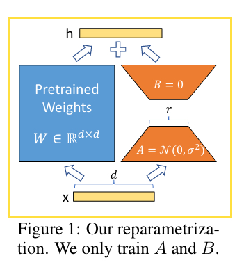

<!-- START doctoc generated TOC please keep comment here to allow auto update -->
<!-- DON'T EDIT THIS SECTION, INSTEAD RE-RUN doctoc TO UPDATE -->
**Table of Contents**  *generated with [DocToc](https://github.com/thlorenz/doctoc)*

- [Repo](#repo)
- [Paper](#paper)
  - [subdomain-1](#subdomain-1)
  - [subdomain-1](#subdomain-1-1)
- [Dataset](#dataset)

<!-- END doctoc generated TOC please keep comment here to allow auto update -->

# Repo

- https://github.com/adapter-hub/adapter-transformers

# Paper

## subdomain-1
### 2022
- P-Tuning v2: Prompt Tuning Can Be Comparable to Fine-tuning Universally Across Scales and Tasks
  - 

    
阅读笔记: 

    1. 相比P-tuning v1只在输入部分添加连续的prompt token，v2在每一层添加prompt token   
    2. 做抽取任务时，类似与bert做token分类，直接对每个位置的输出做分类   
    3. 探索：
        1）分类任务使用更少的prompt token，抽取任务使用更多的prompt
        2）先使用多任务的方式微调参数，再单个任务微调能有一定的提升
        3）在靠近输出的模型层上添加prompt token，能获得更好的效果   
        4）Deep Prompt Tuning:在每一层添加prompt token,方法是先设定输入的prompt token，使用全连接层为每个token生成每层的k和v向量
    
    

### 2021
- LORA: LOW-RANK ADAPTATION OF LARGE LANGUAGE MODELS
  - [[code]](https://github.com/microsoft/LoRA)
  - 

    
阅读笔记: 

    1. 提出了一种低秩自适应的模型微调方式：freeze整个模型的参数，在每个transformer层注入可训练的秩分解矩阵来适应下游任务   
    2. 对self-attention中的q k v以及输出投射层进行了测试，发现在q v上添加lora层与在所有权重上添加效果相同，都取得了最好的效果   
    3. 随着rank的提高，模型并没有取得更好的效果，原因是low-rank已经捕获了足够的信息   
    4. 低秩矩阵与相应的模型层的权重呈现很强的相关性  
    
    

# Dataset
