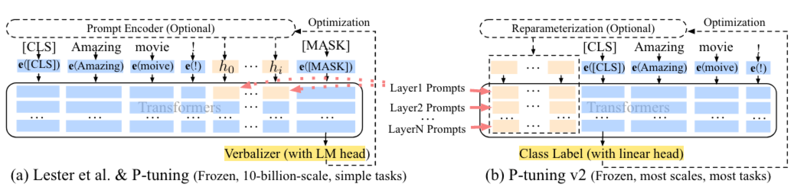

[TOC]

# Repo

- https://github.com/CLUEbenchmark/pCLUE
  - 中文提示学习排行榜，将多个不同NLP任务转化成基于prompt格式，使用生成式模型进行预测
- https://github.com/clue-ai/PromptCLUE
  
- https://github.com/bigscience-workshop/promptsource/ 
  - PromptSource is a toolkit for creating, sharing and using natural language prompts.
- zero shot model https://huggingface.co/bigscience/T0pp/tree/main
- thunlp prompt paper https://github.com/thunlp/PromptPapers
- thunlp开源 https://github.com/thunlp/OpenPrompt
- 刘知远 https://github.com/thu-coai/PPT

## survey

- A Practical Survey on Zero-shot Prompt Design for In-context Learning
  - 2023

- Pre-train, Prompt, and Predict: A Systematic Survey of Prompting Methods in Natural Language Processing
  - 2021

### 2022

- PPT: Pre-trained Prompt Tuning for Few-shot Learning
  - 软提示，将软提示拼接在句首
  - 2022

- P-Tuning v2: Prompt Tuning Can Be Comparable to Fine-tuning Universally Across Scales and Tasks
  - ACL  [[code]](https://github.com/THUDM/P-tuning-v2)
  - 

    
阅读笔记: 

    1. 相比P-tuning v1只在输入部分添加连续的prompt token，v2在每一层添加prompt token   
    2. 做抽取任务时，类似与bert做token分类，直接对每个位置的输出做分类   
    3. 探索：
        1）分类任务使用更少的prompt token，抽取任务使用更多的prompt
        2）先使用多任务的方式微调参数，再单个任务微调能有一定的提升
        3）在靠近输出的模型层上添加prompt token，能获得更好的效果   
    4. Deep Prompt Tuning:在每一层添加prompt token,方法是先设定输入的prompt token，使用全连接层为每个token生成每层的k和v向量
    
    

### 2021
- It’s Not Just Size That Matters: Small Language Models Are Also Few-Shot Learners
  - NAACL  [[code]](https://github.com/timoschick/pet)
  - 

    
阅读笔记: 

    1. 对PET的扩展，PET只支持一个mask，该文章支持多个mask   
    2. 推理时获取最大置信度的token来替换相应位置的mask，然后再经过一个前向来计算其他位置的token，多次迭代完成   
    3. 获取最大的mask长度，训练时使用一次前向，忽略冗余的mask token，计算交叉熵损失（比如最大mask长度时5，当前verbalizer长度时3，冗余的mask长度是2）   
    
    

- Exploiting Cloze Questions for Few Shot Text Classification and Natural Language Inference
  - EACL  [[code]](https://github.com/timoschick/pet)
  - 

    
阅读笔记: 

    1. 提出了一个基于prompt learning的少样本文本分类模型   
    2. 构建patten，将任务转化为完形填空问题，将mask的输出结果映射到标签   
    3. 损失有交叉熵损失和MLM loss组成。计算交叉熵损失时，需要先获取所有标签对应的verbalizer的logits，使用softmax计算得分，真实label用one-hot表示，然后计算交叉熵损失   
    4. iPET：使用不同的patten训练多个模型，然后对部分无标注数据进行预测，将多个模型预测结果进行ensemble，作为soft-label训练集，然后和原始数据集合并再训练多个模型，上述过程迭代多次
    
    

