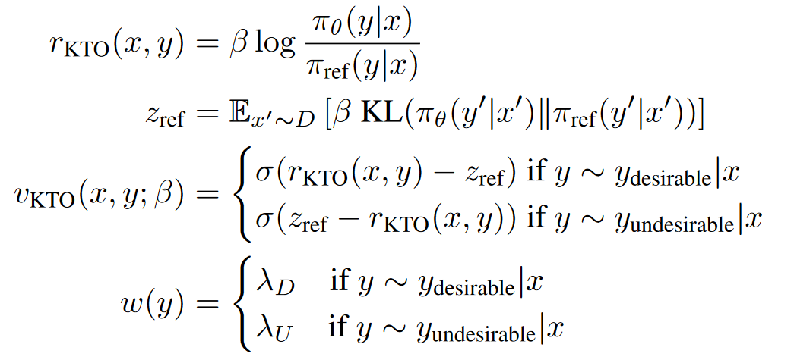

[TOC]

## offline RLHF

Offline RLHF 以 DPO 为代表，进一步发展出一系列 xPO 方法。相关工作在目标设计上做了多种改动：例如移除目标函数中的 reference 约束、引入长度惩罚项、或显式利用偏好数据中的偏好强度信息等。近期研究更多聚焦于在高噪声偏好数据下提升训练稳健性，以缓解分布漂移带来的性能退化；同时，也有工作开始系统分析 xPO 方法的退化现象，并通过对 logits/策略更新施加约束来稳定优化过程。

以下工作由近及远排列，可以选择不同的顺序进行阅读：

- Stable Preference Optimization: A Bilevel Approach to Catastrophic Preference Shift

  - 2025.07, SPO
  - DPO、CPO、SimPO等方法已被观察会出现preferred和dispreferred的绝对概率同时下降的现象，论文认为概率质量不一定回流到preferred，而可以泄露/转移到分布外响应，导致能力崩塌，论文将其定义为灾难性分布偏移。
  - 论文从理论上解释了为何出现preferred下降：概率变化由初始概率决定，变化方向由两者log-prob梯度的相似度（内积项）决定，当preferred和dispreferred的表示相似时，内积项会让preferred的绝对概率下降
  - 论文提出的SPO用双层优化把偏好学习限制在安全区域里：上层做偏好优化，下层用SFT定义可行集，要求上层更新不要跑出这个区域。落地时，作者把下层最优值函数的约束加在上层中，得到一个单层的罚函数目标。SPO 是一个“可插拔增强器”，尤其能救回推理能力崩塌。
  - 

- Stable Preference Optimization: A Bilevel Approach to Catastrophic Preference Shift

  - 2025.07，ROPO

  - 论文指出DPO、CPO、SimPO都属于单边对比学习，这类方法会持续地将chosen样本的概率预测拉向1，rejected样本拉向0，这通常对分类样本是有效的，但是对生成模型来说意味着分布过度尖锐，丧失语言多样性和稳定性。

  - 单边对比学习可以用一个统一框架描述：$L = \mathbb{E}[log\sigma(\beta(Z-m))]$，对不同方法，$Z$和$m$的表示如下：

    

  - 论文提出的ROPO把$Z$限制在一定范围，左边界让模型更好地学习偏好，右边界则限制模型$Z$无限的增大

    

- SimPO: Simple Preference Optimization with a Reference-Free Reward

  - 2024.05
  - SimPO同ORPO都没使用参考模型。SimPO主要引入了两个重要部分：一个是使用了长度归一化的奖励值，不同于DPO使用序列级的log probability，SimPO使用token-level的log probability；第二个是把偏好样本奖励值的差值放进了目标函数中，期望chosen样本和rejected样本奖励值的差值越大越好
  - 

- Provably Mitigating Overoptimization in RLHF: Your SFT Loss is Implicitly an Adversarial Regularizer

  - 2024.05，RPO，NIPS会议
  - RPO结合了DPO损失和SFT损失
  - SFT损失是让策略模仿一个合理的基线分布，起到一种对抗正则化的作用，有助于缓解过度优化，使得训练更加稳健
  - 实验结果：DPO普遍在被接收回复以及被拒绝回复上的log-prob下降，而RPO可以保持较高的log-prob值。

- Learn Your Reference Model for Real Good Alignment

  - 2024.04，TR-DPO，ICLR
  - 论文认为在iterative DPO中，每次启动DPO训练，reference model不应该使用最早的SFT模型，因为最新的偏好数据是从最新训练好的模型采样的，而不是从最初的SFT模型中采样，因此每次启动训练都需要更新reference model
  - TR-DPO提出两种更新方式，一种是上次偏好训练使用的reference model和policy model的参数加权，另外一种是训练每间隔n步便强制把reference model用policy model替代
  - 实验结果非常惊人，使用LLM-as-Judge评估，TR-DPO超越DPO 19%
  - 
  - 

- ROPO: Robust Preference Optimization for Large Language Models

  - 2024.04, ICML
  - 偏好数据中存在比较多的噪声标签时，会使得DPO方法的效果显著下降
  - 论文提出的ROPO方法：为每个样本赋予一个权重，并控制权重的总和，从而迫使模型把一部分样本的权重压到0
  - PORO的目标是一个带约束的联合优化问题，使用交替优化，固定样本权重学习模型权重，固定模型权重学习样本权重
  - ROPO方法相比DPO在较大比例噪声标签的偏好数据上优势更加明显

- ORPO: Monolithic Preference Optimization without Reference Model

  - 2024.03, ORPO

  - ORPO方法不需要参考模型，并且可以在单一步骤中通过赋予不希望生成的风格一个小的惩罚，来高效地进行偏好对齐的监督式微调

  - ORPO通过在传统的负对数似然损失函数中加入一个基于赔率比（Odds Ratio）的惩罚项来区分优选和非优选的生成风格。

  - 正样本赔率：$\text{odds}(y_w|x) = \frac{P(y_w|x)}{1-P(y_w|x)}$，负样本赔率：$\text{odds}(y_l|x) = \frac{P(y_l|x)}{1-P(y_l|x)}$ ，最大化两者的差值$\log \text{odds}(y_w|x) - \log \text{odds}(y_l|x)$ 

    $$L_{OR} = -\log \sigma\left( \log \text{odds}(y_w|x) - \log \text{odds}(y_l|x) \right)$$ 

    总损失：$L_{SFT} + \lambda \cdot L_{OR}$

- Noise Contrastive Alignment of Language Models with Explicit Rewards

  - 2024.02，NCA、InfoNCA，发表在NeurIPS上
  - 背景：DPO通常只使用两两偏好，对于包含多个候选回复的奖励得分的数据，通常构建多个偏好对，但是这种方法丢掉了分数信息，数据利用率低
  - InfoNCA方法：将reward softmax当做软标签，即$softmax(reward/\alpha)$。把模型学习到的隐式的reward当做logits，计算交叉熵，并作为InfoNCA的损失函数。隐式reward是类似DPO中的对数似然比$r_\theta=\beta log(\pi_\theta(y|x)/\mu(y|x))$。当K=2，$\alpha$趋近于0时，InfoNCA退化成DPO。
  - DPO、InfoNCA经常出现chosen likelihood下降的问题，因为这些方法只希望chosen比rejected差异大，绝对值下降并不影响损失，因此论文进一步提出了NCA方法。NCA把多样本交叉熵转换为单样本分类，推动高奖励样本的$r_\theta$上升，同时施加下降力
  - 实验结果发现，不管在多候选回复数据上，还是两两偏好数据上，NCA都超越了DPO
  - 

- Contrastive Instruction Tuning

  - 2024.02，ACL2024 findings
  - 构建正负响应样本，以常见的如同义替换、模板变化、词序调整来构建正样本，采集其他指令的回复作为负样本，最后构建对比学习损失。对比损失中响应的隐藏向量是用模型最后的隐藏层输出的mean pooling得到。
  - 总损失是SFT损失加上对比学习损失。

- Direct Preference Optimization with an Offset

  - 2024.02，ODPO

  - 将accept和reject的reward差值考虑了进去，相当于在DPO损失公式中添加一个margin

  - code：https://github.com/rycolab/odpo

- KTO: Model Alignment as Prospect Theoretic Optimization

  - 2024.02, ICML2024

  - 相比DPO，KTO不需要成对的偏好数据，而是直接使用point wise的数据微调

  - 在一个batch中需要同时包含accept样本和reject样本

  - KTO之所以有效，是因为如果模型提高了accept样本奖励，那么KL惩罚也会上升，而在损失上就不会取得进展。这迫使模型学习究竟是什么使得输出变得理想，以便在保持KL项不变（甚至减少它）的同时增加奖励

  - 

- Aligning Large Language Models with Human Preferences through Representation Engineering

  - 2023.12，RAFT，ACL2024 long
  - RAHF通过识别和操作LLMs内部与高级人类偏好相关的表示和活动模式，来实现对模型行为的精确控制
  - 与RLHF相比，RAHF方法计算成本更低，因为它不需要额外训练奖励模型和价值网络
  - RAHF包含两种方法来控制表示和提取活动模式：单一LLM方法和双LLM方法。单一LLM方法通过对比指令来微调单一模型，而双LLM方法则分别对偏好和不偏好的响应进行监督训练

- Some things are more CRINGE than others:  Iterative Preference Optimization with the Pairwise Cringe Loss

  - 2023.12
  - 基于Cringe Loss改进对偏好数据进行训练，是一种DPO方法平替
  - Binary Cringe Loss：对chosen样本计算似然损失，对与rejected样本计算token-wise的对比loss，具体是基于LLM的top-k token与rejected样本的token计算对比损失
  - Pair Cringe Loss：是对2的改进，增加了一项基于门控的margin loss

- Unveiling the Implicit Toxicity in Large Language Models

  - 2023.11, EMNLP2024
  - 研究者们提出了一种基于强化学习的攻击方法，旨在进一步诱导LLMs生成隐性有毒的文本

- Black-Box Prompt Optimization: Aligning Large Language Models without Model Training

  - 2023.11, BPO, ACL2024，免微调对齐
  - BPO 的关键思想是通过优化用户输入的提示，使其更适合 LLMs 的输入理解，从而在不更新 LLMs 参数的情况下实现用户意图的最佳表达
  - 与使用人类反馈进行强化学习的方法相比，BPO 提供了更好的可解释性，因为它通过优化提示来改善模型的响应，而不是直接修改模型参数
  - BPO 使用一个自动的提示优化器，通过比较人类偏好的响应对来学习，并指导 LLMs 重写输入提示，使其更加明确地包含将响应从不受欢迎转变为受欢迎的特征

- Statistical Rejection Sampling Improves Preference Optimization

  - 2023.09，ICML2024
  - DPO算法所使用的数据是SFT或者其他算法采样出来的，而不是最优策略采样出来的
  - 想要估计某一个分布，需要用这个分布下采样出来的数据才能很好地对分布进行估计
  - DPO使用其他策略采样出的数据计算MLE去估计最优策略，会导致数据和最优策略之间的不匹配
  - [LLM RLHF 2024论文（三）RSO](https://zhuanlan.zhihu.com/p/690198669)

- LARGE LANGUAGE MODELS AS OPTIMIZERS

  - 2023.09, ICML2024, OPRO, 免微调对齐
  - 本文提出了一种名为OPRO的方法，它利用大型语言模型作为优化器来解决各种优化问题，特别是那些缺乏梯度信息的优化问题
  - 在OPRO框架中，优化任务通过自然语言描述，LLM基于此描述和先前生成的解决方案来迭代生成新的解决方案，并通过评估和反馈进行优化
  - 论文在线性回归、旅行商问题和提示优化等案例研究中展示了OPRO的有效性，证明了LLMs能够通过自然语言提示有效优化解决方案，甚至在某些情况下超过了手工设计的启发式算法

- Preference Ranking Optimization for Human Alignment

  - 2023.06，AAAI 2024，基于排序的方法
  - 出了一种偏好排序方法，即采样不同源的回复并使用reward打分，并基于打分结果排序，然后计算首个最佳回复与其余回复的InfoNEC loss，然后drop掉最佳回复，然后使用第二位最佳回复与其余回复的InfoNCE loss，然后drop第二位最佳回复，重复过程，知道drop掉所有回复。将所有的infoNCE loss相加，作为loss1。
  - 选择首个最佳回复计算SFT loss，作为loss2。总loss未loss1和loss2的和。

- Direct Preference Optimization: Your Language Model is Secretly a Reward Model

  - 2023.05, DPO

  - DPO通过一个简单的分类损失函数直接优化策略，而不是先拟合一个奖励模型，然后使用强化学习来最大化这个奖励。与RLHF相比，DPO算法更稳定、性能更好，且计算成本更低。它不需要在微调期间从LM中采样，也不需要进行大量的超参数调整

  - DPO方法背后的理论基础是，存在一个从奖励函数到最优策略的解析映射，这使得研究者能够将基于奖励的损失函数转换为直接针对策略的损失函数

    - 通过RLHF的目标函数，推到出奖励函数和最优策略与参考策略之对数比的数学关系。

    - 为了利用偏好数据训练模型，希望生成高质量的回复概率大于低质量回复的概率。Bradley-Terry模型可以用来计算两个对象，其中一个对象比另外一个对象强的概率。因此可以计算高质量回复的奖励值强于低质量回复的奖励值的概率。

    - 将强度概率公式中的奖励值使用“最优策略与参考策略之对数比”进行替代，便得到DPO的目标公式。
      $$
      \mathcal{L}_{\mathrm{DPO}}(\pi_\theta; \pi_{\mathrm{ref}})
      = -\mathbb{E}_{(x, y_w, y_l) \sim D} \bigg[
          \log \sigma\!\left(
              \beta \log \frac{\pi_\theta(y_w \mid x)}{\pi_{\mathrm{ref}}(y_w \mid x)}
              \;-\;
              \beta \log \frac{\pi_\theta(y_l \mid x)}{\pi_{\mathrm{ref}}(y_l \mid x)}
          \right)
      \bigg]
      $$
      其中$\beta$用来调节模型对好坏答案的区分强度，该参数与RLHF中的KL散度的$\beta$等价

  - Blog：

    - [大语言模型对齐: 直接偏好优化(DPO)](https://syhya.github.io/zh/posts/2025-02-08-dpo/)

    - [有关DPO训练时，为什么chosen和rejected的reward一起下降的猜想](https://zhuanlan.zhihu.com/p/694381064)

- SLiC-HF: Sequence Likelihood Calibration with Human Feedback

  - 2023.05

  - SLiC的损失：
    $$
    \mathcal{L}_{\text{SLiC}}(\pi_\theta, \pi_{\text{ref}}) = \mathcal{L}_{\text{cal}}(\pi_\theta) + \lambda_{\text{reg}} L_{\text{reg}}(\pi_\theta)
    \\
    \mathcal{L}_{\text{cal}} = \mathbb{E}_{x, y_w, y_l \sim D} \left[ \max\left( 0, \delta - \log \frac{\pi_\theta(y_w|x)}{\pi_\theta(y_l|x)} \right) \right]
    \\
    \mathcal{L}_{\text{reg}} = \mathbb{E}_{x \sim D, y \sim \pi_{\text{ref}}(x)} [ -\log \pi_\theta(y|x) ]
    $$

  - $\mathcal{L}_{\text{cal}}$项期望chosen样本的预测概率比rejected样本的预测概率越大越好，但是超过一定的阈值（$\sigma$）之后并不再计算loss

  - $\mathcal{L}_{\text{reg}}$项从reference模型采样输出y，并期望在policy模型的预测概率越大越好，表示希望policy模型和reference模型越接近越好

- RRHF: Rank Responses to Align Language Models with Human Feedback without tears

  - 2023.04， NeurIPS 2023，基于排序的方法
  - 采样不同源的回复，并用reward打分。使用ranking loss + best response sft loss最为total loss

- RAFT: Reward rAnked FineTuning for Generative Foundation Model Alignment

  - 2023.04，TMLT
  - 使用reward模型过滤出高质量样本，然后使用高质量的样本微调模型

- A General Language Assistant as a Laboratory for Alignment

  - 2021.12,  from Anthropic
  - 偏好模型是在序列的最后一个token上加value head，value head负责预测一个标量值来表示得分；模仿学习是只用good example来微调模型
  - 排序偏好模型相比二进制偏好模型有更好的效果
  - context distillation: prompt会减少输入的长度等缺点，使用了一种基于KL的loss来对prompt微调
  - 偏好模型预训练的第二个阶段，使用二进制判别的预训练方法相比排序偏好方法有更好的收益