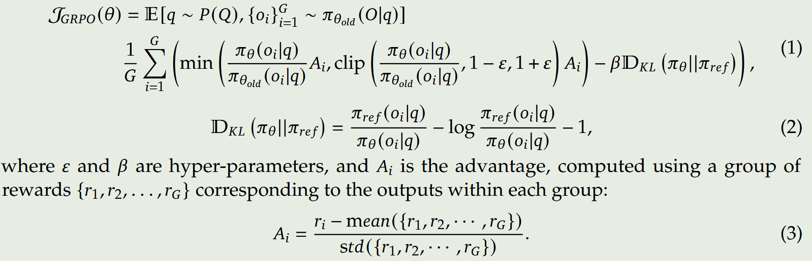
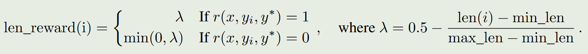

[TOC]

# Paper

- VAPO: Efficient and Reliable Reinforcement Learning for Advanced Reasoning Tasks

  - 2025.04

  - 不同GRPO、DAPO，VAPO是一种基于值模型的方法，并超越了无值模型的方法

  - 作者提出值模型的预训练，认为先前方法效果不好的原因是值模型权重从奖励模型初始化，但是二者目标并不匹配。作者从初始策略模型中采样数据，使用蒙特卡洛回报更新值模型。

  - 论文使用解耦的GAE方法，policy model和value model使用不同的时间衰减系数。在policy model中，advantage作为概率比的加权值，在value model中，advantage与老的值网络的和作为target，与新的值网络之间计算MSE损失。VC-PPO任务将时间衰减系数设置为1，是一种无偏的梯度估计。因此VAPO的policy model的advantage计算采用的时间衰减系数为1，而value model的advantage计算采用的时间衰减系统是0.9

  - 使用长度自适应的GAE。固定的时间衰减系数下，当长度很长时，奖励几乎为0，论文提出的长度自适应的GAE可以根据长度来调整时间衰减系数，使得优势函数中累积的学习信号随着生成长度线性增长。使用了DAPO中token级别的策略梯度损失，进一步缓解异常的序列长度问题。

  - 使用更高的上裁剪值；增加LM损失；组采样时，尽可能采样出有区分度的正负样本。

- DAPO: an open-source LLM reinforcement learning system at scale

  - 2025.03

  - 作者研究发现，使用GRPO的默认参数设置训练出的模型效果远低于DS-R1论文中报告的结果。作者发现在训练过程中，存在熵坍塌、奖励噪声、训练不稳定等问题。

  - 将上裁剪值和下裁剪值解耦，使用更高的上裁剪值，帮助模型进行更好的探索，提升多样性，避免熵坍塌

  - 使用动态采样方法提升训练效率和稳定性，摒弃组内采样奖励值都为0或者1的数据，因为这样的数据计算的advantage都为0

  - 为避免样本级 GRPO 在 Long-CoT 场景下对长序列 token 学习信号的过度稀释及对冗余模式惩罚不足，作者将策略梯度损失由 sample-level 重构为 token-level，从而实现对推理关键 token 的精细化优化与对无意义生成的有效抑制。

  - 对于过长的样本一般采用截断处理，这种方法会引入奖励噪声和损害训练过程。论文提出长度过滤方法，通过定义过长的长度区间，在该区间中，模型回复越长惩罚越大。

- QwQ-32B-Preview

  - [Blog](https://qwenlm.github.io/zh/blog/qwq-32b/)

  - 训练的方法与Deepseek-R1相同

- DeepSeek-R1: Incentivizing Reasoning Capability in LLMs via Reinforcement Learning

  - 2025.01

  - Deepseek-R1-Zero

    - 直接对Base模型应用RL算法训练，没有使用任何有监督数据

    - 使用GRPO RL算法：摒弃了critic model，估计baseline使用了group scores（对于一个输出x，采样多个输出并计算rewards）

      

    - 奖励模型：未使用神经网络的奖励模型，具体使用两个rule-based的奖励方法：准确性方法（答案是否准确，code是否执行通过）；格式遵循方法（生成内容是否遵循要求的格式）

    - 效果：Deepseek-R1-Zero取得了媲美o1的效果，当然也存在一定问题：可读性和生成内容多语言混合

  - Deepseek-R1

    - 不同Deepseek-R1-Zero，Deepseek-R1使用了几千个long CoT数据对base模型微调，作为一个冷启动。该方法主要是为了生成更具可读性的内容。
    - 生成内容语言混合问题使用了语言一致性奖励模型
    - 第二阶段RL训练：主要是为了提高模型的helpfulness和harmlessness，同时保持模型的推理能力

  - 模型蒸馏

    - 使用Deepseek-R1（经过第1阶段RL的模型）生成推理数据和非推理数据，共800k
    - 使用上述数据直接微调qwen和llama模型

  - 蒸馏和RL

    - 使用Deepseek-R1蒸馏的Qwen-32B模型甚至超过了使用和Deepseek-R1一样训练方式的Qwen-32B

  - 失败尝试

    - 过程奖励模型PRM
    - MCTS

- KIMI K1.5:  SCALING REINFORCEMENT LEARNING WITH LLMS

  - 2025.01

  - 概述

    - long context scaling：将RL的上下文窗口scale到了128K，并且观察到不断增长的上下文长度，导致了不断的性能提升
    - 简化的框架：在没有使用复杂技术如Monte Carlo tree search的情况下，学习到的CoT具有规划、反思和纠错的能力
    - 支持多模态

  - Reinforcement Learning

    - 策略优化使用了一种更加鲁棒的在线镜像下降算法

    - 相比传统的RL算法，去掉了value network：value function可能会阻碍模型自我探索、恢复以及纠偏的能力

    - 使用了长度惩罚，对于problem x，采样k个responses，计算min_length和max_length

      

    - RL算法本身具有相对好的采样属性，也就是困难样本提供更大的梯度，论文引入了课程采样和优先采样算法，目的是为了获取更加高效的训练样本

    - reward model for math：使用了传统的RM和Chain-of-Thought RM，传统RM准确率84.4，Chain-of-Thought RM准确率98.5

  - Long2shot

    - 使用了model merging技术；最短CoT的拒绝采样；使用DPO训练，正确并较短的样本为正样本，正确并长的样本为负样本
    - 最后使用RL进行训练，单独执行了long2short RL训练阶段

  - 预训练

    - 多模态预训练；有监督微调，长上下文微调

# Repo

- https://github.com/Unakar/Logic-RL
- https://github.com/eddycmu/demystify-long-cot
- https://github.com/RLHFlow/Minimal-RL
- https://github.com/cmu-l3/l1
- https://github.com/shangshang-wang/Tina
- https://github.com/hkust-nlp/simpleRL-reason
- https://github.com/sail-sg/understand-r1-zero
- https://github.com/Open-Reasoner-Zero/Open-Reasoner-Zero
- https://github.com/agentica-project/rllm
- https://github.com/lzhxmu/CPPO
- https://github.com/OpenManus/OpenManus-RL
  - 基于强化学习优化大模型智能体（类似R1算法）
- https://github.com/huggingface/open-r1
- https://github.com/aburkov/theLMbook/blob/main/GRPO_From_Scratch_Multi_GPU_DataParallel_Qwen_2_5_1_5B_Instruct.ipynb
- https://github.com/dhcode-cpp/X-R1

- Blog
  - [SPO新范式助力大模型推理能力提升](https://mp.weixin.qq.com/s/abUS_x8GTHEqTwS9rCwgLg)
    - 为连续token片段计算reward
  - [探讨Entropy(熵)机制在RL中扮演的角色](https://mp.weixin.qq.com/s/8eTzjE677C2jvyYtsEFukg)
  - [R1 的一些认知：4 个经典误区](https://mp.weixin.qq.com/s/FnNRLXxBCFxFy-1v8QigLQ)
  - [从Math RL初窥LLM推理模型：是怎么work、哪些trick是有效的！](https://mp.weixin.qq.com/s/5zlujCaxGY1CL8IZeGqT2g)
  - [[Experiment] Training R1-Zero-like models with Open R1](https://huggingface.co/spaces/open-r1/README/discussions/20)
  - [Reasoning 模型 RL 对齐的实际挑战](https://zhuanlan.zhihu.com/p/1892270905683575985)
  - [复现和改进 DeepSeek-R1 的一些 tips](https://mp.weixin.qq.com/s/xqWYdf2c9frWbznKNGiagA)
    - 2025.03

  - [浅谈 DeepSeek-R1 和 Kimi k1.5 论文中的思维链 + 强化学习](https://weaxsey.org/articels/2025-02-01/)
    - 2025.02
- Evaluation
  - https://github.com/QwenLM/Qwen2.5-Math

