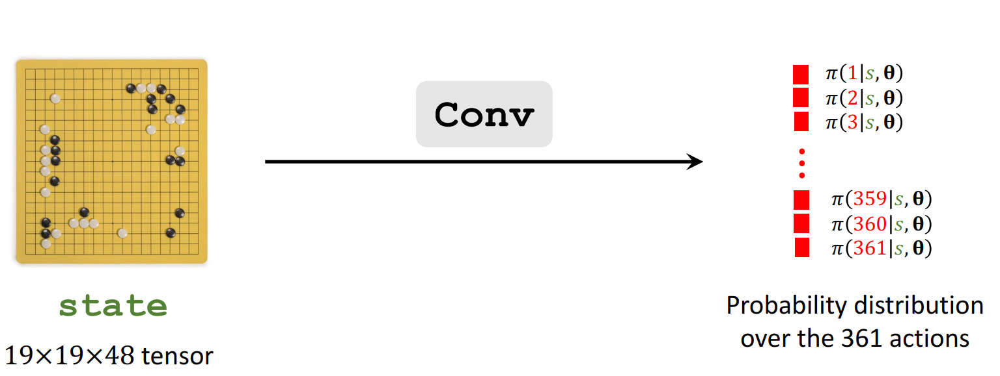
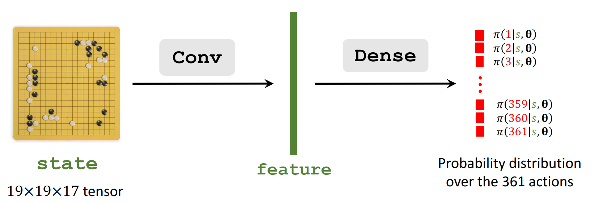

[TOC]


## Repo
- https://github.com/google/dopamine
- https://github.com/openai/gym

- https://github.com/MorvanZhou/Reinforcement-learning-with-tensorflow
- https://github.com/aikorea/awesome-rl

- https://github.com/datawhalechina/easy-rl
  - 经典的入门开源书，附代码

- https://github.com/xiaochus/Deep-Reinforcement-Learning-Practice
- https://github.com/openai/baselines

- https://github.com/ikostrikov/pytorch-a2c-ppo-acktr-gail


## reference material

- https://spinningup.qiwihui.com/zh-cn/latest/
  - openAI RL学习资料

- https://www.youtube.com/@HungyiLeeNTU/playlists
  - 李宏毅强化学习课程

- https://www.boyuai.com/elites/course/xVqhU42F5IDky94x
  - 强化学习视频课程，内容比较全面

## 常见算法

### Q价值函数和状态价值函数

Action-Value function：$Q(s, a)$是agent在状态s下执行某一个动作（如向上走），所获得的及时奖励和未来折扣的累计奖励

State-Value function：$V(s)$是agent在状态s下执行每个动作（上、下、左、右），所获得的加权奖励值（期望奖励值），主要用来评估状态s的好坏，与动作无关

$Q(s, a)$和$V(s)$之间的关系：
$$
V_\pi(s_t)=\mathbb{E}_A\left[Q_\pi(s_t,A)\right]=\sum_a\pi(a|s_t)\cdot Q_\pi(s_t,a).
$$

$$
V_\pi(s_t)=\mathbb{E}_A\left[Q_\pi(s_t,A)\right]=\int\pi(a|s_t)\cdot Q_\pi(s_t,a)da
$$

### Q-Learning

Q-learning使用下一个状态的最优动作来更新Q值
$$
Q(s_t, a_t) \leftarrow Q(s_t, a_t) + \alpha [R(s_t, a_t) + \gamma \max_{a_{t + 1}} Q(s_{t + 1}, a_{t + 1}) - Q(s_t, a_t)]
$$


### Sarsa

Sarsa使用下一个状态的实际动作来更新Q值
$$
Q(s_t, a_t) \leftarrow Q(s_t, a_t) + \alpha [R(s_t, a_t) + \gamma Q(s_{t + 1}, a_{t + 1}) - Q(s_t, a_t)]
$$

### Policy Gradient

策略函数是在给定状态下，给出在该状态下执行各个动作的概率分布。我们的目标是要寻找一个最优策略并最大化这个策略在环境中的期望回报

策略学习的目标函数：$J(\theta)=\mathbb{E}_{s_0}[V^{\pi_\theta}(s_0)]$，其中$s_0$是初始状态，然后对目标函数求梯度：

$\nabla_\theta J(\theta)\propto \mathbb{E}_{\pi_\theta}[Q^{\pi_\theta}(s,a)\nabla_\theta\log\pi_\theta(a|s)]$

这里不进行具体证明，直观理解一下策略梯度这个公式，可以发现在每一个状态下，梯度的修改是让策略更多地去采样到带来较高Q值的动作，更少地去采样到带来较低Q值的动作。

### REINFORCE

REINFORCE算法使用蒙特卡洛算法估计$Q^{\pi_\theta}(s, a)$

即：$Q^{\pi_\theta}(s_t, a_t) \approx \sum_{t^{\prime}=t}^T\gamma^{t^{\prime}-t}r_{t^{\prime}}$

```python
def update(self, transition_dict):
    reward_list = transition_dict['rewards']  # 一个回合中每个时间步的奖励值
    state_list = transition_dict['states']   # 一个回合中每个时间步的状态
    action_list = transition_dict['actions']   # 一个回合中每个时间步的执行动作

    G = 0
    self.optimizer.zero_grad()
    for i in reversed(range(len(reward_list))):  # 从最后一步算起，主要是应为t时间步的累计奖励依赖第t+1时间步的累计奖励值
        reward = reward_list[i]
        state = torch.tensor([state_list[i]],
                             dtype=torch.float).to(self.device)
        action = torch.tensor([action_list[i]]).view(-1, 1).to(self.device)
        # 对应公式中的$log\pi_\theta(a|s)$
        log_prob = torch.log(self.policy_net(state).gather(1, action))
        G = self.gamma * G + reward
        # G表示当前时间步的累计奖励
        loss = -log_prob * G  # 每一步的损失函数
        loss.backward()  # 反向传播计算梯度
    self.optimizer.step()  # 梯度下降
```

### Actor-Critic

策略梯度更加一般的形式：
$$
\nabla_\theta J(\theta) &\propto \mathbb{E}_{\pi_\theta}[Q^{\pi_\theta}(s,a)\nabla_\theta\log\pi_\theta(a|s)] \\
&= \mathbb{E}\left[\sum_{t = 0}^{T} \psi_t \nabla_{\theta} \log \pi_{\theta}(a_t \vert s_t)\right]
$$
其中$\psi_t$可以取的值如下：

1. $\sum_{t' = 0}^{T} \gamma^{t'} r_{t'}$$A^{\pi_{\theta}}(s_t, a_t)$ ---------- 轨迹的总回报
2. $\sum_{t' = t}^{T} \gamma^{t' - t} r_{t'}$$A^{\pi_{\theta}}(s_t, a_t)$ ---------- 动作$a_t$之后的回报 
3. $\sum_{t' = t}^{T} \gamma^{t' - t} r_{t'} - b(s_t)$$A^{\pi_{\theta}}(s_t, a_t)$ ---------- 基准线版本的改进 
4. $Q^{\pi_{\theta}}(s_t, a_t)$$A^{\pi_{\theta}}(s_t, a_t)$ ---------- 动作价值函数 
5. $A^{\pi_{\theta}}(s_t, a_t)$ ---------- 优势函数 
6. $A^{\pi_{\theta}}(s_t, a_t)$ ---------- 时序差分残差

标号2对应到REINFORCE算法采样蒙特卡洛采样的算法，这种方法对策略梯度的估计是无偏的，但是方差比较大

标号3引入baseline，可以降低REINFORCE算法方差过大的问题

标号4对应Actor-Critic算法，使用动态价值函数Q，代替蒙特卡洛采样得到的回报

标号5对Actor-Critic算法进一步改进，把状态价值函数V作为baseline，用Q函数减去V函数，得到A函数，即优势函数A，即：$A=Q^{\pi_{\theta}}(s_t, a_t) - V^{\pi_{\theta}}(s_t)$

标号6对标号5算法进一步改进，利用了$Q=r + \gamma V$，即$r_t + \gamma V^{\pi_{\theta}}(s_{t + 1}) - V^{\pi_{\theta}}(s_t)$


这里介绍基于时序差分残差来指导策略梯度更新的Actor-Critic算法，已知Actor采用策略梯度更新的原则，下面重点介绍Critic的梯度更新原则

将Critic网络表示为$V_w$，参数为$w$，直接采用时序差分残差的学习方式，Critic价值网络的损失是：

$\mathcal{L}(\omega)=\frac{1}{2}(r+\gamma V_\omega(s_{t+1})-V_\omega(s_t))^2$

对应的梯度是：$\nabla_\omega\mathcal{L}(\omega)=-(r+\gamma V_\omega(s_{t+1})-V_\omega(s_t))\nabla_\omega V_\omega(s_t)$

总结Actor - Critic算法的具体流程如下:
- 初始化策略网络参数$\theta$，价值网络参数$\omega$
- for序列$e = 1 \to E$ do:
    - 用当前策略$\pi_{\theta}$采样轨迹$\{s_1, a_1, r_1, s_2, a_2, r_2, \ldots\}$
    - 为每一步数据计算: $\delta_t = r_t+\gamma V_{\omega}(s_{t + 1})-V_{\omega}(s_t)$
    - 更新价值参数$w = w+\alpha_{\omega}\sum_t\delta_t\nabla_{\omega}V_{\omega}(s_t)$
    - 更新策略参数$\theta=\theta+\alpha_{\theta}\sum_t\delta_t\nabla_{\theta}\log\pi_{\theta}(a_t|s_t)$
 - end for 

## AlphaGo和AlphaGo Zero

- AlphaGo的策略网络架构

  - 

- 使用行为克隆的方法来初始化策略网络，即从人类数百万棋盘中进行策略网络的初始化学习，初始化后的策略网络能够超过业余选手的水平。该方法的局限性是：agent无法学习到奖励值；agent只能模仿专家行为，对于未见过的棋盘的泛化性效果不好

- 对经过初始化的策略网络进行强化学习训练

  - 构建两个策略网络，其中一个作为对手，从当前策略网络的先前迭代版本中进行获取
  - 策略网络的梯度更新参考策略梯度的计算公式

- 状态值网络的训练：用来评估当前局面下的胜率

  - 采样多个回合的数据，然后计算每个时间步的预期累计折扣奖励
  - 状态值网络使用神经网络模型，将状态s输入到神经网络中，计算模型预估的预期累计奖励
  - 使用MSE作为损失函数

- 推理时，使用蒙特卡洛搜索向前看，从当前节点出发进行搜索，在模拟过程中的每个状态下，计算棋面$S_t$下的最佳动作$a_t$

  - 计算每个动作的得分，$\mathrm{score}(a) = Q(a) + \eta \cdot \frac{\pi(a \mid s_t; \boldsymbol{\theta})}{1 + N(a)}$，其中$\pi(a \mid s_t; \boldsymbol{\theta})$是策略网络输出的动作概率值，$Q(a)$是通过MCTS计算的action value，$N_a$是在当前时刻动作a已经被选择的次数
  - 具体的，player做出一个action A，该action A并非实际执行的action，而是模拟思考的action；此时opponent也做出一个action
  - 使用训练好的状态值网络计算预期奖励V，持续执行下去，对每个新的状态计算预期奖励，将所有状态的预期奖励平均，作为$Q(a)$的值

- AlphaGo Zero

  - AlphaGo Zero相比AlphaGo效果更强
  - AlphaGo Zero未使用行为克隆
  - 使用了MCTS来训练策略网络
  - 

  


