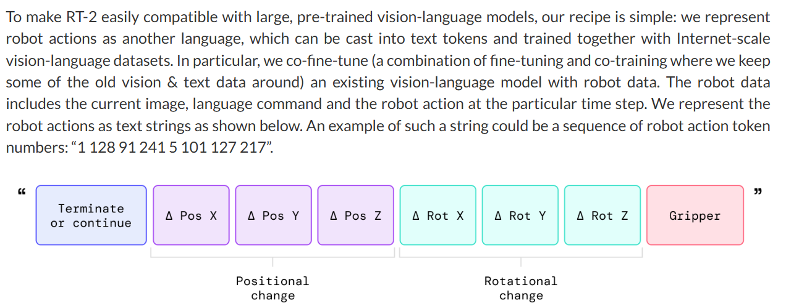
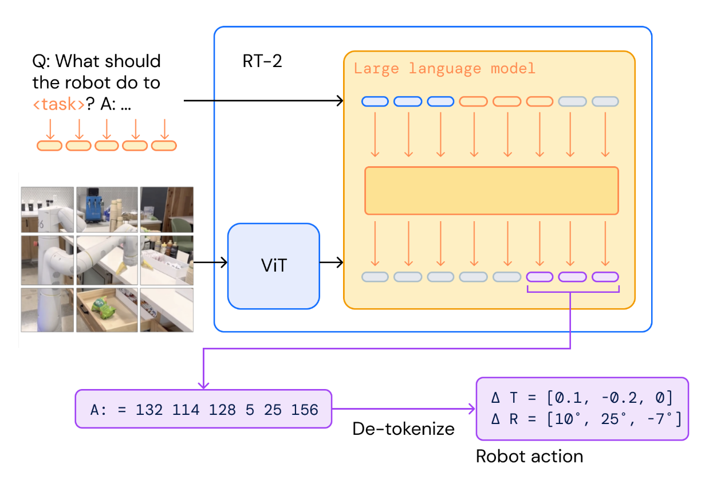

[TOC]

# Paper

- OpenVLA: an open-source vision-language-action model

  - 2024.06
- OpenVLA与RT2模型架构上的不同：
    - base模型使用Prismatic VLM，Prismatic使用了两个visual encoder，SigLIP和Dino V2，二者的输出特征在通道层进行concat。Dino V2 可以提到空间推理能力。
  - 不同RT2的连续action离散化，OpenVLA为了避免训练数据中的极端异常动作把取值范围拉得过大、导致离散后精度变粗，他们不是用最小值和最大值来定范围，而是取该动作在训练集中的 1% 到  99% 分位数区间，再把这个“常见动作范围”均匀切成 256 份。这样既能忽略异常值，又能在机器人最常用的动作区间里保持更高的动作分辨率，从而让 VLA 模型像预测文字一样稳定、精细地预测动作。
  
- 通过评估，OpenVLA超越了RT2等baseline方法；论文进一步研究了数据利用有效性、基于PEFT的任务适应以及量化等
  - OpenVAL和RT2主要应用在机械臂场景

- RT-2: Vision-Language-Action Models Transfer Web Knowledge to Robotic Control

  - 2023.07，Deepmind

  - 基于预训练好的VLM模型，使用多模态视觉任务数据以及robot数据进行共训练。将连续robot action离散化，具体是将每个维度离散成256个bin

    

  - RT2基于PaLI-X和PaLM-E模型构建，架构如下：

    

  - RT2在泛化性、涌现能力、模型参数scaling、思维链推理等方面表现出不错的效果

# Blog

- [一站式具身智能RL入门指南](https://paj5uamwttr.feishu.cn/wiki/GaozwfU3iiWA9Nk0LVUcUzKZnHc)