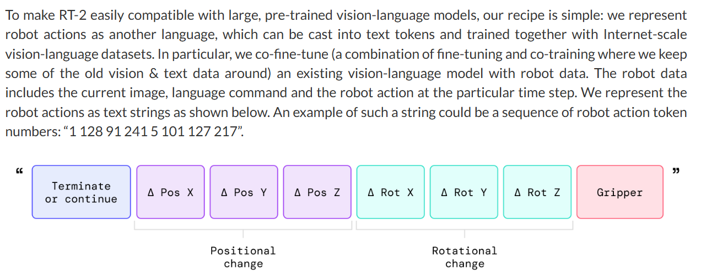
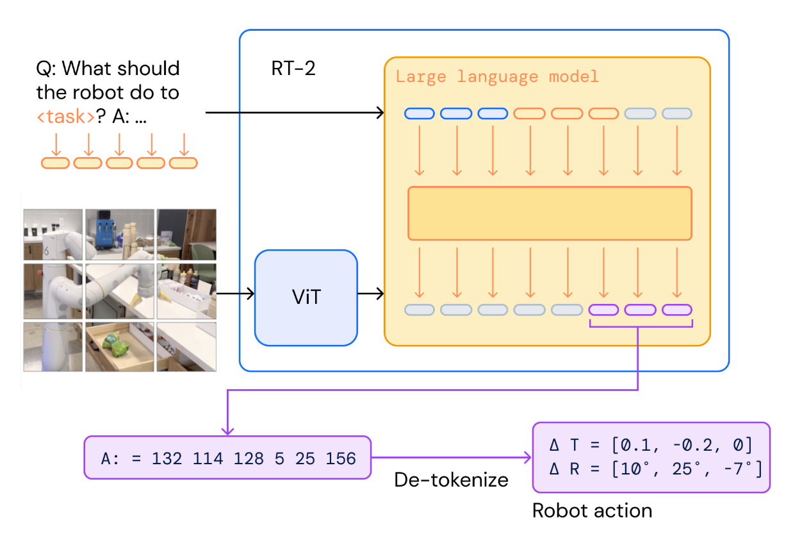

[TOC]

# Paper

- OpenVLA: an open-source vision-language-action model

  - 2024.06
  - OpenVLA与RT2模型架构上的不同：
    - base模型使用Prismatic VLM，Prismatic使用了两个visual encoder，SigLIP和Dino V2，二者的输出特征在通道层进行concat。Dino V2 可以提到空间推理能力。
    - 不同RT2的连续action离散化，OpenVLA为了避免训练数据中的极端异常动作把取值范围拉得过大、导致离散后精度变粗，他们不是用最小值和最大值来定范围，而是取该动作在训练集中的 1% 到  99% 分位数区间，再把这个“常见动作范围”均匀切成 256 份。这样既能忽略异常值，又能在机器人最常用的动作区间里保持更高的动作分辨率，从而让 VLA 模型像预测文字一样稳定、精细地预测动作。
  - 通过评估，OpenVLA超越了RT2等baseline方法；论文进一步研究了数据利用有效性、基于PEFT的任务适应以及量化等
  - OpenVAL和RT2主要应用在机械臂场景
- RT-2: Vision-Language-Action Models Transfer Web Knowledge to Robotic Control

  - 2023.07，Deepmind
  - 基于预训练好的VLM模型，使用多模态视觉任务数据以及robot数据进行共训练。将连续robot action离散化，具体是将每个维度离散成256个bin

    
  - RT2基于PaLI-X和PaLM-E模型构建，架构如下：

    
  - RT2在泛化性、涌现能力、模型参数scaling、思维链推理等方面表现出不错的效果

## Repo

- [RLinf/RLinf](https://github.com/RLinf/RLinf)（Python）：服务于具身智能和 Agentic AI 的强化学习基础设施。
- [OpenHelix-Team/VLA-Adapter](https://github.com/OpenHelix-Team/VLA-Adapter)
- [open-gigaai/giga-brain-0](https://github.com/open-gigaai/giga-brain-0)
- [starVLA/starVLA](https://github.com/starVLA/starVLA)
- [jonyzhang2023/awesome-embodied-vla-va-vln](https://github.com/jonyzhang2023/awesome-embodied-vla-va-vln)
- [Mininglamp-AI/Mano-P](https://github.com/Mininglamp-AI/Mano-P)
- https://github.com/Xbotics-Embodied-AI-club/Xbotics-Embodied-Guide

# Blog

- [具身智能（运动控制方向）如何学习？](https://www.zhihu.com/question/2019488603890266175/answer/2021123672463688982)
- [具身智能（运动控制方向）如何学习？](https://www.zhihu.com/question/2019488603890266175/answer/2022307874802517337)
- [VLA系统化课程](https://zhuanlan.zhihu.com/p/2045105630495642303)
- [Efficient VLA综述](https://zhuanlan.zhihu.com/p/1977112008424960777)

- [ICLR 2026 VLA 研究现状-截止到2025.10月的研究综述](https://zhuanlan.zhihu.com/p/1961724511847192399)

- [一站式具身智能RL入门指南](https://paj5uamwttr.feishu.cn/wiki/GaozwfU3iiWA9Nk0LVUcUzKZnHc)

- [具身智能求职终极指南-VLA篇：从领域现状到最新模型](https://zhuanlan.zhihu.com/p/2011878915350733886)

## 学习路径

- 从仿真开始，侧重 VLA 时可先学习 LIBERO、RoboTwin 2.0 或 ManiSkill；这些环境的代码和文档相对丰富。
- 结合轻量化模型，从 VLA-Adapter 论文与代码开始复现；单卡 4090 可以跑起来。
- 学习扩散策略时，可参考 Diffusion Policy 与千寻智能的 Spirit v1.5；先明确模型输入（observation 图像、本体 state）和输出（action chunk）。
- 真机代码可参考 LeRobot，但复杂度更高；经费允许时，开箱即用的数采设备能节省时间。自行搭建 VR 遥操作可能需要约一个月调试。
