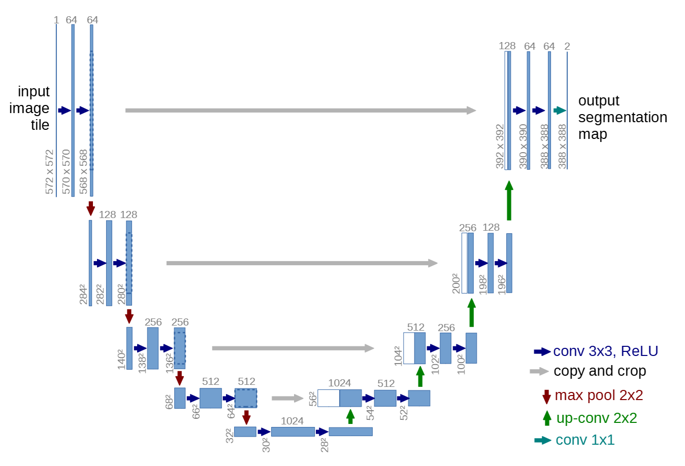
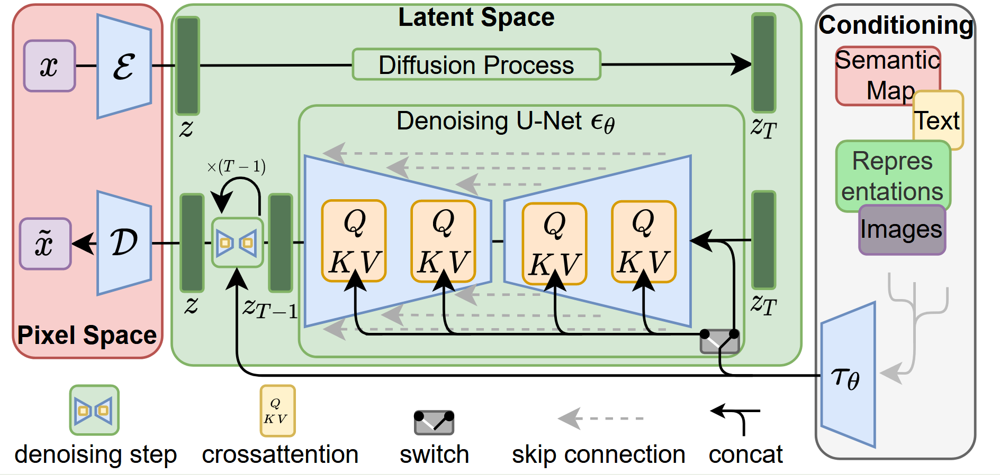
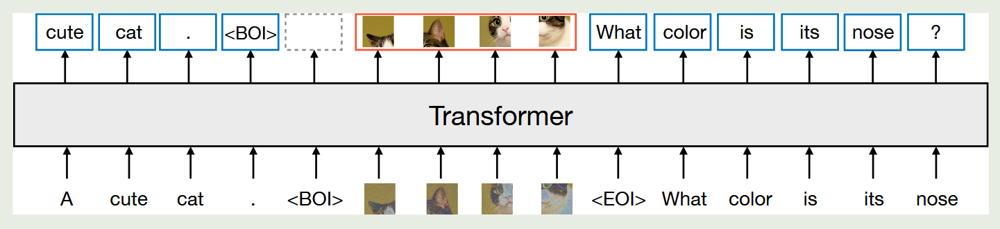
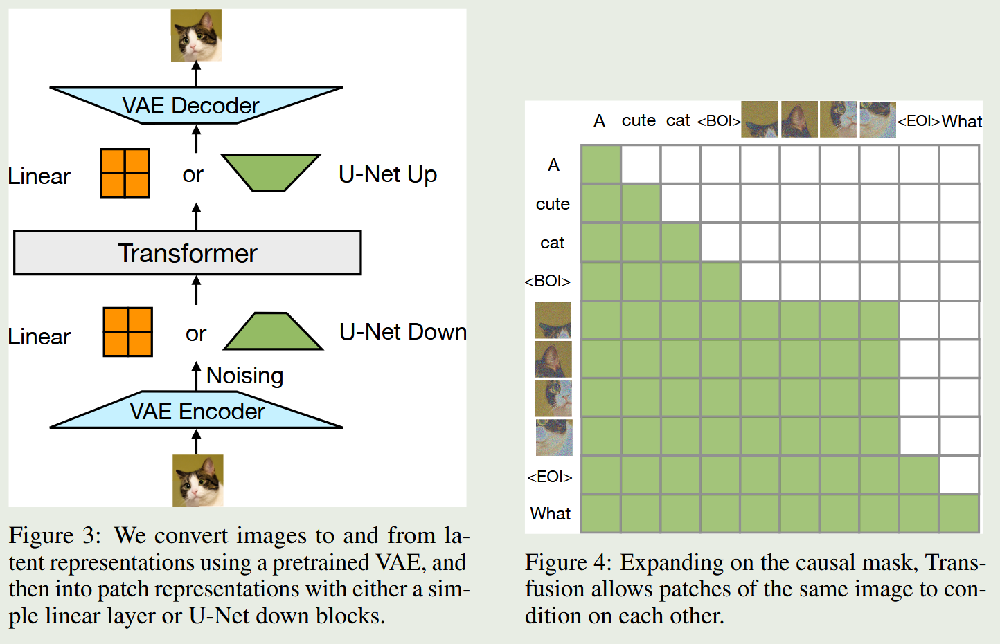
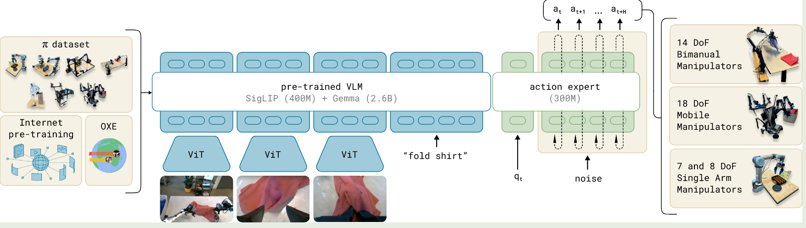
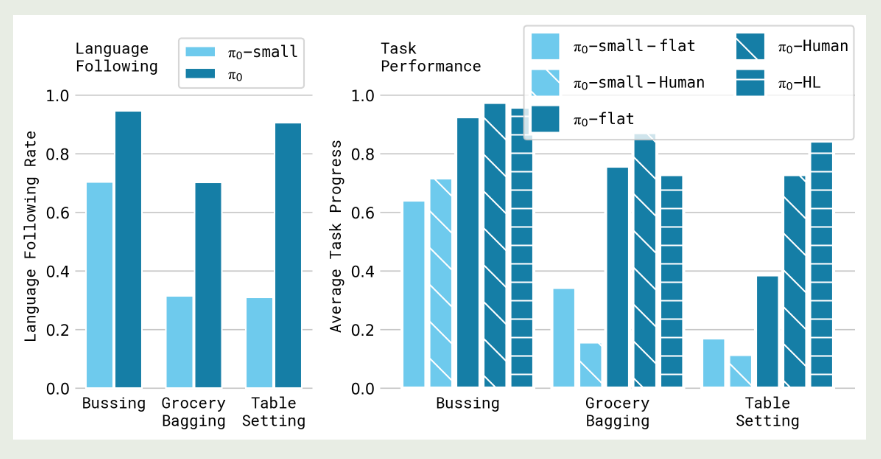

[TOC]

# DDPM

DDPM算法过程：其中前向加噪是已知的高斯马尔可夫链，即手动加噪的过程；反向去噪用神经网络逐步预测噪声并还原。

给定步数 $T$，设一串噪声强度 $\{\beta_t\}_{t=1}^T$，并定义
$\alpha_t = 1-\beta_t,\qquad \bar\alpha_t=\prod_{s=1}^t \alpha_s $
常用的是 $\beta_t$ 随 $t$ 增大，论文里也用线性增长的 $\beta_t$ 设置。

**前向过程（加噪 / diffusion）**

从原始数据 $x_0$ 出发，采样一个$t$，用公式可以表示为：
$x_t = \sqrt{\bar\alpha_t} x_0 + \sqrt{1-\bar\alpha_t} \varepsilon,\quad \varepsilon\sim\mathcal N(0,I) $
这与我们的想法不同，DDPM不是逐步进行加噪的，而是一步完整的。$t$直接控制了加噪的程度，$t$越大，$\beta_t$越大，$\bar\alpha_t$越小，$\sqrt{1-\bar\alpha_t}$就越大，加噪程度越大。

**训练**

核心做法：随机抽一个时间步 $t$，把 $x_0$ 直接加噪成 $x_t$，让噪声预测网络 $\varepsilon_\theta(x_t,t)$ 去拟合真实噪声 $\varepsilon$，用 MSE 训练。

伪代码：

1. 采样真实数据 $x_0 \sim q(x_0)$  
2. 均匀采样时间步 $t \sim \text{Uniform}({1,\dots,T})$   
3. 采样噪声 $\varepsilon \sim \mathcal N(0,I)$   
4. 构造 $x_t=\sqrt{\bar\alpha_t}x_0+\sqrt{1-\bar\alpha_t}\varepsilon$  
5. 最小化 $\mathcal L = |\varepsilon - \varepsilon_\theta(x_t,t)|^2$

直观理解：网络学到“这张图在第 $t$ 步被加了多大噪声、噪声长啥样”，从而学会去噪。

**采样 / 生成（从纯噪声一步步去噪到数据）**

从 $x_T\sim\mathcal N(0,I)$ 开始，按 $t=T\to 1$ 迭代，用网络输出的 $\varepsilon_\theta(x_t,t)$ 做一次去噪，得到 $x_{t-1}$。

伪代码：

1. 初始化 $x_T \sim \mathcal N(0,I)$   
2. 对 $t=T,T-1,\dots,1$：
   - 若 $t>1$，采样 $z\sim\mathcal N(0,I)$，否则 $z=0$   
   - 更新：
     $x_{t-1}=\frac{1}{\sqrt{\alpha_t}}\Bigl(x_t-\frac{\sqrt{1-\alpha_t}}{1-\bar\alpha_t},\varepsilon_\theta(x_t,t)\Bigr)+\sigma_t z$
3. 输出 $x_0$

# UNet

- U-Net 是一种典型的编码器–解码器（Encoder–Decoder）结构，其核心目标是在生成或预测图像时，同时兼顾全局语义理解与局部细节保留。编码器通过多次卷积和下采样逐步降低空间分辨率、提升语义抽象能力，从而捕获“图像是什么”；解码器则通过上采样将高层语义逐步还原为高分辨率图像。

- 为避免编码过程中细节信息的丢失，U-Net 在编码器与解码器的对应层之间引入跳跃连接（Skip Connection），将早期保留的空间结构直接传递给后期生成阶段，从而实现语义与细节的有效融合。具体实现是copy and crop：
  - 在原版 U-Net 中，由于使用的是 valid（不 padding）的 3×3 卷积，特征图在编码器阶段会不断变小，而解码器通过上采样无法恢复这些被卷积“吃掉”的边缘像素，因此同层的 encoder 与 decoder 特征图在空间尺寸上不一致
  - copy and crop 的含义就是：将 encoder 对应层的特征图复制出来，从四周对称裁剪（crop）到与 decoder 当前特征图相同的大小，然后在 通道维度上拼接（concat），以融合 encoder 的高分辨率定位信息和 decoder 的高层语义信息
  - 这不是 resize 或 padding，而是为了解决尺寸不匹配并保证像素级对齐的必要操作，在现代使用 same padding 的 U-Net 中通常不再需要。
- 

# Stable Diffusion

- 与像素级扩散模型不同，Stable Diffusion 首先通过 VAE 将高分辨率图像压缩为低分辨率、高语义密度的潜表示。扩散过程仅在该潜空间中进行，从而显著降低计算成本和显存开销，同时保持较高的生成质量。

- Stable Diffusion 基于 Latent Diffusion Model（LDM） 架构，将扩散过程从高维像素空间转移到由 VAE 学习得到的低维潜空间中。模型推理由文本编码器（CLIP）、潜空间去噪网络（条件 U-Net）和 VAE 解码器组成。VAE 负责在图像与潜变量之间进行双向映射。
- Stable Diffusion 的U-Net 架构，由多层下采样编码器、瓶颈层和对称的上采样解码器构成，并通过 skip connection 保留多尺度特征信息。与传统 U-Net 不同的是，该模型在多个分辨率层中引入了 Transformer Block，从而增强全局建模能力。这种 CNN 与 Transformer 的混合结构兼顾了局部纹理建模与长程依赖建模，适合复杂图像生成任务。每个Transformer Block由self-attention、cross-attention、FFN组成。潜空间特征首选要flatten成序列（类似text embedding），才能被输入到Transformer-Block中。在 cross-attention 中，潜空间特征作为 Query，文本特征作为 Key 和 Value，使模型能够在空间位置级别对齐文本语义。这一机制使得 Stable Diffusion 能够精细控制图像内容和局部细节，是 prompt 驱动生成能力的核心来源。
- 扩散过程被离散为多个时间步，每个时间步通过时间嵌入（time embedding）注入到 U-Net 各层，使模型能够感知当前噪声强度。具体是把时间步t进行sinusoidal embedding，通过MLP，注入到UNet。
- 

# Transfusion

- 背景：有方法通常要么将图像量化为离散 token 并用语言模型统一建模，要么将语言模型与扩散模型通过外部接口拼接。这两类方案分别引入了信息瓶颈或系统复杂度。Transfusion 提出了一种不同的思路：不强行统一模态表示，而是在同一模型中为不同模态使用各自最合适的生成目标。

  

- Transfusion基于Transformer进行训练。模型在文本上采用标准的 next-token prediction，在图像上采用扩散模型的噪声预测损失。模型采用了一种混合注意力机制：文本 token 之间使用因果注意力，而同一图像内部的 patch 之间使用双向注意力，主要是因为图像的patch之间有明显的双向依赖关系。

- 输入的图像首先通过 VAE 编码到 latent 空间，再被切分为一系列连续的 latent patch 向量。文本 token 与图像 patch 被拼接进同一个序列中，并使用特殊标记 <BOI> 和 <EOI> 标识图像的起止位置。

- 在推理阶段，Transfusion 在文本生成与图像生成之间动态切换。当模型以语言模型方式生成文本时，采用标准的自回归采样；一旦生成 <BOI> 标记，模型便切换到扩散模式，在序列中追加固定数量的纯噪声 latent patch，并通过多步扩散去噪同时更新所有 patch。扩散完成后，去噪后的 latent patch 被重新排列为 latent feature map，并通过 VAE 解码器还原为最终图像。

- 

# $\pi$0: A Vision-Language-Action Flow Model for  General Robot Control

- 基于预训练VLM模型构建，充分利用训练好的VLM模型能力。使用多种类型的robot数据，包括单臂、双臂或者移动控制器等。

- 模型架构

  - $\pi$0主要基于Transfusion改进，为了执行高度灵活和负责的物理任务，使用了基于flow matching的action chunking来表示复杂并连续的action分布，推理时可以输出多个未来action轨迹。离散输出使用cross-entropy loss，连续输出使用flow-matching loss。
  - 为了充分整合VLM和flow matching，模型使用了轻量级MoE架构，增加了action expert，对于输入action token只能经过action expert。
  - 

- 简单介绍flow matching：

  - Flow Matching 将生成建模视为一个连续动力系统：模型不再学习“如何去噪”，而是学习在任意时间点上，从当前状态朝向真实数据分布应当移动的瞬时速度。
  - 在训练阶段，Flow Matching 通过构造一条从噪声样本到真实样本的简单路径（通常是线性插值），并在路径上的任意时间点 t 计算出解析可得的真实速度方向。模型的目标就是：在给定当前状态和时间的条件下，预测一个速度向量，使其尽可能接近这条路径上的真实速度，从而实现对“理想流场”的匹配。在生成阶段，模型从随机噪声初始化，通过不断查询模型得到当前时刻的速度预测，并沿该方向进行微小更新。
  - 传统 Diffusion 模型通过学习噪声或 score 来“逐步纠正偏差”，而 Flow Matching 则直接学习“往哪走”。前者是离散、反向的去噪过程，后者是连续、正向的生成过程。这使得 Flow Matching 的训练目标更加直接，生成过程也更自然地对应连续时间动力系统。

- 仅使用高质量数据训练无法让模型从错误中恢复，仅使用低质量数据无法让模型高效并鲁棒性运行，因此将二者结合起来，使模型兼具“模仿高质量数据行动”与“错误时运用恢复修正策略”的能力。

- 结果也是非常好：

  

